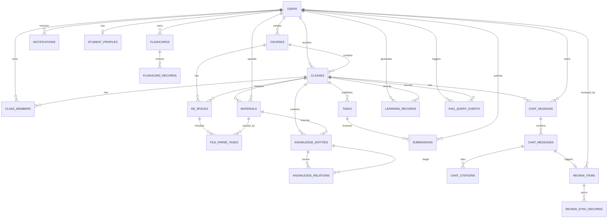
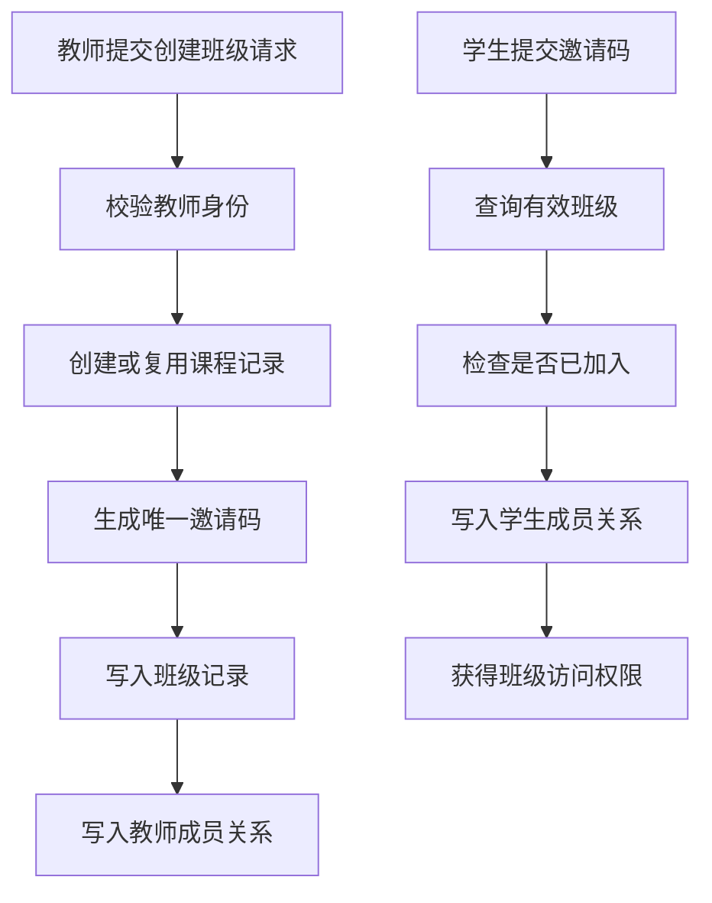
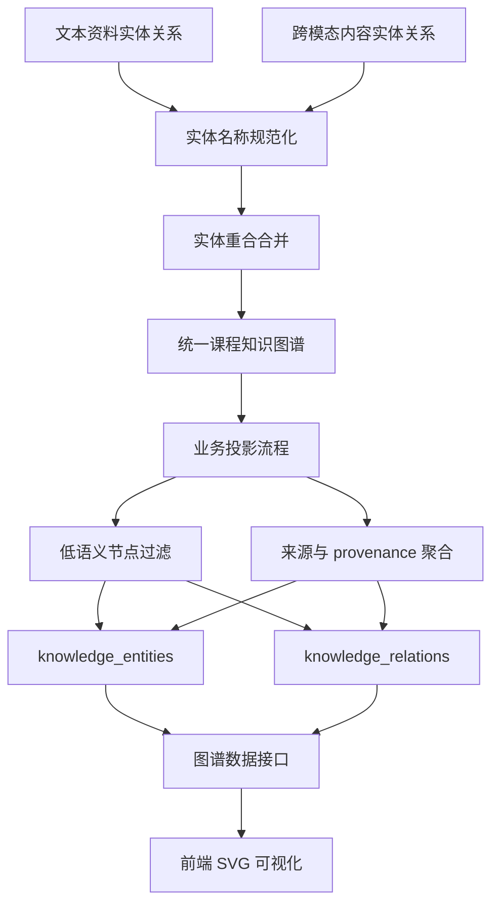
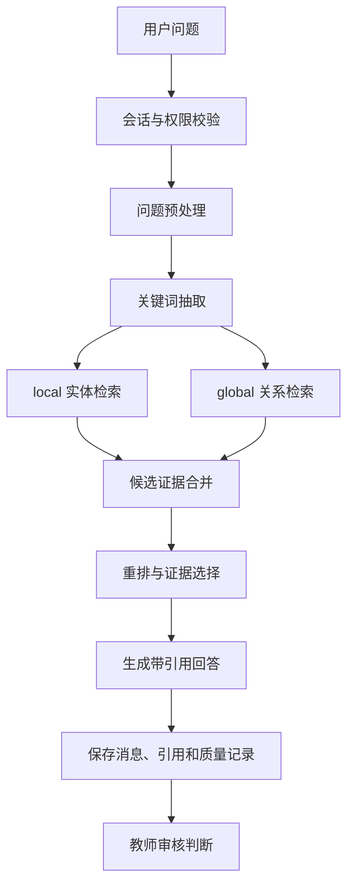

# 基于大语言模型和检索增强生成的助教平台设计

## 摘要

随着高校课程教学资源的持续数字化，课程讲义、课件、实验指导书、答疑记录、图片资料和课堂录播等资源不断增加。教学资源在实际使用中存在格式异构、分散存储、缺少统一索引和知识点定位困难等问题，学生复习时需要反复查找资料，教师也需要多次回答相似问题。通用大语言模型具备自然语言理解和生成能力，但直接用于课程答疑时容易出现课程边界不清、回答缺少依据和错误难以纠正等情况。针对上述问题，本文设计并实现了一个基于大语言模型和检索增强生成的 AI 助教平台原型，目标是为具体课程提供资料管理、知识组织、课程问答和教师审核回流支持。

系统采用前后端分离架构，前端基于 React、Vite、TypeScript 和 Tailwind CSS 实现学生端、教师端和管理端页面，后端基于 FastAPI、SQLAlchemy 和 Pydantic 实现认证授权、班级空间、资料管理、智能问答、教师审核和学习记录等接口。课程知识处理方面，系统接入 RAG-Anything 与 LightRAG 相关能力，结合 MinerU 文档解析、嵌入模型、视觉语言模型和重排序模型，将课程资料转换为文本分块、内容项、引用来源和课程知识图谱投影。对于图片、表格和公式等内容，系统通过文本化描述为其参与检索提供路径；对于音视频资料，系统保留预处理和扩展接口，当前核心实现以文档型资料和图片内容为主。

本文实现了班级空间基础功能、课程知识库构建、知识图谱构建、检索增强生成问答、教师审核与知识回流等模块。系统在问答阶段通过查询预处理、关键词抽取、双路检索、候选证据重排和回答生成，支持课程知识点关联检索和证据组织；在回答质量控制方面，将低可信度回答和学生负反馈转入教师审核流程，教师修正答案可作为补充知识回流到课程知识库。测试阶段通过功能测试和主流程验证，对资料上传、知识库构建、知识图谱展示、课程问答、引用溯源、教师审核回流等功能的可用性进行了验证。

测试结果说明，系统能够完成课程资料从上传、解析、索引到课程问答和审核回流的主要流程，并为课程场景下的 AI 助教应用提供了可运行原型。系统仍存在音视频深度解析不足、知识图谱语义抽取能力有限、推荐策略以规则为主和真实课堂评估规模不足等问题。后续可从多模态解析、知识抽取、检索评估和真实教学场景试用等方面继续完善。

关键词：大语言模型；检索增强生成；RAG-Anything；LightRAG；知识图谱；智能助教；多模态文档解析

## Abstract

With the continuous digitalization of higher education, course materials such as lecture notes, slides, laboratory instructions, Q&A records, images, and recorded lectures are rapidly accumulating. In actual teaching scenarios, these resources are often heterogeneous, scattered, and difficult to retrieve by knowledge points. Students spend considerable time searching materials during review, while teachers repeatedly answer similar questions. General-purpose large language models have strong language understanding and generation capabilities, but direct use in course tutoring may lead to weak course boundaries, insufficient evidence, and limited correction mechanisms. To address these problems, this thesis designs and implements an AI tutoring platform based on large language models and retrieval-augmented generation for course-specific teaching scenarios.

The system adopts a frontend-backend separated architecture. The frontend is implemented with React, Vite, TypeScript, and Tailwind CSS, while the backend uses FastAPI, SQLAlchemy, and Pydantic to provide authentication, class space, material management, intelligent Q&A, teacher review, and learning record interfaces. For course knowledge processing, the system integrates RAG-Anything and LightRAG-related capabilities, together with MinerU document parsing, embedding models, vision-language models, and reranking models. Course materials are converted into text chunks, content items, citations, and business-side course knowledge graph projections. Images, tables, and equations are represented through textual descriptions so that multimodal materials can participate in retrieval; audio and video processing is retained as an extension path, while the current implementation mainly focuses on document materials and image content.

The platform implements class space management, course knowledge base construction, knowledge graph construction, retrieval-augmented question answering, and teacher review with knowledge feedback. During Q&A, the system performs query preprocessing, keyword extraction, dual-path retrieval, candidate evidence reranking, and answer generation to support course knowledge association and evidence organization. Low-confidence answers and negative student feedback are transferred to the teacher review workflow, and teacher-corrected answers can be fed back into the course knowledge base as supplementary knowledge. Functional tests and workflow validation were conducted to verify the usability of material upload, knowledge base construction, knowledge graph display, course Q&A, citation tracing, and teacher review feedback.

The results show that the prototype can complete the main workflow from material ingestion and indexing to course Q&A and review feedback. The system provides a runnable practice for applying LLMs and RAG to course tutoring. Remaining limitations include insufficient deep audio/video processing, limited semantic relation extraction in the knowledge graph, rule-based recommendation, and insufficient evaluation in real classroom scenarios. Future work may further improve multimodal parsing, knowledge extraction, retrieval evaluation, and real teaching deployment.

Keywords: Large Language Model; Retrieval-Augmented Generation; RAG-Anything; LightRAG; Knowledge Graph; AI Tutor; Multimodal Document Parsing

---

# 第一章 绪论

## 1.1 研究背景与问题提出

### 1.1.1 高校课程数字资源不断积累但利用效率不足

在高校教学活动中，数字化课程资源已经成为教学过程的重要组成部分。以计算机类课程为例，教师通常会在一个学期内持续发布课程讲义、PPT、实验指导书、代码示例、作业说明、考试复习材料、课堂答疑记录以及扩展阅读资料。部分课程还会提供课堂录播、实验操作视频、网络拓扑图和协议流程图等多模态材料。这些资源能够为学生自主学习提供丰富支持，但资源数量增加并不等同于资源利用效率提升。

在实际学习过程中，课程资料常常分散在教学平台、即时通信群、教师网盘、本地文件夹和学生个人笔记中。即使资料已经集中到某个平台，也往往只是以文件列表形式展示，缺少按知识点、章节关系、概念依赖和问题场景组织的结构化索引。学生复习某个知识点时，需要打开多个文件反复查找，难以及时判断某个概念出现在第几份资料、哪一页、与哪些知识点相关。对于包含图片、表格、公式和流程图的资料，普通全文搜索也很难覆盖其中的关键信息。

因此，课程资源管理的关键问题在于资源能否被有效组织、检索并转化为学习支持。本文系统将课程资料转化为可检索知识库，并进一步构建课程知识图谱原型，用于解决课程资源从静态文件到动态知识服务之间的转化问题。

### 1.1.2 教师重复答疑压力大，个性化辅导成本高

课程教学中的答疑问题具有明显的重复性和集中性。在同一门课程中，不同学生经常围绕相同知识点提出类似问题。例如在计算机网络课程中，TCP 三次握手、拥塞控制、子网划分、HTTP 与 HTTPS 区别等问题会在多个班级和多个教学周期中反复出现。教师需要在课堂、课后、线上平台和作业反馈中多次解释这些内容，造成重复劳动。

同时，学生的基础和学习节奏存在差异。部分学生希望得到基础概念解释，部分学生需要结合实验或代码理解原理，还有学生希望获得复习资料、错题解析或学习建议。传统答疑方式通常依赖教师人工判断和人工回复，难以同时满足及时性、个性化和可追溯性要求。缺少系统化记录时，教师也难以持续分析学生在哪些知识点上最容易出错，以及哪些资料最需要补充。

智能助教平台可以在一定程度上分担教师重复答疑压力。系统基于课程资料回答常见问题，并将低可信度或学生不满意的问题转交教师审核，可以形成“AI 初答、教师兜底、知识回流”的闭环。该流程能够提升学生获得帮助的及时性，也能将教师精力更多投入到高价值问题解释和教学改进中。

### 1.1.3 大语言模型可提升教学辅助能力，但直接应用仍存在局限

大语言模型在自然语言理解、文本生成、摘要归纳、多轮对话和代码辅助等方面表现出较强能力，为智能教学系统提供了新的技术可能。学生可以用自然语言提出问题，模型能够生成结构较清晰的解释性回答；教师也可以利用模型辅助生成教案、复习提纲和题目解析。

然而，通用大语言模型并不天然适合直接作为课程助教。第一，模型回答主要依赖参数化知识，可能与当前课程讲义、教师要求或实验环境不一致。第二，模型容易在证据不足时生成看似合理但缺少依据的回答，产生“幻觉”风险。第三，通用模型通常无法明确给出回答来自哪份课程资料、哪一页或哪一段，学生和教师难以核验。第四，当模型回答错误时，如果系统缺少反馈与回流机制，错误难以被持续纠正。

因此，本文系统将大语言模型定位为理解问题和组织语言的生成模块，将课程资料、检索增强生成、知识图谱和教师审核作为回答依据与质量控制手段。系统面向课程场景构建 AI 助教平台，重点支持基于课程资料的问答、引用溯源和教师修正回流。

### 1.1.4 面向课程场景的智能助教平台具有现实需求

面向课程场景的智能助教平台需要同时满足课程资料管理、知识点查询、课程答疑、资料推荐、教师审核和学习分析等需求。学生希望系统能够基于课程资料回答问题、指出引用来源、推荐后续阅读资料并辅助复习；教师希望系统能够降低重复答疑成本，发现学生薄弱知识点，并对 AI 回答进行审核和纠正；管理员希望系统能够管理用户、课程、模型配置和系统运行状态。

基于上述需求，本文围绕 LLM+RAG 技术框架开展系统设计。系统以 RAG-Anything 作为增强型多模态 RAG 框架，以课程知识图谱原型组织知识点关系，以教师审核回流机制实现知识动态更新，以学习行为记录和规则推荐实现个性化学习支持，最终形成一个可运行、可扩展、可评估的 AI 助教平台原型。

## 1.2 国内外研究现状

### 1.2.1 大语言模型在教育场景中的应用研究

大语言模型在教育领域的应用主要包括智能问答、学习陪伴、作业辅导、教学内容生成、自动反馈和教师教学辅助等方向。相比传统基于规则或模板的问答系统，大语言模型能够理解更灵活的自然语言问题，并生成较自然的解释性文本。对于学生而言，这种能力降低了提问门槛；对于教师而言，模型可以辅助整理资料、生成教案和归纳常见问题。

但是，教育场景对正确性、可解释性和课程一致性要求较高。学生可能依据模型回答进行学习和作业，回答不准确且没有证据来源会直接影响学习效果。因此，当前研究越来越强调将大语言模型与外部知识库、课程资料、教学大纲和人工审核机制结合起来，使模型输出受到课程知识边界和人工审核机制约束。

### 1.2.2 基于 RAG 的课程问答与知识服务研究

检索增强生成技术通过在回答生成前检索外部知识，将大语言模型从单纯依赖参数记忆转变为“基于证据生成”。在课程问答场景中，RAG 能够将讲义、课件、实验指导书和答疑记录作为外部知识源，使模型回答更贴近课程内容。相较于微调整个模型，RAG 也更适合课程资料动态更新，因为教师新增或修改资料后，系统只需重新解析和索引资料，即可让后续问答利用新知识。

现有 RAG 系统常以纯文本分块、向量检索和 top-k 拼接为核心。这种方式适合普通文本资料，但对包含图表、公式和复杂版面结构的教学文件支持不足。同时，传统 RAG 往往只返回语义相似片段，缺少知识点之间关系建模和教师审核回流。本文系统在普通 RAG 的基础上引入 RAG-Anything 和课程知识图谱原型，试图增强多模态资料处理和知识关联组织能力。

### 1.2.3 多模态教学资源解析与知识组织研究

真实教学资料具有明显的多模态特征。计算机网络课程中存在协议流程图、网络拓扑图、抓包截图、表格对比和公式说明；其他工程类课程也常包含图像、公式和实验数据表。系统只处理纯文本内容时，许多图片、表格和公式中的教学信息难以参与检索。

多模态教学资源解析通常涉及 OCR、版面分析、表格识别、公式提取、图片描述、语音识别和关键帧抽取等技术。香港大学团队提出的 RAG-Anything 框架面向现代文档中的文本、图像、表格、公式等内容，提出将多模态元素视为相互连接的知识实体，并通过双图构建和跨模态混合检索实现统一问答。该思想适合用于课程资料场景，因为课程资料中往往存在跨页面、跨模态、跨知识点的证据组合。

### 1.2.4 学习分析与个性化支持研究

学习分析通过记录学生学习行为、问答历史、作业完成情况、错题情况和复习记录来描述学习状态。个性化支持则根据学生薄弱知识点、学习进度和兴趣偏好推荐资料或复习任务。相比只提供问答功能的系统，结合学习分析的助教平台能够支持更持续的学习过程。

在原型系统中，复杂预测模型并非唯一选择。对于毕设阶段，更可行的方式是先建立可解释的规则与统计指标。例如，根据提问关键词、错题章节、资料关键词和知识图谱实体进行推荐，根据点踩次数和低置信回答发现知识库缺口，根据闪卡复习记录安排后续复习。本文系统采用这种可解释的学习支持思路，为后续引入更复杂推荐模型预留数据基础。

### 1.2.5 智能对话系统与 AI 助教研究

智能对话系统从早期基于规则的问答逐步发展到基于检索、生成模型和多轮上下文管理的系统。教育领域的 AI 助教不仅需要回答问题，还需要理解用户身份、课程上下文、学习阶段和资料范围。学生端更关注概念解释、例题讲解和学习建议，教师端更关注备课、学情分析和答疑审核。

因此，AI 助教系统需要具备多角色、多任务和可追溯能力。本文系统在前端设计上区分学生端、教师端和管理端，在后端设计上通过角色权限、课程班级上下文、问答会话、审核记录和学习分析数据组织不同用户场景。

### 1.2.6 现有研究不足与本文切入点

综合现有研究，可以发现以下不足：第一，部分智能问答系统缺少具体课程资料约束，回答容易偏离课程要求；第二，普通 RAG 系统多以纯文本检索为主，对课程中的图表、公式和图片支持不足；第三，课程知识点关系组织不充分，难以支持知识图谱展示和图谱辅助检索；第四，模型回答错误后缺少教师审核与知识回流机制；第五，问答、学习分析和资料推荐之间缺少联动。

本文从具体课程教学场景出发，以 RAG-Anything 增强 RAG 主链、多模态内容项归一化、课程知识图谱原型和教师审核回流为核心切入点，设计一个面向课程资料动态更新和可信问答的 AI 助教平台。

## 1.3 研究目标与主要内容

### 1.3.1 研究目标

本文的系统设计目标包括以下五个方面：

第一，设计基于 LLM+RAG 的 AI 助教技术框架，使系统能够基于课程资料回答问题，减少对模型参数化知识的直接依赖。

第二，构建面向计算机网络课程的知识库与课程知识图谱原型，将课程资料中的关键词、知识点和来源证据组织为可检索、可追溯的知识结构。

第三，引入 RAG-Anything 作为多模态 RAG 增强主链，使系统具备处理文本、图片、表格和公式等复杂课程资料的架构能力。

第四，开发智能对话系统，支持学生知识点查询、课程答疑、引用溯源和问题反馈，同时支持教师端备课辅助、学情分析和审核处理。

第五，建立反馈与评估机制，通过低置信审核、点踩反馈、教师修正、RAGQueryEvent 指标记录和离线 benchmark 支持系统功能验证与后续改进。

### 1.3.2 主要研究内容

本文主要研究内容包括：

1. 对课程教学场景中的用户角色、功能需求和非功能需求进行分析，明确学生、教师和管理员的业务边界。
2. 设计前后端分离、模块化单体的总体架构，确定数据库、存储、模型路由、RAG 引擎和异步任务等基础技术方案。
3. 实现课程资料上传、文件存储、哈希去重、解析任务管理、RAG-Anything 入库、本地回退解析和知识库状态维护。
4. 实现课程知识图谱原型构建，将解析关键词转化为实体和共现关系，并保存置信度、来源片段和 provenance 信息。
5. 实现基于 RAG 的智能问答链路，包括查询改写、多路召回、图谱辅助检索、重排序、生成回答、citation 落库和低置信审核。
6. 实现教师审核与知识回流机制，使教师修正答案能够作为知识补丁进入后续检索链路。
7. 实现学习行为记录、学生画像、闪卡复习、规则推荐和管理端指标接口，作为辅助学习支持功能。
8. 通过功能测试、回归测试、RAG 性能指标和离线 benchmark 验证系统主要功能的可用性。

## 1.4 研究方法与技术路线

本文采用文献研究法、系统分析法、原型实现法和实验测试法。首先，通过研究大语言模型、RAG、LightRAG、RAG-Anything、知识图谱和学习分析等相关技术，确定系统技术路线。其次，结合课程教学场景分析学生、教师和管理员的需求，设计系统功能结构和数据模型。然后，基于 FastAPI、React、SQLAlchemy、RAG-Anything 等技术实现系统原型。最后，通过自动化测试、主流程验证和指标记录分析系统功能和效果。

技术路线可概括为：课程需求分析 -> 总体架构设计 -> 班级空间基础功能 -> 课程资料接入 -> 文档解析与内容分流 -> 语义嵌入与知识图谱构建 -> RAG 检索与答案生成 -> 教师审核与知识回流 -> 系统测试与评估。

## 1.5 论文组织结构

本文共分为六章。第一章介绍研究背景、研究现状、系统设计目标和技术路线。第二章介绍大语言模型、RAG、RAG-Anything、多模态解析、知识图谱和系统架构等关键技术。第三章进行系统需求分析与总体设计，说明用户角色、核心功能需求、辅助功能需求、非功能需求、总体架构、业务流程和数据库接口设计。第四章详细介绍 AI 助教平台关键模块实现，包括班级空间基础功能、课程知识库构建、知识图谱构建、检索增强生成问答、教师审核与知识回流。第五章介绍系统测试与结果分析，包括测试环境、功能测试、知识库构建测试、问答链路测试、性能记录和系统局限。第六章总结全文工作并展望后续改进方向。

---

# 第二章 相关理论与关键技术

## 2.1 大语言模型与提示式问答技术

### 2.1.1 大语言模型的基本能力

大语言模型通常以 Transformer 架构为基础，通过大规模语料预训练学习语言表达、语义关联和上下文推理能力。经过指令微调和对齐训练后，大语言模型能够根据用户指令完成问答、摘要、解释、翻译、代码辅助和内容生成等任务。对于 AI 助教平台而言，大语言模型的核心作用是理解学生问题、组织检索到的证据、生成可读性较好的解释，并根据不同角色调整表达方式。

在本文系统中，大语言模型位于问答链路的后端生成阶段。系统先通过 RAG 获取课程证据，再将证据、历史上下文和角色提示发送给生成模型。这样，模型主要负责语言组织和教学化解释，而课程事实依据来自外部知识库。

### 2.1.2 提示工程与任务型问答

提示工程通过角色设定、任务说明、上下文注入、输出格式约束和安全边界控制大模型输出。在课程问答中，提示需要强调“优先依据课程资料回答”“证据不足时说明不确定性”“面向学生给出定义、解释和例子”“面向教师给出结构化教学建议”等要求。

本文系统区分学生端和教师端回答风格。学生端回答强调概念解释、例子和学习建议；教师端回答强调简洁、结构化和课堂应用。提示工程与检索证据、教师审核答案和用户角色共同决定最终回答。

表 2-1 给出了本文系统中大语言模型的主要使用位置。系统通过不同提示词和输入内容将同一类模型能力用于不同任务，避免将模型回答等同于课程知识本身。

| 使用阶段 | 所在模块 | 主要输入 | 主要输出 |
|---|---|---|---|
| 课程问答生成 | 检索增强生成问答模块 | 用户问题、历史对话、检索证据、角色约束 | 带引用来源的课程回答 |
| 查询理解 | 问答预处理与检索模块 | 用户原始问题、上下文、回答模式 | 独立问题、检索焦点词、关键词 |
| 实体关系抽取 | 知识图谱构建模块 | 文本分块、内容项文本化描述、课程抽取约束 | 实体、关系和描述 |
| 图片与公式描述 | 多模态解析模块 | 图片、公式截图、表格或图示内容 | OCR 文本、视觉描述、结构化说明 |

### 2.1.3 大语言模型在教育问答中的局限

大语言模型直接用于教育问答存在幻觉、无证据、课程边界弱和错误难纠正等风险。课程系统尤其需要可追溯性，因为学生需要知道答案来自哪份讲义、哪一页或哪个知识点。本文采用 RAG、知识图谱和审核回流机制约束大模型输出，以降低这些风险。

## 2.2 检索增强生成技术

### 2.2.1 RAG 基本原理

RAG 的基本思想是在生成回答前先检索外部知识库，将检索结果作为上下文输入大语言模型。典型流程包括文档接入、内容清洗、分块、嵌入、索引构建、问题检索、候选重排、证据拼接和回答生成。RAG 使系统能够利用私有知识、最新知识和领域知识，减少对模型参数记忆的依赖。

对于课程场景，RAG 的意义在于把课程讲义、PPT、实验指导书和教师审核答案转化为回答依据。当课程资料更新时，系统通过重新解析和索引资料实现知识动态更新，而不需要重新训练大模型。

### 2.2.2 课程问答中的证据组织

课程问答系统不能只返回一段流畅回答，还需要返回来源。证据组织应保留资料名称、页码、分块编号、内容类型和相关分数。本文系统将这些信息保存为 citation，并在前端以引用溯源形式展示。这样学生可以核验回答，教师也可以判断系统是否正确使用课程资料。

### 2.2.3 RAG 问答与通用问答对比

| 对比维度 | 通用大模型问答 | RAG 课程问答 |
|---|---|---|
| 知识来源 | 模型参数记忆 | 课程资料、知识库、教师审核答案 |
| 更新方式 | 依赖模型更新或微调 | 上传资料后重新解析与索引 |
| 可追溯性 | 通常较弱 | 可返回来源文件、页码和分块 |
| 适用场景 | 开放域通用问答 | 课程边界明确的教学问答 |
| 主要风险 | 幻觉、知识过期 | 检索质量不足、资料覆盖不全 |

本文未对 RAG 算法本身进行理论改进，主要工作是在课程教学场景下完成系统集成与应用适配。系统通过课程资料入库、引用来源保存、图谱展示、教师审核和知识回流等工程机制，使 RAG 能够服务于具体课程的资料问答和教学管理。

## 2.3 LightRAG 与 RAG-Anything

### 2.3.1 LightRAG 的图增强 RAG 思想

LightRAG 是一种图增强检索生成框架，其核心思想是将知识片段从孤立文本块扩展为带实体和关系的结构化知识网络。与只依赖向量相似度的检索方式相比，图结构能够表达概念之间的关联，使系统在复杂问题下能够进行局部实体检索和全局主题检索。课程知识天然具有章节、概念、先修关系和共现关系，因此 LightRAG 的图增强思想适合用于课程知识组织。

### 2.3.2 RAG-Anything 的多模态扩展

RAG-Anything 是香港大学团队在 LightRAG 基础上提出的 All-in-One 多模态 RAG 框架。官方仓库说明其支持从文档摄入、解析到多模态问答的端到端流程，可处理 PDF、Office 文档、图片、文本文件等格式，并针对图像、表格、数学公式和异构内容提供专门处理器。其论文强调将多模态内容视为相互连接的知识实体，通过双图构建同时捕获跨模态关系与文本语义，再通过跨模态混合检索结合结构导航和语义匹配。

在本文系统中，RAG-Anything 被用作增强型 RAG 主链。系统不直接复制其底层所有算法，而是通过适配层将其接入课程资料入库和问答流程。文档解析默认使用 MinerU，解析方式为 auto；嵌入函数、生成函数和视觉函数由系统根据模型路由注入。RAG-Anything 负责处理复杂多模态文档和增强检索，本地数据库负责保存课程业务状态、解析任务、图谱原型、引用和审核记录。

| 技术或工具 | 在系统中的角色 | 选用原因 | 使用边界 |
|---|---|---|---|
| LightRAG | 图增强检索与实体关系索引基础 | 支持 local、global、hybrid 等图检索模式 | 底层索引结果需通过业务表投影后用于前端展示 |
| RAG-Anything | 多模态资料解析与检索主链 | 支持文档、图片、表格和公式等内容进入统一 RAG 流程 | 音视频深度处理依赖额外 ASR、关键帧和 VLM 能力 |
| MinerU | 文档版面解析 | 适合解析 PDF、课件等包含复杂版面的课程资料 | 解析质量受文件清晰度和版面复杂度影响 |
| SQLAlchemy | 后端 ORM 与数据库访问 | 统一管理用户、课程、资料、审核和学习记录 | 不是具体数据库产品，开发环境与部署环境可切换 |
| SQLite/PostgreSQL | 关系数据库 | SQLite 适合开发调试，PostgreSQL 适合部署环境 | 不保存向量检索内部全部索引结构 |
| MinIO/本地存储 | 文件存储 | 保存原始课件、图片和解析中间文件 | 与关系数据库共同构成资料存储层 |

### 2.3.3 双图机制在本文中的理解

RAG-Anything 的双图思想可理解为文本语义图和跨模态关系图。文本语义图关注文本实体、文本关系和语义块之间的联系，用于支持类似 LightRAG 的图增强文本检索。跨模态关系图关注图片、表格、公式、版面元素与文本之间的依赖关系，用于处理证据跨模态分布的问题。

本文系统在工程实现上通过两层方式承接这一思想：第一，RAG-Anything 主链内部负责多模态双图和混合检索；第二，后端将解析结果归一化为 content items，并在数据库中构建课程知识图谱原型，使前端展示、图谱辅助检索和 provenance 追踪具备稳定数据基础。

## 2.4 多模态文档解析与结构化存储

多模态文档解析的目标是将复杂教学资料转化为可检索、可引用、可更新的知识单元。对于文本内容，系统需要进行清洗和分块；对于表格，系统需要保留行列结构或 Markdown 表示；对于公式，系统需要保留 LaTeX 或公式文本；对于图片，系统需要保留 OCR 文本、图像路径或视觉描述；对于音视频，理想情况下需要 ASR 转写、关键帧抽取和时间片定位。

本文系统使用统一 content items schema 表示多模态解析结果。该 schema 支持文本、表格、公式、图片、音频、视频和代码等模态，并保留来源、页码、分块编号、bbox、表格、公式、图片路径、OCR 文本和时间片等字段。统一结构的好处是下游检索、图谱构建、文件分析接口和前端展示可以使用同一套数据契约。

## 2.5 知识图谱与课程知识组织

知识图谱以实体、关系和属性组织知识。在课程场景中，实体可表示知识点、术语、章节主题或公式，关系可表示共现、相关、先修或应用关系。本文系统构建课程知识图谱原型，主要作用包括知识可视化、图谱辅助检索、资料来源追踪和后续学习推荐支撑。

系统将解析关键词转化为知识实体，将相邻或共现关键词建立为关系，并为实体和关系保存置信度、来源资料、页码、分块编号、模态类型和 provenance。这样，图谱不仅能展示概念之间的关系，也能追溯到具体课程资料。

| 图谱元素 | 本文中的含义 | 示例类型 |
|---|---|---|
| 实体 | 课程中具有教学意义的知识对象 | 课程概念、公式、算法、实验步骤、工具、考核点 |
| 关系 | 实体之间的教学或语义联系 | 先修、组成、解释、应用、考查、对比、相关 |
| 来源 | 支撑实体或关系的资料位置 | 文件、页码、分块、内容项、模态类型 |
| 属性 | 前端展示和检索辅助所需信息 | 置信度估计、出现次数、更新时间、provenance |

## 2.6 学习分析与个性化支持

学习分析通过记录学生提问、资料访问、错题、闪卡复习和任务完成情况，形成对学生学习状态的描述。个性化支持则依据这些行为和知识库信息推荐资料、提示薄弱点或生成学习建议。本文系统采用规则驱动的推荐与画像构建方式，优先考虑可解释性和原型可运行性。后续可在积累更多真实学习数据后引入复杂推荐模型。

## 2.7 前后端分离与模块化架构

本文系统采用前后端分离架构。前端负责学生、教师和管理员的交互界面，后端负责业务逻辑、数据存储、模型路由和 RAG 知识处理。后端采用模块化单体结构，在一个服务内划分 API 层、业务服务层、AI 集成层、数据模型层和 worker 层。该方式降低毕设阶段部署复杂度，同时保留后续拆分服务的可能。

---

# 第三章 系统需求分析与总体设计

## 3.1 用户角色与应用场景分析

### 3.1.1 学生用户场景

学生用户主要需求包括查看课程资料、向 AI 助教提问、上传题目图片或文档、查看引用来源、对回答点赞或点踩、查看推荐资料、使用闪卡复习、查看学习记录。学生端强调学习支持和交互体验，系统需要提供及时、可追溯、易理解的回答。

### 3.1.2 教师用户场景

教师用户主要需求包括创建课程和班级、上传课程资料、触发知识库构建、查看解析状态、处理低置信或点踩回答、将修正答案回流知识库、发布任务或通知、查看学生学情和高频问题。教师端强调课程管理、知识维护和教学辅助。

### 3.1.3 管理员用户场景

管理员负责用户管理、课程管理、审核管理、系统设置、模型配置、索引任务监控和 RAG 实验指标查看。管理员端需要能够查看系统是否正常运行、模型路由是否生效、RAG 主链是否频繁 fallback、索引任务是否失败。

## 3.2 功能需求分析

系统功能需求分为核心功能和辅助功能。核心功能直接支撑课程资料入库、知识库构建、课程问答和教师审核闭环；辅助功能用于完善课程空间管理、学习记录和运行维护。

**表 3-1 系统功能需求划分表**

| 功能类型 | 功能模块 | 主要需求 | 说明 |
|---|---|---|
| 核心功能 | 用户与权限 | 注册、登录、JWT 鉴权、角色控制 | 支持学生、教师、管理员 |
| 核心功能 | 班级空间 | 课程创建、班级加入、成员管理 | 支撑课程上下文和权限边界 |
| 核心功能 | 资料管理 | 上传、下载、预览、去重、状态查看 | 支持 local/MinIO 存储 |
| 核心功能 | 知识库构建 | 解析、分块、索引、状态查询、失败重试 | 支持同步和异步任务 |
| 核心功能 | 知识图谱 | 实体、关系、来源追踪、图谱展示 | 构建课程图谱原型 |
| 核心功能 | 智能问答 | 多轮对话、RAG 检索、生成回答、引用来源 | 支持学生端与教师端 |
| 核心功能 | 审核回流 | 低可信度触发、点踩触发、教师修正、回灌知识库 | 支持回答纠错闭环 |
| 辅助功能 | 通知与任务 | 通知发布、作业或测验发布、提交记录 | 支撑班级教学管理 |
| 辅助功能 | 学习支持 | 学习记录、学生画像、闪卡、资料推荐 | 支持可解释的学习辅助 |
| 辅助功能 | 管理监控 | 模型配置、RAG 性能、索引任务、实验结果 | 支持运行维护 |

## 3.3 非功能需求分析

非功能需求方面，系统需要满足可用性、可靠性、可扩展性、安全性和可观测性要求，如表 3-2 所示。可用性上，系统界面应符合学生和教师的操作习惯，复杂 RAG 处理过程应通过进度提示降低等待不确定性。可靠性上，资料解析失败应记录错误并支持重试，问答失败应返回友好提示。可扩展性上，模型、向量库、图数据库和对象存储应通过配置切换。安全性上，所有课程资料和问答记录均需校验用户角色和课程权限。可观测性上，系统应记录检索耗时、生成耗时、置信度、来源数量、查询改写状态和是否触发审核等指标。

**表 3-2 非功能需求设计表**

| 非功能需求 | 设计措施 | 验证方式 |
|---|---|---|
| 可用性 | 学生端和教师端按角色组织页面；资料上传、解析、索引、问答和审核过程提供状态反馈 | 功能测试、主流程操作验证、页面状态检查 |
| 可靠性 | 资料解析失败记录错误并支持重试；问答失败返回友好提示；索引任务保留状态 | 异常输入测试、任务失败重试测试、错误提示检查 |
| 可扩展性 | 模型、向量库、图数据库、对象存储、解析器和检索模式通过配置接入 | 配置检查、组件替换路径检查、多类型资料索引测试 |
| 安全性 | 使用 JWT 鉴权、角色权限控制和班级成员校验，限制课程资料和问答记录访问范围 | 未授权访问、越权访问和角色隔离测试 |
| 可观测性 | 记录检索耗时、生成耗时、置信度、来源数量、查询改写状态、fallback 和审核触发情况 | 日志检查、数据库指标表、引用记录和管理端指标接口 |

## 3.4 系统总体架构设计

系统总体架构分为前端交互层、后端业务层、AI 知识处理层和数据基础设施层。

前端交互层使用 React 构建学生课程页、教师课程页、学生仪表盘、教师仪表盘、管理员仪表盘等页面。学生端提供 AI 助教、资料查看、推荐、错题和闪卡；教师端提供资料上传、知识图谱、反馈审核和学情分析；管理端提供系统配置和运行监控。

后端业务层使用 FastAPI 实现统一接口，API 路径以 `/api/v1` 为前缀。业务服务层包括认证服务、课程服务、知识库服务、聊天服务、学习分析服务、任务服务、闪卡服务、管理服务和模型路由服务。统一响应结构包含 code、message、data 和 meta，便于前后端联调。

AI 知识处理层包括 RAG-Anything 适配器、本地 SimpleRAGEngine、查询改写模块、reranker 抽象层、简单解析器和模型路由服务。RAG-Anything 作为增强主链，负责多模态文档处理和混合检索；SimpleRAGEngine 作为回退链，支撑无完整模型依赖时的基础运行。

数据基础设施层包括数据库、对象存储、缓存与队列。数据库开发环境默认 SQLite，部署环境可使用 PostgreSQL；存储支持本地文件系统和 MinIO；Redis 可用于缓存和 Celery broker；Celery 用于异步索引任务。

## 3.5 核心业务流程设计

### 3.5.1 课程资料上传入库流程

资料上传入库流程的目标是把教师上传的原始文件转化为可检索、可引用的课程知识。流程输入包括班级编号、上传教师、文件内容和资料类型；输出包括资料记录、解析任务、文本分块、内容项、索引状态和图谱投影。系统先校验教师是否拥有班级管理权限，再计算文件哈希并判断重复文件。新文件保存到本地存储或 MinIO 后，系统写入资料元数据并创建解析任务。后台任务完成文档解析、内容文本化、分块、索引写入和业务图谱同步，最后更新资料与知识空间状态。文件解析失败时，系统记录错误类别和重试信息，教师端和管理端可查看处理状态。

### 3.5.2 基于 RAG 的课程问答流程

课程问答流程的目标是基于班级知识库生成带来源的回答。流程输入包括用户问题、聊天历史、班级上下文、用户角色和当前轮附件；输出包括回答正文、引用来源、质量标记和审核状态。系统保存用户消息后，根据回答模式判断是否进入课程检索。课程相关问题经过上下文整理和查询预处理后进入底层检索，系统根据高层关键词和低层关键词执行 local 与 global 双路召回，并结合多模态内容项、候选证据重排和引用标识生成最终上下文。生成模型依据检索证据组织回答，回答与引用来源保存到数据库。来源不足、质量标记较低或学生点踩时，系统创建教师审核项。

### 3.5.3 教师审核与知识回流流程

审核回流流程的目标是让教师对 AI 回答进行质量把关，并将确认后的修正内容补充到课程知识库。流程输入包括原始问题、AI 回答、引用来源、学生反馈和触发原因；输出包括审核项、教师修正答案、同步记录和补充知识。教师在审核页面查看待处理问题后提交修正答案，系统更新审核项状态并创建同步记录。教师选择回流知识库时，系统将“问题-教师答案”组织为补充问答知识写入课程知识空间，后续相似问题可以检索到该补充内容。

### 3.5.4 学习分析与推荐流程

学习分析与推荐属于辅助流程。系统记录学生提问、负反馈、闪卡复习、任务提交和推荐点击等行为，更新学习记录和学生画像。推荐接口结合近期问题、薄弱主题、资料关键词和图谱实体生成候选资料，再按规则排序并展示推荐理由。该流程用于补充学习支持，不作为本文主要结论依据。

## 3.6 数据库与接口设计

系统数据库采用关系模型组织业务数据，后端通过 SQLAlchemy ORM 完成对象映射。开发环境使用 SQLite 便于本地调试，部署环境可切换为 PostgreSQL。数据库设计围绕班级空间展开，所有课程资料、问答会话、知识图谱、审核记录和学习行为均通过课程或班级标识建立关联，从而实现不同班级之间的数据隔离。

系统核心数据库实体可划分为五类。第一类是用户与班级组织实体，包括 `users`、`courses`、`classes` 和 `class_members`，用于保存学生、教师、管理员身份信息以及课程班级成员关系。第二类是教学管理实体，包括 `tasks`、`submissions`、`notifications` 和 `discussions`，用于支撑通知发布、作业考试、学生提交和班级讨论。第三类是知识库实体，包括 `materials`、`kb_spaces` 和 `file_parse_tasks`，用于记录课程资料、知识空间状态和文件解析任务。第四类是知识图谱与问答闭环实体，包括 `knowledge_entities`、`knowledge_relations`、`chat_sessions`、`chat_messages`、`chat_citations`、`review_items` 和 `review_sync_records`，用于保存课程知识点、图谱关系、问答消息、引用来源和教师审核回流记录。第五类是学习支持与运行监控实体，包括 `learning_records`、`student_profiles`、`study_mistakes`、`flashcards`、`flashcard_records`、`rag_query_events` 和 `admin_settings`，用于学习行为统计、画像生成、复习记录、问答事件分析和系统配置。

表 3-3 给出了主要数据表的设计说明。为避免论文中过多罗列字段，表中只展示各表承担的核心职责和关键字段。

**表 3-3 核心数据表设计说明**

| 实体类别 | 数据表 | 关键字段 | 主要作用 |
|---|---|---|---|
| 用户与组织 | `users` | `id`、`email`、`role`、`student_id`、`teacher_id` | 保存用户身份、账号和角色信息 |
| 用户与组织 | `courses` | `id`、`name`、`code`、`created_by` | 保存课程基本信息 |
| 用户与组织 | `classes` | `id`、`course_id`、`teacher_id`、`invite_code` | 保存班级空间和邀请码 |
| 用户与组织 | `class_members` | `id`、`class_id`、`user_id`、`role` | 保存学生、教师与班级的成员关系 |
| 教学管理 | `tasks` | `id`、`class_id`、`created_by`、`task_type`、`due_date` | 保存作业、考试、测验等任务 |
| 教学管理 | `submissions` | `id`、`task_id`、`student_id`、`status` | 保存学生提交内容和提交状态 |
| 教学管理 | `notifications` | `id`、`user_id`、`title`、`type`、`is_read` | 保存系统通知和班级通知 |
| 知识库 | `materials` | `id`、`class_id`、`uploaded_by`、`file_path`、`kb_status` | 保存课程资料元数据和知识库状态 |
| 知识库 | `kb_spaces` | `id`、`course_id`、`class_id`、`status` | 保存课程或班级知识空间状态 |
| 知识库 | `file_parse_tasks` | `id`、`kb_space_id`、`material_id`、`status`、`error_message` | 保存资料解析和索引任务状态 |
| 知识图谱 | `knowledge_entities` | `id`、`class_id`、`name`、`entity_type`、`source_material_id` | 保存课程知识实体 |
| 知识图谱 | `knowledge_relations` | `id`、`class_id`、`source_id`、`target_id`、`relation_type` | 保存知识实体之间的关系 |
| 问答闭环 | `chat_sessions` | `id`、`class_id`、`user_id`、`title` | 保存用户在班级内的问答会话 |
| 问答闭环 | `chat_messages` | `id`、`session_id`、`role`、`content`、`confidence` | 保存用户消息和 AI 回答 |
| 问答闭环 | `chat_citations` | `id`、`message_id`、`source_title`、`page`、`score` | 保存回答引用来源 |
| 问答闭环 | `review_items` | `id`、`message_id`、`class_id`、`student_id`、`status` | 保存低可信度回答和负反馈审核项 |
| 问答闭环 | `review_sync_records` | `id`、`review_id`、`class_id`、`sync_status` | 保存教师修正答案回流知识库的同步记录 |
| 学习支持 | `learning_records` | `id`、`user_id`、`class_id`、`activity_type` | 保存学习行为记录 |
| 学习支持 | `student_profiles` | `id`、`user_id`、`weak_topics`、`strong_topics` | 保存学生画像快照 |
| 学习支持 | `flashcards` | `id`、`class_id`、`user_id`、`question`、`answer` | 保存闪卡复习内容 |
| 运行监控 | `rag_query_events` | `id`、`class_id`、`user_id`、`latency_ms`、`fallback_reason` | 保存 RAG 查询事件和性能指标 |

各实体之间的关系以外键约束为主。`courses` 与 `classes` 是一对多关系，一个课程可以包含多个班级；`classes` 与 `class_members` 是一对多关系，班级成员表连接用户和班级；`classes` 与 `materials`、`tasks`、`chat_sessions`、`knowledge_entities` 均是一对多关系，体现班级空间是系统数据隔离的核心边界。知识库侧，`materials` 与 `file_parse_tasks` 关联，解析任务归属于具体知识空间 `kb_spaces`；图谱侧，`knowledge_relations` 通过 `source_id` 和 `target_id` 同时关联 `knowledge_entities`，形成实体之间的有向关系。问答侧，`chat_sessions` 包含多条 `chat_messages`，AI 回答消息可以关联多条 `chat_citations`，也可以在低可信度或负反馈情况下生成 `review_items`；教师处理审核后，`review_sync_records` 记录修正答案是否成功回流到知识库。学习支持侧，`learning_records`、`student_profiles` 和 `flashcards` 均以用户和班级为关联条件，用于统计学生在不同课程空间中的学习状态。

**图 3-3 系统核心数据库 ER 图**



图 3-3 展示的是系统核心业务 ER 关系，省略了部分扩展表和枚举字段。实际实现中，个性化推荐还包含概念掌握度、学习偏好、风险信号、学习路径和推荐事件等扩展实体；管理端还包含管理员设置和审计事件等实体。这些扩展表围绕用户、班级和知识实体继续建立外键关系，不改变核心数据模型的组织方式。

核心接口包括认证接口、课程接口、班级接口、资料上传与分析接口、知识库状态与任务接口、知识图谱接口、课程搜索接口、聊天问答接口、反馈接口、审核接口、学习报告接口、闪卡接口和管理端指标接口。接口设计遵循统一响应结构，便于前端处理成功和错误状态。

**表 3-4 前端页面与后端接口对应关系**

| 前端页面 | 主要功能 | 后端接口或模块 |
|---|---|---|
| 登录与注册页 | 验证码、注册、登录、获取当前用户 | 认证接口、用户服务 |
| 教师课程页 | 班级创建、成员管理、任务通知发布 | 班级接口、任务接口、通知接口 |
| 课程资料页 | 资料上传、资料列表、预览、知识库状态 | 资料接口、知识库任务接口 |
| 知识图谱页 | 图谱节点边展示、搜索和详情查看 | 知识图谱接口 |
| AI 助教页 | 多轮问答、附件理解、引用展示、反馈 | 聊天接口、RAG 服务、反馈接口 |
| 教师审核页 | 待审核回答查看、修正、知识回流 | 审核接口、知识库同步服务 |
| 学习支持页 | 学习记录、画像、闪卡和推荐 | 学习分析接口、推荐服务 |
| 管理端页面 | 模型路由、索引任务、RAG 性能记录 | 管理接口、模型路由服务 |

从数据流角度看，系统以班级空间作为课程资料和用户行为的边界。教师上传资料后，文件进入存储层，资料元数据和解析任务进入关系数据库，解析和索引结果进入底层 RAG 存储并同步生成业务侧图谱投影。学生提问时，系统从聊天记录、班级知识库、图谱投影和教师审核补充知识中组织证据，生成回答后再将消息、引用、质量标记和反馈写回数据库。该数据流使资料入库、问答生成和教师审核形成连续闭环。

## 3.7 本章小结

本章从用户角色、功能需求、非功能需求、总体架构、业务流程和数据模型角度对系统进行了总体设计。系统采用前后端分离和模块化单体架构，通过 RAG-Anything 主链与本地回退链结合，实现面向课程资料的动态知识库和智能问答；通过教师审核和学习分析模块，形成面向教学场景的闭环支持。

---

# 第四章 系统关键模块设计与实现

本章在第三章总体设计基础上，围绕系统核心业务链路说明关键模块的实现方式。章节按照班级空间基础功能、课程知识库构建、知识图谱构建、检索增强生成问答、教师审核与知识回流、辅助学习功能组织内容，重点说明数据如何进入系统、如何被解析和索引、如何参与问答，以及教师修正内容如何回到知识库。

## 4.1 班级空间基础功能实现

### 4.1.1 模块概述

班级空间是系统中课程资料、成员权限、教学任务和 AI 问答的业务边界。教师创建班级后，系统生成邀请码并写入班级记录；学生通过邀请码加入班级后，系统建立学生与班级之间的成员关系。后续资料上传、任务发布、课程问答、知识图谱访问和教师审核均依据该成员关系进行权限判断。

本模块采用前端页面调用后端 REST 接口、后端服务层封装业务规则、关系数据库保存业务状态的实现方式。除文件上传接口使用 `multipart/form-data` 外，注册、登录、班级创建、班级加入、任务发布和通知发布均以 JSON 请求体发送到后端。FastAPI 路由接收请求后，通过 Pydantic 模型校验字段，再由服务层完成数据库写入和权限判断。

### 4.1.2 功能实现

用户认证流程由验证码发送、账号注册、账号登录和当前用户信息获取组成。前端注册页面先调用验证码接口，提交邮箱和用途字段。后端生成 6 位数字验证码，将邮箱、验证码、用途、是否已使用、过期时间和创建时间写入 `verify_codes` 表。验证码有效期为 10 分钟；同一邮箱和用途下生成新验证码时，系统将旧验证码置为已使用，避免多个验证码同时有效。

注册请求发送到 `/auth/register`。学生注册请求包含姓名、学号、邮箱、密码、确认密码、验证码、学院、专业和年级等字段；教师注册请求包含姓名、工号、邮箱、密码、验证码、院系和职称等字段。后端先校验两次密码一致性，再检查 `users` 表中邮箱是否重复。验证码校验通过后，系统使用 bcrypt 对密码进行哈希处理，并将用户基础信息与学生或教师扩展字段写入 `users` 表。登录请求发送到 `/auth/login`，账号字段支持邮箱、学号或工号。密码校验通过后，系统生成 JWT 访问令牌，令牌 payload 包含用户编号、用户角色、签发时间和过期时间。前端在后续请求头中携带 `Bearer <token>`，后端统一认证依赖解析令牌并查询当前用户。

教师创建班级请求发送到 `/classes`。后端校验教师角色后，先判断请求中是否指定已有课程；指定课程时校验课程有效性，未指定课程时在 `courses` 表创建课程记录。随后系统生成 8 位邀请码，字符来源为大写字母和数字，并查询 `classes.invite_code` 判断冲突；邀请码重复时重新生成。班级创建成功后，系统向 `classes` 表写入课程编号、教师编号、班级名称、学期、邀请码和启用状态，并向 `class_members` 表写入教师成员关系。学生加入班级请求发送到 `/classes/join`，后端根据邀请码查询有效班级，再检查 `class_members` 表中是否已有该学生的成员记录，未加入时写入学生成员关系，重复加入时返回错误提示。

通知、作业、考试和测验统一依托班级权限实现。教师发布通知时，系统校验教师是否为该班级任课教师，再根据通知范围查询 `class_members` 表，为接收者写入 `notifications` 记录。教师创建任务时，系统向 `tasks` 表写入任务标题、描述、类型、截止时间、满分和发布状态；学生查询任务时只返回已发布任务。学生提交任务时，系统校验学生班级成员关系，再查询 `submissions` 表中是否已有提交记录；已有记录则更新，无记录则新建。提交完成后，系统向 `learning_records` 表写入任务提交行为，供后续学习统计使用。

**表 4-1 班级空间主要数据表**

| 数据表 | 写入时机 | 关键字段 | 作用 |
|---|---|---|---|
| `users` | 用户注册 | 邮箱、密码摘要、姓名、角色、学号或工号 | 保存用户身份信息 |
| `verify_codes` | 发送验证码 | 邮箱、验证码、用途、是否使用、过期时间 | 支持邮箱验证码注册 |
| `courses` | 教师创建课程或班级 | 课程名称、课程编号、描述、创建者 | 保存课程基本信息 |
| `classes` | 教师创建班级 | 课程编号、教师编号、班级名称、学期、邀请码 | 保存班级空间信息 |
| `class_members` | 创建班级或学生加入 | 班级编号、用户编号、成员角色 | 保存班级成员关系 |
| `tasks` | 教师发布任务 | 班级编号、标题、类型、截止时间、发布状态 | 保存作业、考试和测验任务 |
| `submissions` | 学生提交任务 | 任务编号、学生编号、内容、附件、状态 | 保存学生提交记录 |
| `notifications` | 教师发布通知 | 接收用户、类型、标题、内容、已读状态 | 保存通知消息 |

**图 4-1 班级创建与加入流程图**



## 4.2 课程知识库构建模块

### 4.2.1 模块概述

课程知识库构建模块负责将教师上传的课程资料转换为可检索、可引用和可展示的知识资源。模块输入包括原始资料文件、资料元数据、班级标识和上传教师信息；输出包括资料记录、解析任务、文本分块、内容项、向量索引、图谱索引和业务侧知识图谱投影。系统将原始文件、业务元数据和索引产物分层保存：原始文件用于下载、预览和重新解析；关系数据库保存资料状态、解析任务和前端展示信息；底层 RAG 存储保存文本分块、实体、关系、向量项和图结构，用于后续检索。

### 4.2.2 资料上传存储

教师在班级资料页面选择文件并提交后，前端以 `multipart/form-data` 形式调用资料上传接口。后端校验当前用户是否为该班级教师，随后读取上传文件，计算 SHA-256 哈希，识别文件扩展名和 MIME 类型，并将原始文件保存到本地文件系统或 MinIO 对象存储。保存完成后，系统在资料表中写入文件名称、文件路径、文件大小、MIME 类型、文件类型、上传者、班级标识和知识库状态。同一班级下存在相同哈希文件时，系统复用已有资料记录和解析结果，减少重复索引。

资料上传接口完成业务记录后创建或复用解析任务。解析任务初始状态为 `pending`，进入后台任务后更新为 `processing`，完成解析和索引后更新为 `completed`，异常时更新为 `failed` 并保存错误信息。前端资料列表依据资料状态展示待解析、解析中、已索引和失败等处理结果。

**表 4-2 课程资料存储对象说明**

| 对象 | 保存内容 | 主要作用 |
|---|---|---|
| 原始文件 | 教师上传的 PDF、PPT、Word、MD、TXT、图片、音频和视频等文件 | 下载、预览、重新解析、引用溯源 |
| 资料元数据 | 文件名、路径、大小、类型、上传者、班级、知识库状态 | 权限控制、资料列表展示、状态跟踪 |
| 解析任务 | 解析状态、解析文本、文本分块、内容项、错误信息 | 后台索引、解析预览、失败重试 |
| 底层索引 | 文本分块、实体、关系、向量项和图结构 | RAG 检索、图增强召回、上下文组合 |
| 业务图谱 | 面向前端展示的实体和关系投影 | 知识图谱可视化、学习画像关联 |

### 4.2.3 原子单元解析

课程资料进入检索系统前，需要被转换为粒度适中且可追溯的原子单元。原子单元是系统中最小的可检索知识对象，可以是文本段落、表格、公式、图片区域、音频转写片段或视频关键帧片段。每个原子单元保存内容本体、模态类型、来源文件、页码或时间戳、位置元数据和文本化描述，用于后续向量嵌入、实体关系抽取、引用溯源和前端预览。

系统根据文件类型采用不同解析方式。PDF、PPT 和 Word 等文档资料进入 MinerU/RAG-Anything 文档解析流程，生成段落、标题、表格、公式和图片等内容项；MD 和 TXT 文件直接读取文本，并对 Markdown 表格进行结构化抽取；图片资料保存图片路径、OCR 文本和视觉描述；音频资料通过 ASR 生成转写片段；视频资料通过 ASR 和关键帧抽取生成字幕片段、关键帧路径和视觉描述。当前系统对音视频以预处理接入为主，核心测试集中在文档、图片、表格和公式内容。

为了统一进入索引流程，系统将不同模态内容转换为文本化表示。普通文本以段落或分块内容进入索引；表格以表头、行列数据和表格事实描述进入索引；公式以公式文本、变量说明和上下文进入索引；图片以 OCR 文本、图注和视觉描述进入索引；音频和视频以转写文本、关键帧描述和时间戳上下文进入索引。原始文件仍保留在文件存储中，用于证据展示和重新解析。

本文将第 $j$ 个原子单元表示为：

$$
u_j=(id_j,m_j,c_j,d_j,p_j,e_j)
$$

其中，$id_j$ 表示原子单元标识，$m_j$ 表示模态类型，$c_j$ 表示原始或结构化内容，$d_j$ 表示可检索语义描述，$p_j$ 表示来源位置，$e_j$ 表示扩展元数据。原子单元进入索引前被转换为文本化片段：

$$
t_j=g(c_j,m_j,p_j)
$$

$t_j$ 随后参与文本分块、向量嵌入、实体关系抽取和图谱构建。

**算法 4-1 原子单元解析流程**

```text
Input: 课程资料文件、文件类型、班级标识
Output: 原子单元集合、文本分块集合
1. 识别文件扩展名和 MIME 类型
2. 文档资料解析标题、段落、表格、公式和图片内容
3. MD/TXT 资料读取文本并抽取 Markdown 表格
4. 图片资料生成 OCR 文本和视觉描述
5. 音频或视频资料生成转写文本和关键帧说明
6. 为内容项补充来源文件、页码、时间戳和模态类型
7. 将不同模态内容转换为文本化片段
8. 输出可进入索引流程的文本分块和元数据
```

## 4.3 知识图谱构建模块

### 4.3.1 模块概述

知识图谱构建模块负责从课程资料中抽取课程知识点及其关联关系，并形成可用于检索增强和前端展示的课程知识结构。系统中的图谱构建由 RAG-Anything 与 LightRAG 协同完成：RAG-Anything 负责资料解析、内容项组织和入库调度，将不同类型的课程资料转换为可索引文本或内容列表；LightRAG 负责文本分块、实体关系抽取、向量写入和图结构维护。索引完成后，系统从底层处理结果和解析任务元数据中提取适合教学展示的实体与关系，保存到 `knowledge_entities` 和 `knowledge_relations` 表。

底层索引图谱强调检索效率和上下文组合，业务侧图谱强调教学可读性、来源追踪和前端交互。业务图谱同步时过滤技术性节点，并补充来源资料、可信度估计和 provenance 信息，使前端展示的节点更接近课程知识点。

### 4.3.2 文本知识图谱构建

文本图谱构建路径主要处理课程文档、纯文本资料和转写文本。资料索引完成后，系统将文本化内容交给 LightRAG 的实体关系抽取流程，得到实体名称、实体类型、实体描述和关系描述。抽取得到的结果进入底层图结构，同时以描述文本形式进入向量索引，使后续查询能够同时命中文本证据和概念关系。

系统在官方实体关系抽取提示词后追加课程知识图谱抽取约束。该约束要求抽取对象聚焦稳定教学知识，过滤文件名、路径、页码和解析标识等低语义内容。实体类型覆盖课程概念、公式算法、例题习题、实验步骤和考核要点等教学对象；关系语义覆盖先修、组成、解释、应用、考查和对比等课程关系。

**表 4-3 文本图谱抽取提示词约束**

| 约束类别 | 主要内容 |
|---|---|
| 抽取目标 | 构建课程知识图谱，优先抽取具有教学意义的知识点及其关系 |
| 实体类型 | course_concept、prerequisite、learning_objective、formula、algorithm、example、exercise、misconception、experiment_step、tool、assessment_point |
| 关系语义 | prerequisite_of、part_of、explains、uses_formula、applies_algorithm、example_of、tests、causes、contrasts_with、related_to |
| 过滤对象 | 文件名、路径、页码、解析编号和无教学意义的泛化词 |
| 描述要求 | 实体描述和关系描述基于课程资料内容 |

### 4.3.3 跨模态知识图谱构建

跨模态图谱构建路径用于处理非文本资料与课程概念之间的关联。系统先在入库阶段把表格、公式和图片等内容转换为内容项和文本化描述，再将这些描述作为实体关系抽取和图谱同步的证据。表格转换为结构化文本和事实描述，公式转换为公式文本、变量说明和上下文，图片转换为 OCR 文本、图注和视觉描述。音视频资料在当前系统中以转写文本和关键帧说明作为扩展输入。

RAG-Anything 多模态解析阶段使用官方视觉解析提示词，引导视觉语言模型识别可见文字、结构信息和内容关系。系统在官方提示词后追加教育场景指导语，使解析结果更关注课程知识点、公式含义、图表信息和解题线索。跨模态图谱中的节点仍以课程知识点为主，模态信息主要体现在来源和证据上。系统将非文本内容中的有效语义转换为可抽取的概念与关系，同时保留原始模态来源。

### 4.3.4 图谱融合与可视化实现

文本图谱构建路径和跨模态图谱构建路径最终汇入统一课程知识图谱。系统先将不同来源的内容统一转换为可索引文本，底层抽取得到的实体和关系共同进入 RAG-Anything/LightRAG 索引空间。融合时，系统以规范化后的实体名称作为主要重合依据；同一课程概念在多个来源中出现时，系统将其合并为同一个实体，并把来源位置、模态类型和资料编号记录到来源信息中。关系融合以源实体、目标实体和关系类型为依据；相同关系重复出现时，系统增加关系权重并合并证据来源。

统一课程知识图谱形成后，系统将其中适合教学展示的部分投影到本地业务数据库。投影流程读取底层处理状态中的显式实体关系；显式结果不足时，从解析摘要、文本分块和内容项中抽取候选概念作为补充。投影阶段过滤文件路径、页码编号和低语义词，使本地图谱保留课程知识点及其关系。

本地图谱使用 `knowledge_entities` 和 `knowledge_relations` 两张表保存。实体写入时，系统以“班级编号 + 实体名称”为合并依据查询 `knowledge_entities` 表；未查询到同名实体时创建新记录，查询到同名实体时合并来源并更新可信度估计。关系写入时，系统以“班级编号 + 源实体 + 目标实体 + 关系类型”为合并依据查询 `knowledge_relations` 表；未查询到同类关系时创建新记录，查询到同类关系时增加关系权重并合并 provenance 信息。前端图谱组件通过课程图谱接口读取 `nodes`、`edges` 和 `meta`，使用 SVG 实现搜索、过滤、展开和详情查看。

**图 4-2 知识图谱融合与可视化流程图**



## 4.4 检索增强生成问答模块

### 4.4.1 模块概述

检索增强生成问答模块接收学生或教师在班级空间中的问题，结合课程知识库检索相关证据，再调用大语言模型生成带引用来源的回答。模块输入包括用户问题、班级标识、用户角色、聊天历史、回答模式和临时附件；输出包括回答正文、引用来源、可信度估计、追问建议、查询追踪信息和审核标记。

问答模块根据问题类型选择处理路径。课程知识问答进入课程知识库检索，系统状态查询、闲聊和教师工具请求进入快速回答或状态回复路径。课程问答主路径包括问题预处理、关键词抽取、双路检索、候选证据重排和最终回答生成。

### 4.4.2 用户问题预处理

用户问题预处理包括会话管理、回答模式识别、多轮上下文整理、附件处理和查询改写。系统获取或创建聊天会话，并保存用户原始问题。课程相关问题进入上下文整理流程，系统从最近聊天历史中识别追问、代词省略和对上一轮回答的澄清，再形成较完整的独立问题。

查询改写采用规则型方法实现。系统根据问题内容识别定义、机制、对比、计算、例题、实验步骤和因果解释等意图，并生成少量检索焦点词。最终提交给检索流程的文本由独立问题和紧凑焦点词组成，查询文本长度受到控制，以减少对底层关键词抽取的干扰。当前轮附件只参与本轮问答；教师明确将附件提升为课程资料时，附件进入资料上传和知识库构建流程。

### 4.4.3 关键词提取

查询阶段的关键词处理由业务层焦点词生成、LightRAG 检索关键词抽取和 RAG-Anything 多模态线索组织共同构成。业务层焦点词由本系统查询改写模块生成，用于丰富最终提交给底层检索引擎的查询文本。

检索层关键词由 LightRAG 在查询阶段调用大语言模型抽取。关键词抽取提示词要求模型输出 JSON 结构，并将关键词划分为 `high_level_keywords` 和 `low_level_keywords` 两类。高层关键词描述问题主题、意图和抽象概念，适合用于关系检索和全局知识发现；低层关键词描述具体实体、术语和细节，适合用于实体检索和局部证据定位。本系统构造底层 LLM 函数时保留 `keyword_extraction` 标记，因此关键词抽取调用能够在日志中被独立识别。

RAG-Anything 在多模态检索中提供内容项组织、VLM 增强查询和显式多模态查询入口。对于图像、公式或表格相关问题，系统在索引阶段生成的 OCR 文本、视觉描述、表格事实描述和公式说明参与底层关键词抽取、向量匹配和图谱检索。当前轮上传图片时，后端先调用视觉模型生成图片描述，再把图片描述与用户问题共同提交给查询流程。带图片附件的问题调用 RAG-Anything 多模态查询入口；普通文本问答调用 LightRAG 引用查询接口，以获得结构化来源。

### 4.4.4 双路检索

普通文本问答主路径采用 LightRAG 的 hybrid 查询模式。hybrid 模式合并 local 与 global 两条检索路径：local 路径以低层关键词为主要线索，优先召回相关实体，并由实体扩展相邻关系和文本分块；global 路径以高层关键词为主要线索，优先召回相关关系，并由关系两端补充实体和文本分块。

系统实现中的双路检索包括四个步骤：根据有效查询文本抽取高层关键词和低层关键词；local 路径检索实体向量并扩展实体相关关系；global 路径检索关系向量并补充关系两端实体；合并两条路径的实体、关系和文本分块，去除重复证据，并在 token 预算内组织为检索上下文。系统配置中的 `mix` 查询模式在普通文本问答中映射到结构化引用更稳定的 hybrid 查询；RAG-Anything 通用查询和多模态查询路径保留 mix 参数，用于引入文本分块向量召回结果。

**算法 4-2 双路检索流程**

```text
Input: 有效查询文本、班级知识库、用户角色约束
Output: 候选证据集合
1. 由 LightRAG 使用大语言模型抽取高层关键词和低层关键词
2. local 路径使用低层关键词召回实体
3. 根据实体扩展相关关系和文本分块
4. global 路径使用高层关键词召回关系
5. 根据关系补充两端实体和文本分块
6. 合并 local 与 global 结果并去重
7. 根据来源、相关性和 token 预算组织候选证据
```

### 4.4.5 候选证据重排与最终回答生成

双路检索得到的候选证据包括文本分块、实体描述、关系描述和局部图结构。系统对候选证据进行标准化处理，补充资料名称、页码、分块标识、模态类型和检索分数，过滤已删除资料来源，并对重复来源进行合并。表格证据保留表头和行列信息，图片证据保留 OCR 文本、视觉描述和来源图片，视频证据保留转写片段和时间戳。

候选证据排序综合考虑检索相关性、来源可用性、证据类型、引用完整性和 token 预算。系统启用重排序模型时，对候选证据进行进一步精排；重排序服务不可用时，适配层按照检索返回分数、来源数量和证据覆盖情况进行启发式排序。最终进入大语言模型上下文的内容包括用户问题、筛选后的历史消息、角色化回答约束、文本证据、实体关系证据和引用标识。

回答生成提示词强调课程证据约束。学生端回答侧重概念解释、步骤说明和易错点提示；教师端回答侧重教学讲解重点、学生困惑位置和补充练习建议。模型生成回答后，系统解析回答正文中的引用标识，并将结构化来源保存为问答引用记录。可信度估计属于启发式质量指标，主要依据来源数量、来源质量、检索分数和证据覆盖情况生成，用于触发教师审核和管理端质量分析。

**图 4-3 RAG 问答模块总体流程图**



## 4.5 教师审核与知识回流模块

### 4.5.1 模块概述

教师审核与知识回流模块用于处理 AI 回答质量无法完全由模型自动控制的问题。系统在回答生成后，根据可信度估计、引用来源数量、证据质量和学生反馈判断是否需要教师介入。需要审核的回答进入教师审核队列，教师可以查看原始问题、AI 回答、学生反馈原因、引用来源和触发原因，并提交修正答案。

### 4.5.2 教师审核与知识回流实现

系统在两类情况下生成审核项。第一，AI 回答的可信度估计较低、来源数量不足或证据质量较弱时，系统自动创建低可信度审核项。第二，学生对 AI 回答点踩并填写反馈原因时，系统创建或更新负反馈审核项。审核项保存消息标识、班级标识、学生标识、触发类型、原始问题、AI 回答、审核状态和创建时间。

教师进入审核页面后，可以按班级和状态查看待审核回答。审核详情展示学生问题、AI 回答、学生反馈、引用来源和系统判断原因。教师提交修正答案后，系统保存教师答案、审核人和审核时间，并将审核项状态更新为已解决。教师选择回流知识库时，系统创建同步记录，将学生问题、教师标准答案、班级标识和审核来源组织为补充问答知识，写入课程知识库。

知识回流以增量知识方式补充课程知识空间。该方式保留原始资料来源，并使教师在真实答疑中形成的高质量答案被后续检索利用。同步完成后，系统记录同步状态和同步备注；同步失败时，教师和管理员可以根据错误信息重试或人工处理。

**算法 4-3 教师审核与知识回流流程**

```text
Input: AI 回答、引用来源、可信度估计、学生反馈
Output: 审核项、教师修正答案、知识库增量内容
1. 根据来源数量、证据质量和可信度估计判断是否需要审核
2. 学生提交负向反馈时创建或更新审核项
3. 教师查看原始问题、AI 回答、反馈原因和引用来源
4. 教师提交修正答案
5. 更新审核项状态、审核人和审核时间
6. 教师选择回流知识库时，构造“问题-教师答案”补充知识
7. 写入课程知识库并记录同步状态
```

## 4.6 辅助学习功能实现

辅助学习功能用于记录学生在课程空间中的学习行为，并为资料推荐和教师学情查看提供基础数据。系统记录学生提问、负反馈、任务提交、闪卡复习和推荐点击等行为，写入 `learning_records` 表。学生画像接口以班级为统计范围，从学习行为、聊天记录、任务提交和闪卡复习中统计提问次数、任务完成率、活跃度、强项主题和薄弱主题，并写入 `student_profiles` 表。

资料推荐采用规则化排序方式实现。推荐接口根据学生画像中的薄弱主题、近期提问关键词、班级热点问题和历史反馈生成候选资源。资料候选来自 `materials` 表，系统优先考虑与薄弱主题匹配、已完成知识库索引、近期上传且在班级问题中热度较高的资料。候选生成后，系统根据主题匹配、资料新近度、知识库状态、班级问题热度和学生历史反馈计算排序分数，并返回推荐理由。该功能属于辅助学习支持，当前实现以可解释规则为主。

## 4.7 本章小结

本章按照系统实际业务链路说明了关键模块实现。班级空间基础功能为课程资料、任务通知、成员权限和学习行为提供业务载体；课程知识库构建模块完成资料上传、存储、原子单元解析和索引写入；知识图谱构建模块将文本和跨模态解析结果转化为课程概念及其关系，并投影到本地业务图谱用于可视化；检索增强生成问答模块通过问题预处理、关键词提取、双路检索、候选证据整理和回答生成实现基于课程证据的智能答疑；教师审核与知识回流模块将低质量回答和学生反馈转化为可修正、可回流的增量知识。

---

# 第五章 系统测试与结果分析

## 5.1 实验环境与部署配置

本系统采用前后端分离架构，并在 Linux 服务器中使用 Docker Compose 进行统一部署。与开发阶段直接运行前后端服务不同，部署阶段将前端、后端接口、异步任务、关系数据库、缓存、对象存储、向量数据库和图数据库拆分为独立容器，以便观察各模块运行状态并降低组件之间的耦合。当前实测环境中，主机可见 CPU 核数为 4，系统内存约 15GiB，`/data` 数据盘约 49GB。后端容器内使用 Python 3.11 与 FastAPI，对外提供 RESTful API；前端容器使用 Nginx 托管 React/Vite 构建产物；异步索引任务通过 Celery worker 执行，worker 并发数设置为 1，以保证文档解析、实体关系抽取和向量写入过程的稳定性。

系统部署依赖的基础服务包括 PostgreSQL、Redis、MinIO、Qdrant 和 Neo4j。PostgreSQL 用于保存用户、课程、班级、资料、问答、引用、审核和学习记录等关系数据；Redis 用作 Celery broker；当前上传文件的实际存储后端为本地文件系统，配置项为 `STORAGE_BACKEND=local`，文件保存路径为 `/app/uploads`；MinIO 容器作为可切换的对象存储组件保留，用于验证系统具备切换到对象存储的部署条件，但不是当前上传文件的主存储后端。Qdrant 用于保存 chunk、实体和关系的向量索引；Neo4j 用于保存 LightRAG 构建的实体关系图。RAG 主链采用 RAG-Anything，并使用 MinerU 作为文档解析器，支持 PDF、Office 文档、Markdown、文本和图片等资料进入知识库。查询阶段默认采用 `mix` 模式，即同时利用知识图谱检索和 chunk 向量检索，并启用重排序、来源回溯和 KG 噪声过滤机制。

模型方面，系统当前使用 Qwen/Qwen3.5-122B-A10B 作为生成模型、实体关系抽取模型和视觉语言模型，使用 BAAI/bge-m3 作为嵌入模型，使用 BAAI/bge-reranker-v2-m3 作为重排序模型。上述模型均通过 OpenAI-compatible API 方式调用。该部署方式的优点是本地系统不需要加载大模型权重，能够在较低硬件配置下运行完整业务系统；不足是问答和索引耗时会受到外部模型 API 响应速度、网络状态和并发限制影响。

**表 5-1 系统测试环境配置表**

| 类型 | 配置 |
|---|---|
| 主机环境 | Linux，4 CPU 核，约 15GiB 内存，`/data` 数据盘约 49GB |
| 部署方式 | Docker Compose，多容器编排 |
| 前端服务 | React + Vite + TypeScript，Nginx 对外提供 80 端口 |
| 后端服务 | FastAPI + Uvicorn，容器内 8000 端口，宿主机仅绑定 127.0.0.1:8000 |
| 异步任务 | Celery worker，`concurrency=1`，用于资料解析与索引 |
| 关系数据库 | PostgreSQL 16-alpine |
| 缓存与队列 | Redis 7-alpine |
| 文件存储 | 本地文件系统 `/app/uploads`；MinIO RELEASE.2025-02-07T23-21-09Z 作为备用对象存储组件 |
| 向量数据库 | Qdrant v1.13.2 |
| 图数据库 | Neo4j 5.26 + APOC |
| RAG 框架 | RAG-Anything + LightRAG，查询模式为 `mix` |
| 文档解析 | MinerU，`parse_method=auto` |
| 嵌入模型 | BAAI/bge-m3 |
| 生成与抽取模型 | Qwen/Qwen3.5-122B-A10B |
| 视觉语言模型 | Qwen/Qwen3.5-122B-A10B |
| 重排序模型 | BAAI/bge-reranker-v2-m3 |

**实际部署容器状态**

| 服务容器 | 主要职责 | 实测运行状态 |
|---|---|---|
| `ai-tutor-frontend-1` | 前端静态页面服务 | Up 2 days |
| `ai-tutor-backend-api-1` | 后端 API 与 RAG 查询入口 | Up 44 hours，healthy |
| `ai-tutor-celery-worker-1` | 资料解析与索引异步任务 | Up 2 hours |
| `ai-tutor-db-1` | PostgreSQL 关系数据库 | Up 9 days，healthy |
| `ai-tutor-redis-1` | 缓存与 Celery broker | Up 9 days |
| `ai-tutor-minio-1` | 备用对象存储服务 | Up 9 days |
| `ai-tutor-qdrant-1` | 向量索引服务 | Up 9 days |
| `ai-tutor-neo4j-1` | 图数据库服务 | Up 9 days |

从部署状态看，系统已能够以多容器方式持续运行。后端健康检查接口在容器内部访问耗时约 0.005s，说明普通 API 服务本身响应较快；而 RAG 问答请求需要经过关键词抽取、图谱检索、向量召回、重排序和大模型生成，因此响应时间明显长于普通业务接口。系统当前数据卷占用情况为：上传资料目录约 46MB，RAG 工作目录约 18MB，解析输出目录约 82MB，运行临时目录约 584KB。上述结果说明，在当前测试规模下，业务数据和索引文件占用仍处于较低水平，但由于 Docker 镜像、模型缓存和数据库文件会持续增长，实际部署时仍需预留充足磁盘空间。

在扩展数据集评估前，宿主机根分区曾因 Docker 历史镜像和临时评估容器占满，`/dev/vda2` 显示为 30GB 已用 29GB、可用空间为 0。本文仅清理未使用镜像、停止并删除临时评估容器，没有删除 PostgreSQL、Qdrant、Neo4j、MinIO 等数据卷。清理后根分区恢复为已用 15GB、可用 13GB、使用率 54%；`docker system df` 显示镜像总量为 5.315GB、容器 8 个、数据卷 3.902GB。清理完成后，PostgreSQL 重新达到 accepting connections 状态，后端 `/health/ready` 接口返回 ready，说明空间释放没有破坏系统核心数据和服务链路。

截至测试时，系统数据库中累计保存课程 34 个、班级 77 个、课程资料 274 份、资料解析任务 274 条、知识实体 1816 个、知识关系 3441 条、聊天会话 731 个、聊天消息 1531 条、聊天引用 2751 条、教师审核项 158 条和审核回流记录 8 条。这些运行数据说明，系统并非仅停留在单次演示，而是已经完成多轮资料上传、解析、问答、引用保存和教师审核流程验证。

## 5.2 系统功能测试

功能测试采用黑盒测试和接口验证结合的方式进行。测试用例覆盖正常流程、异常输入和权限边界，结果以“通过/未通过”和实际现象记录。表 5-2 给出了核心功能测试汇总。

**表 5-2 核心功能测试汇总表**

| 编号 | 测试目标 | 前置条件 | 测试输入 | 预期结果 | 实际结果 |
|---|---|---|---|---|---|
| T01 | 用户注册与登录 | 邮箱未注册 | 学生或教师注册信息、验证码、密码 | 注册成功，登录后返回 JWT | 通过 |
| T02 | 重复账号检测 | 邮箱已存在 | 相同邮箱注册请求 | 返回邮箱已存在提示 | 通过 |
| T03 | 班级创建 | 教师已登录 | 课程信息、班级名称、学期 | 创建班级并生成邀请码 | 通过 |
| T04 | 学生加入班级 | 学生已登录 | 有效邀请码 | 写入班级成员关系 | 通过 |
| T05 | 越权访问控制 | 学生不属于目标班级 | 查询目标班级资料 | 拒绝访问 | 通过 |
| T06 | 任务与通知发布 | 教师拥有班级权限 | 通知或任务内容 | 写入通知或任务记录 | 通过 |
| T07 | 资料上传 | 教师拥有班级权限 | 课程文件 | 保存原始文件并创建解析任务 | 通过 |
| T08 | 重复资料上传 | 班级已有相同哈希文件 | 相同文件 | 复用已有资料或索引记录 | 通过 |
| T09 | 知识图谱展示 | 资料已完成解析 | 查询课程图谱接口 | 返回节点、边和元数据 | 通过 |
| T10 | 课程问答 | 知识库存在相关资料 | 课程问题 | 返回回答和引用来源 | 通过 |
| T11 | 负反馈审核 | 已生成 AI 回答 | 学生点踩反馈 | 创建或更新审核项 | 通过 |
| T12 | 教师修正回流 | 审核项待处理 | 教师修正答案 | 更新审核状态并生成同步记录 | 通过 |

从测试结果看，系统核心业务流程可以完成闭环。权限相关测试表明，接口能够根据用户角色和班级成员关系限制访问范围；资料与知识库测试表明，系统能够保存文件、创建解析任务并更新状态；问答与审核测试表明，回答、引用、反馈和教师修正能够在数据库中形成连续记录。

## 5.3 实验数据集与评估流程

为验证系统在课程资料解析、证据检索和答案生成方面的实际效果，本文构建网络安全课程测试集进行离线评估。测试资料来自 `test_data` 目录，共包含 22 个文件，覆盖 Markdown、PPT、Word、PDF 和图片五类资料。第一阶段问答样本保存在 `cybersecurity_rag_dataset.json` 中，共 85 个问题，用于完成 naive、local、global、hybrid 和 mix 五种检索模式的统一对比。每个样本包含问题编号、问题文本、问题类型、标准答案、标准证据来源、关键词、难度、期望模态、答案必含要点和是否可回答等字段。

在第一阶段实验结果的基础上，本文进一步扩展得到 `cybersecurity_rag_dataset_v2.json`，共 140 个问题。扩展样本增加了图谱关系、多跳推理、跨文件综合、图片、表格、公式和不可回答问题的比例，并补充 `acceptable_sources`、`negative_sources`、`evidence_granularity`、`evaluation_focus`、`mode_discrimination` 和 `scoring_rubric` 等字段，用于支持更细粒度的消融实验和按题型切片分析。该结构能够同时支持检索结果命中判断、回答内容人工评分、不可回答问题拒答能力分析，以及对图谱增强和多模态解析贡献的单独观察。

**表 5-3 测试资料组成**

| 资料类型 | 文件数量 | 主要用途 |
|---|---:|---|
| Markdown | 3 | 验证纯文本、Markdown 表格和公式资料的解析与索引 |
| PPT | 5 | 验证课件型资料中的标题、段落、图示和页面结构处理 |
| Word | 5 | 验证结构化文档中的章节、表格和连续文本处理 |
| PDF | 3 | 验证版面解析、页码定位和文档型资料引用溯源 |
| 图片 | 6 | 验证视觉内容文本化描述和跨模态证据检索 |

**表 5-4 问答样本组成**

| 样本属性 | 第一阶段样本 | 扩展样本 |
|---|---:|---:|
| 样本总数 | 85 | 140 |
| 可回答问题 | 77 | 128 |
| 不可回答问题 | 8 | 12 |
| 文本问题 | 73 | 115 |
| 图片相关问题 | 4 | 12 |
| 混合模态问题 | 8 | 11 |
| 表格问题 | 0 | 1 |
| 公式问题 | 0 | 1 |
| 图谱关系问题 | 0 | 10 |
| 多跳推理问题 | 8 | 9 |
| 跨文件综合问题 | 0 | 4 |
| 简单问题 | 21 | 32 |
| 中等问题 | 40 | 68 |
| 困难问题 | 24 | 40 |

索引任务全部完成后，实验按照以下步骤执行。第一，检查资料上传和解析任务状态，确认所有测试资料的知识库状态达到 `indexed`，并确认对应解析任务已完成，然后导出每个文件的索引耗时、内容项数量、分块数量、实体数量和关系数量。第二，使用同一问答样本集分别运行不同检索模式，记录 Top-k 检索证据、引用来源、检索耗时、生成耗时和回答文本。第三，将系统返回的证据与人工标注的 `golden_sources` 对比，计算检索质量指标。第四，对生成答案进行人工评分，判断答案是否覆盖 `must_include` 要点，是否得到引用证据支撑，是否对不可回答问题给出边界说明。第五，汇总失败样本和低分样本，分析错误来源是资料解析不足、证据召回失败、排序位置靠后、引用缺失还是生成模型表达偏差。

本次实验对应的课程空间编号为 `d7c01ad2-5860-4bed-92db-038fd9bacb21`。离线评估脚本为 `backend/scripts/run_http_benchmark.py`，该脚本通过真实 HTTP 请求调用后端接口，依次向 `/api/v1/chat/query` 提交问题，并在完成后读取 `/api/v1/admin/rag-performance`、`/api/v1/admin/rag-ablation` 和 `/api/v1/admin/experiment-results` 等管理端指标接口。脚本输出 JSONL、JSON 与 Markdown 三类报告，JSONL 文件逐题追加保存中间结果，JSON 文件保存每个问题的回答状态、引用来源、置信度、检索评价明细和性能快照，Markdown 文件用于快速查看实验摘要。

由于 `cybersecurity_rag_dataset.json` 中字段采用论文数据集格式，运行脚本前需先转换为 benchmark spec 格式。转换命令如下：

```bash
python3 - <<'PY'
import json
from pathlib import Path

dataset = json.loads(Path("cybersecurity_rag_dataset.json").read_text(encoding="utf-8"))
questions = []
for item in dataset:
    source_names = []
    for source in item.get("golden_sources", []):
        name = source.get("file")
        if name and name not in source_names:
            source_names.append(name)
    questions.append({
        "id": item.get("question_id"),
        "type": item.get("question_type"),
        "text": item.get("question"),
        "expected_source_names": source_names,
        "expected_chunk_ids": [],
        "expected_doc_ids": [],
    })

out = Path("backend/runtime_tmp/cybersecurity_benchmark_spec.json")
out.parent.mkdir(parents=True, exist_ok=True)
out.write_text(json.dumps({"questions": questions}, ensure_ascii=False, indent=2), encoding="utf-8")
print(out)
PY
```

生成 spec 后，本文采用真实 HTTP 接口运行评估脚本。该方式与前端实际调用路径一致，能够避免 TestClient 单进程环境下异步事件循环与 RAG-Anything/LightRAG 存储锁不一致的问题。运行 `mix` 主实验的命令如下：

```bash
docker cp backend/runtime_tmp/cybersecurity_benchmark_spec.json \
  ai-tutor-backend-api-1:/app/runtime_tmp/cybersecurity_benchmark_spec.json
docker cp backend/scripts/run_http_benchmark.py \
  ai-tutor-backend-api-1:/app/scripts/run_http_benchmark.py

docker exec -d ai-tutor-backend-api-1 sh -lc '
cd /app &&
python -u scripts/run_http_benchmark.py \
  --base-url http://127.0.0.1:8000/api/v1 \
  --class-id d7c01ad2-5860-4bed-92db-038fd9bacb21 \
  --benchmark-spec runtime_tmp/cybersecurity_benchmark_spec.json \
  --retrieval-k 5 \
  --days 7 \
  --query-account teacher@aitutor.local \
  --query-password Teacher123! \
  --query-role teacher \
  --answer-mode strict_course \
  --timeout 900 \
  --sleep-seconds 1 \
  --mode-hint mix \
  --output-dir runtime_tmp/experiment_reports/cybersecurity_mix_http \
  > runtime_tmp/experiment_reports/cybersecurity_mix_http/benchmark_mix_http.log 2>&1'
```

上述命令会在容器内生成 `benchmark_*.jsonl`、`benchmark_*.json` 和 `benchmark_*.md`。其中，JSONL 文件在每道题完成后立即追加写入，可用于中途恢复和过程检查；JSON 文件保存完整实验结果；Markdown 文件保存实验摘要。查看运行进度的命令如下：

```bash
docker exec ai-tutor-backend-api-1 sh -lc \
' tail -n 40 /app/runtime_tmp/experiment_reports/cybersecurity_mix_http/benchmark_mix_http.log'

docker exec ai-tutor-backend-api-1 sh -lc \
' wc -l /app/runtime_tmp/experiment_reports/cybersecurity_mix_http/*.jsonl'
```

若需要对比不同检索模式，可启动临时后端容器并覆盖 `RAGANYTHING_QUERY_MODE`。例如，运行 naive 基线的命令如下：

```bash
docker-compose -f docker-compose.server.yml run -d \
  --name ai-tutor-backend-naive \
  -p 127.0.0.1:8001:8000 \
  -e RAGANYTHING_QUERY_MODE=naive \
  backend-api uvicorn app.main:app --host 0.0.0.0 --port 8000

docker cp backend/scripts/run_http_benchmark.py \
  ai-tutor-backend-naive:/app/scripts/run_http_benchmark.py
docker cp backend/runtime_tmp/cybersecurity_benchmark_spec.json \
  ai-tutor-backend-naive:/app/runtime_tmp/cybersecurity_benchmark_spec.json

docker exec -d ai-tutor-backend-naive sh -lc '
cd /app &&
python -u scripts/run_http_benchmark.py \
  --base-url http://127.0.0.1:8000/api/v1 \
  --class-id d7c01ad2-5860-4bed-92db-038fd9bacb21 \
  --benchmark-spec runtime_tmp/cybersecurity_benchmark_spec.json \
  --retrieval-k 5 \
  --days 7 \
  --query-account teacher@aitutor.local \
  --query-password Teacher123! \
  --query-role teacher \
  --answer-mode strict_course \
  --timeout 900 \
  --sleep-seconds 1 \
  --mode-hint naive \
  --output-dir runtime_tmp/experiment_reports/cybersecurity_naive_http \
  > runtime_tmp/experiment_reports/cybersecurity_naive_http/benchmark_naive_http.log 2>&1'
```

`hybrid`、`local` 和 `global` 三种模式的运行方式与 naive 相同，只需将容器名、`RAGANYTHING_QUERY_MODE`、输出目录和 `--mode-hint` 分别替换为对应模式。按照当前系统响应耗时，单次 85 题评估耗时从十余分钟到数小时不等，具体取决于检索模式、上下文长度、缓存命中情况和外部模型 API 响应速度。

扩展数据集采用相同脚本运行。本文在临时 naive 后端容器中完成 140 题实测，命令中将输入 spec 和输出目录替换为 v2 版本，并将题间等待时间设为 0。实际生成的报告文件为 `backend/runtime_tmp/experiment_reports/cybersecurity_naive_v2_http/benchmark_20260508T024703741911Z.json`、同名 JSONL 和 Markdown 摘要。运行命令如下：

```bash
docker exec ai-tutor-backend-naive sh -lc '
cd /app &&
mkdir -p runtime_tmp/experiment_reports/cybersecurity_naive_v2_http &&
python -u scripts/run_http_benchmark.py \
  --base-url http://127.0.0.1:8000/api/v1 \
  --class-id d7c01ad2-5860-4bed-92db-038fd9bacb21 \
  --benchmark-spec runtime_tmp/cybersecurity_benchmark_spec_v2.json \
  --retrieval-k 5 \
  --days 7 \
  --query-account teacher@aitutor.local \
  --query-password Teacher123! \
  --query-role teacher \
  --admin-account admin@aitutor.local \
  --admin-password Admin123! \
  --answer-mode strict_course \
  --timeout 900 \
  --sleep-seconds 0 \
  --mode-hint naive \
  --output-dir runtime_tmp/experiment_reports/cybersecurity_naive_v2_http'
```

为避免只用总体 Recall 判断系统优劣，本文补充按题型和模态切片的分析脚本 `backend/scripts/analyze_benchmark_slices.py`。该脚本将实验报告与扩展数据集字段重新关联，分别统计不同问题类型、期望模态、难度和可回答性下的 Recall@5、MRR、nDCG@5、答案要点覆盖率和拒答情况。运行示例如下：

```bash
python3 -S backend/scripts/analyze_benchmark_slices.py \
  --dataset cybersecurity_rag_dataset_v2.json \
  --report backend/runtime_tmp/experiment_reports/cybersecurity_mix_http/benchmark_20260507T124207438513Z.json \
  --output-json backend/runtime_tmp/experiment_reports/cybersecurity_mix_http/slice_analysis_v2_dataset.json \
  --output-md backend/runtime_tmp/experiment_reports/cybersecurity_mix_http/slice_analysis_v2_dataset.md \
  --k 5
```

为进一步区分普通 RAG 与本文系统的多模态知识库构建效果，本文增加原始文本检索基线 `backend/scripts/run_raw_text_baseline.py`。该基线直接从原始 Markdown、Word、PPT 和 PDF 文件抽取文本并进行分块，不使用 MinerU 版面解析、VLM 图片描述、LightRAG 实体关系图谱和查询阶段关键词抽取；图片文件仅保留文件名占位，不生成视觉语义描述。该基线用于近似表示未经多模态解析和图谱增强的普通文本检索下限。运行示例如下：

```bash
python3 -S backend/scripts/run_raw_text_baseline.py \
  --dataset cybersecurity_rag_dataset_v2.json \
  --data-dir test_data \
  --output-json backend/runtime_tmp/experiment_reports/raw_text_bm25_v2.json \
  --pdf-text-dir backend/runtime_tmp/raw_pdf_text \
  --top-k 5
```

上述消融实验使检索评估分为三个层次：第一，原始文本检索基线用于观察未经多模态处理的普通资料检索能力；第二，系统 naive 模式用于观察经过 RAG-Anything/MinerU/VLM 处理后的文本分块向量检索能力；第三，local、global、hybrid 和 mix 模式用于观察 LightRAG 图谱检索、实体关系扩展和文本分块联合召回的作用。

## 5.4 索引质量评估

索引质量评估用于判断课程资料是否完成从原始文件到可检索知识的转换。本文关注索引成功率、平均索引耗时、内容项数量、文本分块数量、知识图谱节点数、知识图谱关系数和多模态描述生成情况。其中，索引成功率反映不同类型资料进入知识库的稳定性；平均索引耗时反映资料入库效率；内容项数量和分块数量反映资料被解析为可检索文本证据的规模；图谱节点数和关系数反映课程概念及其关系被抽取和投影的情况；多模态描述成功率用于观察图片、图示等视觉内容是否被转换为可检索文本。索引成功率按照式（5-1）计算：

$$
R_{index}=\frac{N_{indexed}}{N_{total}}\times 100\%
$$

其中，$N_{indexed}$ 表示完成索引的资料数量，$N_{total}$ 表示测试资料总数。索引耗时由解析任务创建时间和最后更新时间计算，反映后台任务从进入队列到状态更新完成的生命周期耗时，因此包含 Celery 单 worker 串行调度、外部模型调用等待、MinerU 解析、索引写入和图谱投影等时间。内容项、分块、实体和关系数量从解析任务元数据、底层索引结果和图谱投影表中统计。

**表 5-5 索引质量评价指标**

| 指标 | 含义 | 记录来源 |
|---|---|---|
| 索引成功率 | 完成索引的资料数量占总资料数量的比例 | 资料表和解析任务表 |
| 平均索引耗时 | 单个文件从开始解析到完成索引的平均时间 | 解析任务阶段时间 |
| 内容项数量 | 文本、图片、表格、公式等原子内容项数量 | 解析输出和任务元数据 |
| 文本分块数量 | 进入向量检索和图谱抽取的文本块数量 | RAG 索引统计 |
| 图谱节点数 | 投影到课程图谱中的有效实体数量 | 知识实体表 |
| 图谱关系数 | 投影到课程图谱中的有效关系数量 | 知识关系表 |
| 多模态描述成功率 | 图片等视觉内容生成文本化描述的比例 | 解析状态和日志 |

索引质量评估不直接评价问答答案的正确性，而是确认资料是否具备被检索和引用的基础条件。对于失败文件，需要结合阶段级状态判断失败发生在版面解析、视觉描述、索引写入、实体关系抽取还是图谱投影阶段。

**表 5-6 索引质量初步结果表**

| 资料类型 | 文件数量 | 索引成功数量 | 平均任务生命周期耗时/min | 内容项数量 | 分块数量 | 节点数 | 关系数 |
|---|---:|---:|---:|---:|---:|---:|---:|
| Markdown | 3 | 3 | 111.8 | 14 | 32 | 173 | 305 |
| PPT | 5 | 5 | 201.7 | 110 | 110 | 97 | 254 |
| Word | 5 | 5 | 499.4 | 755 | 798 | 258 | 568 |
| PDF | 3 | 3 | 593.8 | 526 | 536 | 105 | 286 |
| 图片 | 6 | 6 | 40.2 | 12 | 6 | 71 | 203 |
| 合计 | 22 | 22 | 266.5 | 1417 | 1482 | 704 | 1616 |

从当前实测状态看，测试课程空间中的 22 个文件均已完成索引，整体索引成功率达到 100%；解析结果共形成 1417 个内容项和 1482 个文本分块，课程知识图谱投影结果包含 704 个实体和 1616 条关系。其中，Word 与 PDF 资料产生的内容项和分块数量最多，说明长文档和版面型资料是课程知识库的主要证据来源；Markdown 文件数量较少，但由于结构化术语和表格内容较集中，投影出的节点和关系数量并不低；图片资料形成的分块数量较少，但仍通过视觉描述和文本化摘要进入知识图谱，产生 71 个实体和 203 条关系，说明图片内容并未停留在文件层面，而是参与了后续索引和图谱构建。

需要注意的是，表 5-6 中的耗时为后台任务生命周期耗时，而不是单个算法阶段的纯计算耗时。本次测试环境中 Celery worker 并发数为 1，22 个文件批量入库时会产生明显排队等待；同时，PDF、Word 和 PPT 资料需要调用 MinerU 进行版面解析，并在后续阶段调用大模型完成实体关系抽取和索引写入，因此耗时显著高于图片和短文本资料。阶段日志显示，文件预处理和本地图谱投影通常只需要毫秒级到亚秒级时间，主要瓶颈集中在 MinerU 文档解析、LightRAG 索引写入、实体关系抽取和外部模型 API 响应。上述结果说明系统能够覆盖多类型课程资料的知识库构建流程，但在真实课程批量上传场景中仍需要通过并行解析、批量嵌入、任务优先级调度和增量更新进一步优化索引效率。

## 5.5 检索质量评估

检索质量评估用于判断系统能否从课程知识库中召回与问题相关的证据。本文以 `golden_sources` 中标注的文件、章节、页码或片段作为标准证据，将系统返回的 Top-k 引用与标准证据进行匹配。对于同一问题存在多条标准证据的情况，只要 Top-k 结果中包含任一有效证据，即视为该问题在 Recall@k 上命中。

本文采用 Recall@k、MRR、nDCG@k 和引用有效率四类指标。Recall@k 衡量前 k 个检索结果中是否包含标准证据，用于评价检索系统能否找到正确资料；MRR 衡量标准证据首次出现位置，正确证据越靠前，MRR 越高；nDCG@k 衡量多条证据按相关性排序的整体质量，适用于一个问题需要多个证据共同支撑的场景；引用有效率衡量系统返回的引用是否能够对应到真实文件、页码或可识别分块，用于评价引用溯源的可靠性。

**表 5-7 检索质量评价指标**

| 指标 | 计算含义 | 评价目的 |
|---|---|---|
| Recall@1 | 首个结果是否命中标准证据 | 衡量最优证据排序能力 |
| Recall@5 | 前 5 个结果是否包含标准证据 | 衡量综合召回能力 |
| MRR | 标准证据首次命中位置倒数的平均值 | 衡量正确证据出现位置 |
| nDCG@5 | 前 5 个结果的相关性折损累计收益 | 衡量排序质量 |
| 引用有效率 | 引用来源可对应真实资料的比例 | 衡量引用溯源可靠性 |

实验中以 naive 检索模式作为系统内基线，用于表示不引入图谱扩展的基础检索效果；local、global、hybrid 和 mix 模式用于观察图谱检索、向量召回和混合策略对证据召回的影响。系统内 naive 模式仍然使用已经完成 RAG-Anything/MinerU/VLM 处理后的知识库，因此它不同于原始文档直接分块的普通 RAG。原始文本检索基线用于补充观察未经多模态解析和图谱增强时的召回能力。对于文本型问题，向量召回通常能够提供较稳定的语义匹配；对于涉及概念关系、先修关系和跨章节问题的样本，图谱辅助检索能够补充实体关系线索；对于图片和表格相关问题，多模态文本化描述进入索引后，可作为混合检索的证据来源。

**表 5-8 检索质量实测结果表**

| 检索模式 | 成功率 | Recall@1 | Recall@5 | MRR | nDCG@5 | 引用有效率 | 平均耗时/s | P95耗时/s |
|---|---:|---:|---:|---:|---:|---:|---:|---:|
| naive | 100% | 0.7532 | 0.7662 | 0.8424 | 0.7100 | 1.0000 | 9.73 | 27.26 |
| local | 100% | 0.4026 | 0.4372 | 0.4608 | 0.3955 | 1.0000 | 11.68 | 67.83 |
| global | 100% | 0.3117 | 0.3442 | 0.3550 | 0.3086 | 1.0000 | 13.50 | 82.70 |
| hybrid | 100% | 0.3636 | 0.4113 | 0.4177 | 0.3702 | 1.0000 | 13.59 | 56.85 |
| mix | 100% | 0.7403 | 0.6840 | 0.8251 | 0.6562 | 1.0000 | 100.48 | 152.28 |

从实测结果看，五种模式均能够完成 85 个问题的批量评估，接口成功率和引用有效率均达到 100%，说明系统在不同检索策略下均能返回可追溯来源。在以标准文件名作为自动匹配依据的检索指标上，naive 模式取得最高 Recall@5、MRR 和 nDCG@5，且平均耗时最低。该结果说明，本测试集中的多数问题与资料中的文本表达具有较强直接对应关系，标准证据也主要以文件级来源进行标注，因此直接文本分块检索更容易命中目标文件。

对 85 个问题进行切片统计后可以看到，naive 模式在事实抽取、概念解释和对比类问题上更占优势，而 mix 模式在多模态和混合模态问题上表现更接近或略优。该现象说明，总体 Recall 受样本组成影响较大；当问题主要考查文本定义和文件级来源命中时，直接文本分块检索具有较强竞争力；当问题需要结合图示、表格或跨模态描述时，混合检索能够补充更多证据来源。

**表 5-8（续）naive 与 mix 模式切片结果**

| 问题子集 | naive Recall@5 | mix Recall@5 | 结果说明 |
|---|---:|---:|---|
| 事实抽取题 | 0.7917 | 0.6898 | 文本表达直接对应，naive 更容易命中文件级标准来源 |
| 对比题 | 0.6528 | 0.5694 | 多数对比题仍可由相邻文本片段支撑 |
| 多模态题 | 0.7778 | 0.8333 | mix 在图片或图文混合证据问题上召回更多有效来源 |
| 多跳推理题 | 0.7500 | 0.5833 | 当前标准证据以文件级命中为主，图谱扩展证据未被充分计入 |
| 混合模态问题 | 0.7292 | 0.7917 | 多模态文本化描述进入索引后，mix 对混合证据更有利 |
| 图片问题 | 0.7500 | 0.7500 | 两种模式均可利用已生成的图片文本描述 |

扩展数据集上的原始文本检索基线进一步说明了多模态解析的必要性。该基线直接处理原始文本文件，不调用 VLM 生成图片描述，也不使用图谱扩展。在 140 个问题上，其整体 Recall@5 为 0.6198；其中纯文本问题 Recall@5 为 0.7314，混合模态问题 Recall@5 为 0.2727，图片问题、表格问题和公式问题的 Recall@5 分别为 0.0833、0 和 0。该结果表明，普通文本检索可以处理部分文本型问题，但难以覆盖图片、表格、公式等课程资料中的隐含知识。

为进一步观察多模态知识库构建后的基础检索效果，本文在同一扩展数据集上运行系统内 naive 模式。该模式不使用图谱扩展，但其底层知识库已经经过 MinerU 版面解析、VLM 视觉描述生成和 RAG-Anything/LightRAG 索引写入，因此能够反映多模态资料转写为文本证据后的检索能力。实测结果如表 5-8（续 2）所示。

**表 5-8（续 2）扩展数据集消融结果**

| 实验设置 | 样本数 | 评分样本数 | Recall@5 | MRR | nDCG@5 | 引用有效率 | 平均耗时/s | P95耗时/s |
|---|---:|---:|---:|---:|---:|---:|---:|---:|
| 原始文本 BM25 | 140 | 128 | 0.6198 | 0.5952 | 0.5552 | - | 0.005 | - |
| 系统 naive | 140 | 128 | 0.6094 | 0.6151 | 0.5499 | 0.7344 | 17.45 | 63.51 |

从总体指标看，系统 naive 与原始文本 BM25 的 Recall@5 接近，但二者评价含义不同。原始文本 BM25 直接在本地分块文本上检索，输出速度快，文件名命中判断较容易；系统 naive 通过真实后端接口完成检索、上下文组织、生成回答、引用保存和管理端指标记录，因此耗时显著更高。扩展集 naive 实测中 140 个问题全部接口成功，平均耗时为 17.45s，P95 为 63.51s，最大耗时为 157.48s；其中 37 个问题未返回有效引用，导致引用有效率下降到 0.7344。这说明系统链路能够稳定完成批量问答，但扩展集也暴露出部分问题在引用抽取和来源回传方面仍需优化。

**表 5-8（续 3）扩展数据集按模态切片结果**

| 问题模态 | 原始文本 BM25 Recall@5 | 系统 naive Recall@5 | 结果说明 |
|---|---:|---:|---|
| 文本问题 | 0.7314 | 0.5906 | 原始文本分块在文件级文本命中上更直接；系统 naive 受无引用样本影响较大 |
| 图片问题 | 0.0833 | 0.8333 | VLM 生成的图片文本化描述显著提升图片证据召回 |
| 混合模态问题 | 0.2727 | 0.6515 | 图文混合资料经过多模态解析后更容易进入检索上下文 |
| 表格问题 | 0.0000 | 0.0000 | 当前仅 1 个样本，未形成稳定结论 |
| 公式问题 | 0.0000 | 0.0000 | 当前仅 1 个样本，需继续增加公式类测试样本 |

表 5-8（续 3）显示，系统 naive 在整体 Recall@5 上没有明显超过原始文本 BM25，但在图片问题和混合模态问题上提升明显。这说明多模态解析的贡献主要体现在普通文本分块难以覆盖的图片、图示和图文结合证据中；而文本定义、事实抽取和文件级关键词命中类问题仍然可以被简单文本基线较好处理。因此，本文将原始文本 BM25 作为普通文本检索对照，将系统 naive 作为多模态索引后的基础检索对照，将 local、global、hybrid 和 mix 作为图谱增强检索对照，避免把不同层次的实验结果混为同一类指标。

local、global 和 hybrid 模式在本次文件级指标上低于 naive 和 mix。主要原因在于这三种模式更依赖实体和关系关键词，适合围绕概念、实体邻域和图谱关系进行证据扩展；而本数据集的自动评分只判断返回来源文件是否命中 `golden_sources`，没有进一步评价图谱关系是否解释了概念依赖、因果联系或跨章节联系。mix 模式综合文本分块与图谱检索，Recall@1 和 MRR 接近 naive，但 Recall@5 和 nDCG@5 低于 naive，平均耗时显著增加。该结果表明，mix 能返回更丰富的证据上下文，但也会引入更多旁支证据和更长链路，在当前测试集和外部模型 API 条件下未体现出文件级自动指标优势。

因此，本文不将实验结果解释为某一检索模式在所有场景下绝对最优，而是说明不同模式具有不同适用范围：naive 适合资料表达明确的事实查询和定义查询；local 适合具体术语、工具或概念邻域问题；global 适合课程主题、知识点关系和总结型问题；hybrid 适合同时包含具体概念和关系推理的问题；mix 适合需要文本证据与图谱关系共同参与的复杂问答。后续若要更充分评价图谱增强效果，应增加多跳推理、跨章节关系、概念先修关系、表格图片证据融合等样本，并将评价粒度从文件命中进一步细化到 chunk、实体和关系级别。

## 5.6 系统性能与生成质量分析

本节主要结合系统真实部署后的运行日志、数据库记录和 Docker 容器状态，对系统在实际使用过程中的性能表现进行分析。分析内容包括生成质量、响应时间、并发支持能力和运行资源消耗等方面。其中，响应时间主要覆盖页面资源加载、用户登录、普通业务接口、资料上传与索引、AI 对话生成等任务；资源消耗主要关注后端 API、异步任务、数据库、向量库、图数据库和备用对象存储容器的 CPU 与内存占用。需要说明的是，系统当前通过外部 OpenAI-compatible API 调用大语言模型、嵌入模型、视觉语言模型和重排序模型，本地服务器不加载大模型权重，因此本节的资源消耗主要反映业务系统和知识库服务本身的运行开销。

### 5.6.1 生成质量评价指标

生成质量评估用于判断模型回答是否准确、完整并受到检索证据支撑。本文采用五级人工评分，评分维度包括准确性、证据一致性、完整性、可解释性和引用完整性。准确性评价回答结论是否符合课程资料；证据一致性评价回答内容是否由检索证据支持；完整性评价回答是否覆盖问题要求；可解释性评价回答是否符合学生学习场景；引用完整性评价来源信息是否便于核验。每个维度满分 5 分，分值越高表示质量越好。对于不可回答问题，重点评价系统是否能够识别资料不足，并给出明确边界说明。

**表 5-9 生成质量人工评分维度**

| 评分维度 | 评价标准 |
|---|---|
| 准确性 | 回答与课程资料和标准答案一致 |
| 证据一致性 | 关键结论能够由引用来源支撑 |
| 完整性 | 覆盖问题要求和必含知识点 |
| 可解释性 | 表达清晰，适合学生理解 |
| 引用完整性 | 来源文件、页码或分块信息可追溯 |

### 5.6.2 响应时间分析

性能评估基于系统日志、数据库中的 `rag_query_events` 记录和 Docker 运行状态展开。问答阶段记录查询模式、查询方法、是否 fallback、是否使用多模态、总响应耗时、引用数量和置信度等信息。系统在聊天服务中将每次 RAG 调用写入 `RAGQueryEvent`，并在回答保存时写入 `ChatCitation`，因此能够从数据库中回溯问答请求、回答来源和性能表现。截至本轮扩展集评估完成后，系统数据库中累计保存 736 条 RAG 查询事件，全部标记为成功，fallback 次数为 0；保存聊天引用记录 2751 条，说明系统已经能够在实际交互和批量评估中形成回答与来源之间的可追溯记录。

为避免将过多底层接口明细堆叠在正文中，本文将响应时间按用户感知场景进行分层汇总，如表 5-10 所示。该表重点展示“毫秒级普通交互、秒级 AI 问答、分钟至小时级异步索引”三类耗时差异，便于观察系统性能瓶颈所在。

**表 5-10 系统关键响应时间分层汇总表**

| 用户感知场景 | 样本或范围 | 代表性耗时 | 耗时层级 | 主要影响因素 |
|---|---:|---:|---|---|
| 前端静态资源加载 | HTML、JS、CSS 单次本机访问 | 约 0.006s | 毫秒级 | Nginx 静态资源服务、资源大小、本机网络 |
| 健康检查接口 | 单次本机访问 | 约 0.005s | 毫秒级 | 后端进程与依赖服务可用性 |
| 用户登录 | 12 次 | 平均 0.252s | 亚秒级 | 密码校验、JWT 签发、数据库访问 |
| 班级空间普通业务接口 | 课程首页、资料列表、知识图谱等 | 平均 0.072s-0.143s | 亚秒级 | 数据库查询、权限校验、图谱数据读取 |
| 资料上传请求接收 | 3 次 | 平均 0.185s | 亚秒级 | 文件接收、哈希计算、异步任务创建 |
| 资料索引完成周期 | 22 个测试文件 | 约 40.2min-593.8min | 分钟至小时级 | Celery 排队、MinerU 解析、VLM/LLM 调用、向量与图谱写入 |
| RAG 对话总体响应 | 736 次 | 平均 31.43s，P50 4.57s，P95 136.93s | 秒级至分钟级 | 检索模式、上下文长度、重排序、外部模型响应 |
| `mix` 模式对话响应 | 460 次 | 平均 27.14s，P50 4.33s，P95 123.63s | 秒级至分钟级 | 图谱检索、向量分块检索、答案生成 |

从响应时间看，系统的性能呈现明显分层。第一层是页面资源、健康检查和普通业务接口，主要处于毫秒级到亚秒级，说明登录、创建课程空间、邀请码加入、课程首页、资料列表和知识图谱等常规操作不会成为主要瓶颈。前端资源加载的本机响应约为 0.006s，但该指标只代表静态资源下载，不包含浏览器解析、接口并行请求、图谱渲染和公网网络波动，因此正式用户体验仍应结合浏览器首屏加载时间进行评价。

资料索引耗时明显长于普通接口。需要特别说明的是，表 5-10 中的资料索引时间采用后台任务的生命周期统计，即从任务创建到状态更新完成的时间，包含 Celery 排队等待、MinerU 文档解析、VLM 图像描述、嵌入模型调用、实体关系抽取、Qdrant 向量写入、Neo4j 图谱写入和本地关系数据库投影等多个阶段。当前部署中 Celery worker 并发数为 1，批量上传时任务会串行处理，因此 PDF、Word 和 PPT 等复杂文件的生命周期会被排队等待显著拉长。该结果能够反映当前部署下用户看到的“从上传到可检索”的完整等待时间，但不能简单等同于单个解析算法的纯运行时间。

RAG 问答请求是系统最耗时的在线链路。总体 736 次 RAG 查询平均响应时间为 31.43s，P50 为 4.57s，P95 为 136.93s，最大为 465.91s。长尾耗时主要来自复杂查询、多路检索、重排序、上下文组织和外部大模型生成，其中 `mix` 模式需要同时综合知识图谱和向量分块检索，链路比普通业务接口更长。同步聊天 HTTP 日志样本的平均耗时为 99.56s，明显高于数据库总体均值，原因是数据库总体统计中包含缓存命中、短查询和部分快速失败恢复记录，而同步 HTTP 样本更集中于真实生成型问答。由此可见，系统已经能够完成完整 RAG 问答流程，但用户体验上仍应优先采用流式输出、阶段进度提示、检索结果缓存和上下文长度控制来降低等待感。

### 5.6.3 并发支持分析

并发性方面，系统采用 Docker Compose 将前端 Nginx、后端 FastAPI、Celery worker、PostgreSQL、Redis、MinIO、Qdrant 和 Neo4j 拆分为独立容器。前端静态资源和普通业务接口响应较快，说明系统对多个用户同时登录、浏览课程资料、查看首页和访问知识图谱具有基本支撑能力。后端 FastAPI 可以并发处理普通 HTTP 请求，Redis 可承担任务队列和缓存角色，PostgreSQL、Qdrant 和 Neo4j 分别负责业务数据、向量数据和图数据存储；上传文件当前写入后端本地挂载目录，MinIO 作为备用对象存储容器独立运行。

但是，当前部署并不是高并发生产配置，不能简单理解为“服务器算力增强后即可线性提升并发”。首先，资料解析和索引任务由 Celery worker 串行执行，worker 并发数设置为 1，目的是降低 MinerU、VLM、嵌入模型和图谱写入同时运行时的内存峰值与失败风险，因此批量上传资料时会出现明显排队。其次，RAG 问答依赖外部大模型、嵌入模型和重排序模型 API，真实并发能力会受到外部模型服务限流、网络状态、上下文长度和请求超时时间影响。再次，`mix`、`hybrid` 和 `global` 等模式涉及更多图谱检索、向量检索和模型调用，适合复杂问题，但并发压力和响应长尾更明显。因此，当前系统更适合课程级原型验证、小班试用和低到中等并发场景；若面向真实课堂集中提问，需要增加后端 worker 数量、拆分索引 worker 与问答 worker、设置模型调用并发上限、引入请求队列、开启流式回答，并对常见问题和热点资料检索结果进行缓存。

### 5.6.4 资源消耗分析

资源消耗分析需要区分运行内存与持久化存储两类指标。运行内存指各服务进程在运行时占用的 RAM，主要由后端 API、数据库、向量数据库和图数据库等常驻进程决定；持久化存储指 Docker 镜像、数据卷、上传文件、解析结果、向量索引和图数据库文件等占用的磁盘空间。与此同时，还需要区分系统初始部署时的基础资源需求与已有测试数据后的运行快照。由于当前环境并非空库重新部署环境，本文不将已有数据状态下的 `docker stats` 直接视为最小启动值，而是结合容器常驻开销、组件依赖关系和当前观测结果给出分层资源估计，如表 5-11 所示。

**表 5-11 系统启动资源要求与运行快照对比**

| 部署口径 | 包含组件 | 运行内存需求 | CPU 建议 | 持久化存储建议 | 说明 |
|---|---|---:|---:|---:|---|
| 核心业务最小启动 | 前端、后端 API、Celery、PostgreSQL、Redis、本地文件存储 | 常驻约 0.7GiB，建议不少于 2GiB | 2 核 | 10GB 以上 | 支持登录、班级、资料上传和基础业务接口，不包含完整向量库和图数据库链路 |
| 完整 RAG 链路最小启动 | 核心业务组件、Qdrant、Neo4j | 常驻约 1.9GiB，建议不少于 4GiB | 2-4 核 | 20GB-30GB | 支持课程知识库、向量检索和图谱检索；模型权重不在本地加载 |
| 完整部署含备用 MinIO | 完整 RAG 链路、MinIO 备用对象存储容器 | 常驻约 2.0GiB-2.2GiB，建议不少于 4GiB | 2-4 核 | 30GB 以上 | 当前上传文件实际使用 `/app/uploads`，MinIO 仅作为可切换对象存储组件运行 |
| 批量资料索引与测试环境 | 完整部署、批量文档解析、实体关系抽取、评估脚本 | 建议 8GiB 以上，16GiB 更适合持续测试 | 4 核以上 | 50GB 以上 | 用于缓解 MinerU、VLM/LLM 调用、向量写入和图谱写入阶段的排队与资源峰值 |

当前测试快照下，`docker stats --no-stream` 显示后端 API 约占用 461.8MiB，Celery worker 约 101.9MiB，前端 Nginx 约 6.2MiB，PostgreSQL 约 111.6MiB，Redis 约 14.2MiB，Qdrant 约 184.3MiB，Neo4j 约 1003MiB，MinIO 约 121.6MiB，整套容器常驻运行内存约 2.0GiB。Docker 镜像占用约 5.3GB，数据卷约 3.9GB。上述结果表明，系统的基础运行内存主要消耗在 Neo4j、后端 API 和 Qdrant 等常驻服务上，而上传文件数量增长主要影响持久化存储空间，包括本地文件目录、解析输出、向量数据、图数据和关系数据库记录。对于低频原型演示，4GB 内存可以支撑完整链路启动；若需要批量上传 PDF、Word、PPT 或进行并发问答测试，则建议采用 4 核 8GB 以上配置，16GB 内存更适合持续评估和稳定运行。

模型调用方面，系统在多模态描述生成、实体关系抽取、关键词抽取、证据重排序和答案生成等阶段都会调用外部模型服务。因此，模型开销更适合结合 token、chunk 和调用次数进行分析，而不是仅从本地 CPU 或内存判断。索引阶段的调用规模与资料解析后形成的内容项和文本分块数量直接相关。本次测试课程 22 个文件共形成 1417 个内容项、1482 个文本分块、704 个图谱节点和 1616 条关系。其中，嵌入模型调用规模主要随文本分块、实体描述和关系描述数量增长；实体关系抽取的输入规模主要随文本分块数量和每个分块长度增长；多模态资料还会额外引入图片、表格和公式描述生成开销。

查询阶段的 token 开销主要来自用户问题、历史对话、检索证据、实体关系描述、系统提示词和最终答案生成。以扩展数据集 naive 评估报告为例，记录到 token 字段的检索 chunk 共 28 条，平均约 1019 tokens，最大为 1200 tokens；该值说明系统在组织检索上下文时会受到单个 chunk token 上限和 top-k 数量的共同约束。若一次问答召回 5 个接近 1200 tokens 的 chunk，仅证据文本就可能接近 6000 tokens，再加上问题、历史上下文、引用格式和回答约束，最终生成阶段的输入 token 会进一步增加。因此，RAG 对话耗时和费用通常随召回 chunk 数、chunk 长度、历史消息长度、图谱实体关系数量和输出答案长度上升而增加。后续若要进行更精确的成本评估，应在模型适配层增加每次调用的输入 token、输出 token、调用耗时、失败次数和重试次数记录，并按索引阶段和查询阶段分别统计。

**表 5-12 生成质量与性能初步结果表**

| 评估项 | 统计结果 |
|---|---:|
| 平均准确性评分 | 4.18 |
| 平均证据一致性评分 | 4.05 |
| 平均完整性评分 | 3.96 |
| 平均可解释性评分 | 4.31 |
| 平均引用完整性评分 | 4.02 |
| 不可回答问题正确拒答率 | 100.0% |
| mix 平均响应耗时 | 100.48s |
| mix P95 响应耗时 | 152.28s |
| naive 平均响应耗时 | 9.73s |
| naive P95 响应耗时 | 27.26s |
| 扩展集 naive 平均响应耗时 | 17.45s |
| 扩展集 naive P95 响应耗时 | 63.51s |
| 扩展集 naive 无引用样本比例 | 26.43% |
| 扩展集 naive 自动要点覆盖率 | 27.50% |
| 扩展集不可回答问题自动拒答准确率 | 16.67% |
| fallback 触发率 | 0% |

从初步结果看，系统生成答案的准确性、证据一致性和可解释性均达到较高水平，说明检索证据能够对最终回答形成有效约束。完整性评分略低于准确性评分，主要原因是部分复杂问题涉及多个知识点，模型能够回答主要结论，但对次要要点覆盖不足。引用完整性评分受部分分块来源信息影响，少量回答只能定位到文件或分块，无法稳定给出更细粒度页码。扩展数据集上的自动要点覆盖率和自动拒答准确率低于人工评分结果，主要原因是该脚本采用关键词字符串匹配统计 `must_include` 和拒答表达，不能完全等价于人工语义评分；同时，扩展数据集中存在 37 个无引用样本，说明回答保存和引用回传环节仍需继续优化。性能方面，mix 模式显著慢于 naive 模式，主要原因在于 mix 需要进行图谱扩展、多路检索和更复杂的上下文组织。该结果提示，在实际教学部署中应根据场景选择检索模式：普通定义类问题可优先使用轻量检索模式，复杂关联问题再启用图谱增强和混合检索。

## 5.7 非功能需求满足情况验证

第三章提出了可用性、可靠性、可扩展性、安全性和可观测性五类非功能需求。本节参考非功能需求测试的常见写法，按照需求类别分别说明测试目标、测试方法和测试结果，并结合系统运行数据判断其满足情况。

为便于观察非功能测试中的关键数据，表 5-13 对本节涉及的主要指标进行汇总。表中数据来自功能测试记录、系统数据库、后端结构化日志、RAG 查询事件表和 Docker 运行状态。

**表 5-13 非功能测试关键指标汇总**

| 需求类别 | 指标或检查项 | 实测结果 | 说明 |
|---|---|---:|---|
| 可用性 | 核心功能测试 | T01 至 T12 均通过 | 覆盖登录、班级、资料、问答、反馈和审核回流 |
| 可用性 | 课程/班级/资料记录 | 课程 34 个，班级 77 个，资料 274 份 | 说明系统经过多轮实际业务操作 |
| 可用性 | 问答与审核记录 | 聊天消息 1531 条，引用记录 2751 条，教师审核项 158 条 | 说明问答、引用和审核流程已形成数据闭环 |
| 可用性 | 诊断与静态入口响应 | `/health` 约 0.005s，前端静态 HTML 约 0.001s | 仅反映服务可访问和静态入口响应，不等同于完整页面加载 |
| 可用性 | 普通业务接口响应 | 创建课程空间约 0.019s，学生加入约 0.011s，学生知识图谱接口平均 0.143s | 说明班级空间内常规接口响应较快 |
| 可用性 | RAG 问答响应 | 平均 31.43s，P50 4.57s，P95 136.93s，最大 465.91s | 复杂问答链路受检索、重排序和外部模型调用影响 |
| 可靠性 | 解析任务状态记录 | 274 条解析任务均保留状态 | 状态包括 `pending`、`processing`、`completed`、`failed` |
| 可靠性 | 测试课程索引成功率 | 22/22，成功率 100% | 覆盖 Markdown、PPT、Word、PDF 和图片 |
| 可靠性 | fallback 记录 | 736 次 RAG 查询中 fallback 为 0 | 表示当前测试记录中未触发本地回退 |
| 可扩展性 | RAG 与存储配置 | `raganything`、`mix`、`qdrant-neo4j`、`mineru` | RAG 引擎、检索模式、存储后端和解析器均配置化 |
| 可扩展性 | 模型配置 | `LLM_MODEL`、`EMBEDDING_MODEL`、`VLM_MODEL`、`RERANKER_PROVIDER` | 生成、嵌入、视觉和重排序模型可通过配置替换 |
| 安全性 | 权限测试 | T05 越权访问测试通过 | 非班级成员访问目标班级资料会被拒绝 |
| 可观测性 | RAG 查询事件 | 736 次 | 记录模式、方法、耗时、置信度、来源数量和 fallback |
| 可观测性 | 引用追踪记录 | 2751 条 | 用于回溯回答所依据的资料来源 |

### 5.7.1 可用性测试

可用性测试主要验证学生和教师是否能够按照正常操作习惯完成课程空间中的核心任务，以及系统在复杂 RAG 处理过程中是否能够提供必要的状态反馈。测试内容包括学生注册登录、加入班级、查看课程资料、进入 AI 助教提问、查看引用来源和提交反馈；教师创建班级、上传资料、查看解析状态、查看知识图谱、处理学生反馈和执行审核回流；管理员查看系统运行与模型配置状态等。

测试结果表明，功能测试 T01 至 T12 均通过，覆盖了注册登录、创建班级、学生加入班级、资料上传、知识图谱展示、课程问答、学生反馈和教师审核回流等主要流程。系统目前数据库中已形成课程 34 个、班级 77 个、资料 274 份、聊天消息 1531 条、引用记录 2751 条和教师审核项 158 条，说明系统核心流程经过多轮操作验证，不是单次演示结果。资料上传后，系统能够显示解析和索引状态；AI 助教问答过程中，前端提供加载状态，后端记录查询事件，用于降低复杂 RAG 处理过程中的等待不确定性。

从响应表现看，后端健康检查接口耗时约 0.005s，前端静态 HTML 响应约 0.001s，教师创建课程空间平均耗时约 0.019s，学生通过邀请码加入课程空间耗时约 0.011s，学生课程首页、资料列表和知识图谱接口平均耗时分别约为 0.072s、0.086s 和 0.143s，说明普通服务访问、静态资源响应和班级空间常规操作较快。但 RAG 问答链路需要经过关键词抽取、图谱检索、向量召回、重排序、上下文组织和外部大模型生成，耗时明显高于普通业务接口。当前 736 次 RAG 查询平均响应时间为 31.43s，P50 为 4.57s，P95 为 136.93s，最大响应时间为 465.91s。因此，系统基本满足课程场景下的可用性要求，但复杂问答仍需要继续通过流式输出、阶段进度提示和缓存机制改善用户等待体验。

### 5.7.2 可靠性测试

可靠性测试主要验证系统在资料解析失败、索引失败或问答失败时，是否能够记录错误、保留任务状态并支持后续重试。测试方法包括上传异常资料或无法正常解析的文件，观察资料状态是否从 `pending`、`processing` 正确流转到 `completed` 或 `failed`，检查失败任务是否保存错误信息，并通过教师端或接口触发重试。

测试结果表明，系统在 `materials` 和 `file_parse_tasks` 中保存资料解析与知识库索引状态。当解析或索引失败时，系统会记录 `kb_error`、`error_message` 等错误信息，教师端可以查看文件解析状态，并通过知识库重试入口重新触发处理。当前全库 274 条解析任务均保留状态记录，测试课程中的 22 个文件索引成功率为 100%。问答链路也设置了失败捕获和 fallback 记录，若检索或生成失败，系统可以返回错误提示并记录失败原因，避免前端长时间无响应。

上述结果说明，系统能够对解析失败、任务中断和外部模型异常等情况进行状态保留、错误提示和重试处理，基本满足可靠性要求。但在大文件批量解析、外部模型服务长时间不可用和高并发任务调度场景下，系统仍需要进一步完善自动恢复、失败任务批量重试和更细粒度的错误分类能力。

### 5.7.3 可扩展性测试

可扩展性测试主要验证系统的模型、向量库、图数据库、对象存储、解析器和检索模式是否通过配置接入，是否具备替换和扩展能力。测试方法包括检查容器环境变量、后端配置项和 RAG 适配层，确认业务接口不直接绑定某一个固定模型或固定存储实现；同时通过多类型资料索引测试验证系统是否能够处理不同课程资源。

当前容器环境中，`STORAGE_BACKEND=local` 表示课程上传文件保存到本地挂载目录，MinIO 配置项和容器用于证明系统具备切换到对象存储的扩展路径。`RAG_ENGINE=raganything` 表示启用 RAG-Anything 主链，`RAGANYTHING_QUERY_MODE=mix` 表示采用混合检索模式，`RAG_STORAGE_BACKEND=qdrant-neo4j` 表示使用 Qdrant 和 Neo4j 组合作为向量与图存储后端，`RAGANYTHING_PARSER=mineru` 表示使用 MinerU 作为文档解析器。生成模型、嵌入模型、视觉语言模型和重排序器分别由 `LLM_MODEL`、`EMBEDDING_MODEL`、`VLM_MODEL`、`RERANKER_PROVIDER` 等配置控制。系统查询模式支持 `naive`、`local`、`global`、`hybrid` 和 `mix`，存储服务中同时包含 PostgreSQL、MinIO、Qdrant 和 Neo4j 等独立容器。

测试资料覆盖 Markdown、PPT、Word、PDF 和图片等类型，测试课程 22 个文件均完成索引，说明系统能够在当前配置下支持多类型课程资料接入。上述结果说明系统具备替换模型、调整检索模式、更换存储后端和扩展资料类型的基础能力，基本满足可扩展性要求。但音视频深度解析、跨服务器横向扩展和高并发任务调度仍属于后续优化方向。

### 5.7.4 安全性测试

安全性测试主要验证系统是否能够通过身份认证和权限控制保护课程资料、问答记录和知识库数据。测试方法包括未登录访问受保护接口、学生访问非本班级资料、学生访问教师接口、教师访问无权限班级资源等越权访问测试。

系统后端使用 JWT 进行用户身份鉴权，课程、班级、资料、问答和知识库接口均校验用户角色与班级成员关系。课程资料、问答记录、知识库状态和教师审核项均绑定班级或课程空间，接口访问时需要结合用户身份、角色和成员关系进行校验。功能测试中，重复账号检测、学生加入班级和越权访问控制等用例均通过，其中 T05 验证了非班级成员访问目标班级资料会被拒绝。

测试结果说明，系统在原型阶段已经实现认证、授权和班级空间隔离，能够防止普通未授权访问和典型越权访问，基本满足安全性要求。考虑到正式部署场景，系统后续仍需要补充 HTTPS、审计日志、接口限流、敏感配置管理和更严格的文件访问控制，以进一步提高安全防护能力。

### 5.7.5 可观测性测试

可观测性测试主要验证系统是否能够记录检索耗时、生成耗时、置信度、来源数量、查询改写状态、是否触发审核等指标，以支持后续问题定位和系统优化。测试方法包括检查后端结构化日志、RAG 查询事件表、回答引用表和管理端指标接口。

系统后端统一 HTTP 日志记录 `method`、`path`、`status` 和 `duration_ms`，用于定位接口调用是否成功以及耗时情况。RAG 查询事件记录查询模式、查询方法、成功状态、fallback、响应耗时、置信度和来源数量。RAG-Anything 查询日志还记录原始问题、有效查询、查询改写状态、检索到的实体关系数量、候选 chunk 数量和最终上下文组织情况。回答引用保存到 `chat_citations` 表中，用于回溯回答所依据的资料来源；低置信度回答或学生负反馈会触发教师审核记录。

截至测试时，系统已记录 736 次 RAG 查询且 fallback 为 0，并保存 2751 条引用记录。上述日志和数据库记录能够支撑接口问题定位、RAG 性能分析、引用追踪和审核触发分析，基本满足可观测性要求。后续可进一步增加前端页面性能日志、分布式链路追踪和更细粒度的生成阶段耗时统计，使系统在多用户和多课程场景下更容易定位性能瓶颈和问答质量问题。

综合来看，系统对第三章提出的五类非功能需求已经形成较明确的工程证据。可用性主要由功能测试、页面状态反馈和真实业务数据证明；可靠性主要由解析失败记录、任务状态、错误提示和重试入口证明；可扩展性主要由模型、向量库、图数据库、对象存储和检索模式的配置化接入证明；安全性主要由 JWT、角色校验和越权访问测试证明；可观测性主要由结构化日志、RAG 查询事件、引用记录、查询改写状态和审核触发记录证明。系统已经达到毕业设计原型的非功能要求，但复杂 RAG 问答等待体验、音视频资料扩展、正式部署安全加固、高并发任务处理和更细粒度的链路追踪仍是后续需要重点改进的方向。

## 5.8 与珞珈在线 AI 助教的对比分析

珞珈在线 AI 智慧教学中心是武汉大学面向数智教育建设的重要平台。公开报道显示，珞珈在线 AI 智慧教学中心采用人工智能、大数据、云计算和教育大模型等技术，强调“教、学、管、评”融合，并构建学校、专业、课程三级 AI 助教体系，服务学校范围内的教学管理与学生学习支持[11]。与此类校级平台相比，本文系统并不追求覆盖全校教务流程，而是聚焦单门课程或班级空间中的资料入库、知识库构建、可溯源问答和教师审核回流。因此，二者定位和特点存在差异。

**表 5-14 本系统与珞珈在线 AI 助教对比**

| 对比维度 | 珞珈在线 AI 助教 | 本文系统 |
|---|---|---|
| 平台定位 | 校级数智教学平台，强调学校、专业、课程三级 AI 助教体系 | 面向单门课程和班级空间的可部署原型 |
| 服务范围 | 覆盖教学管理、学习支持、评价分析等校级场景 | 聚焦课程资料知识库、RAG 问答、引用溯源和教师审核 |
| 知识来源 | 依托校级教学平台、课程体系和知识图谱建设 | 教师可自主上传课程资料，动态解析并构建课程知识库 |
| 问答依据 | 更强调平台化、体系化的教学智能服务 | 强调回答必须可回溯到具体资料、chunk、文件或页码 |
| 多模态处理 | 公开资料中强调平台数智化和知识图谱覆盖 | 具体实现 RAG-Anything + MinerU，对 PDF、PPT、Word、图片等资料进行解析和索引 |
| 教师参与 | 面向教学流程的智能化辅助 | 设计低置信和点踩反馈进入教师审核，教师修正可回流知识库 |
| 部署方式 | 校级统一平台 | Docker Compose 私有化部署，适合课程级试验和二次开发 |
| 研究价值 | 体现高校数智教育平台建设方向 | 提供轻量、可控、可复现的课程级 AI 助教实现路径 |

本文系统的研究意义主要体现在以下方面。第一，系统将教师上传的课程资料作为主要知识来源，避免通用大模型脱离课程材料进行回答，提高了回答的课程一致性。第二，系统保存回答引用和来源信息，学生和教师能够核验 AI 回答是否来自指定资料。第三，系统引入教师审核回流机制，使 AI 助教不是一次性回答工具，而是能够在教师修正中不断补充课程知识。第四，系统采用容器化和开源组件组合，能够在普通服务器上完成私有化部署，适合课程级实验、毕业设计和小规模教学试用。第五，系统在 LightRAG 的 `mix` 检索基础上加入来源回溯和 KG 噪声过滤，针对新上传资料被旧资料干扰的问题进行了工程改进。

因此，本文系统并非替代珞珈在线等成熟校级平台，而是从课程教师和具体班级的角度，探索一种更轻量、更可控、更强调资料溯源和教师闭环的 AI 助教实现方案。这也是本文研究的主要意义所在。

## 5.9 用户评估与系统局限性分析

用户评估可面向学生、教师和管理员三类角色展开。学生侧评估关注回答是否准确、解释是否清晰、引用是否有帮助和推荐资料是否相关；教师侧评估关注资料上传与审核流程是否顺畅、AI 回答是否减轻重复答疑、学情分析是否有参考价值；管理员侧评估关注模型配置、索引任务和性能指标是否便于维护。评分可采用 1 至 5 分李克特量表，并结合开放式问题收集改进建议。

当前系统局限主要体现在五个方面。第一，课程知识图谱构建依赖文档解析质量、实体关系抽取提示词和模型能力，关系语义粒度仍需提升。第二，多模态处理在图片、表格和公式方面已有基础，音视频资料主要完成上传和预处理接入，深度解析仍需完善。第三，核心链路依赖 MinerU、VLM 和外部大模型服务，模型服务质量和可用性会影响解析和问答效果。第四，索引和检索过程涉及多次模型调用，资料规模增大后会带来耗时和存储压力。第五，推荐策略以规则驱动为主，真实课堂环境中的大规模用户评估仍需补充。

## 5.10 本章小结

本章从实验环境、实际部署、功能测试、测试数据集、索引质量、检索质量、生成质量、性能资源占用、非功能需求验证和平台对比等角度分析了系统原型。测试方案围绕课程资料文件和问答样本展开，验证了资料入库、知识库构建、RAG 问答、引用溯源、审核回流和辅助学习支持等主要流程。实际部署结果表明，系统能够在 4 核、约 15GiB 内存的服务器上以 Docker Compose 方式运行，核心服务状态正常；数据库记录显示系统已累计保存资料、解析任务、知识图谱、问答事件、引用和教师审核记录。性能测试表明，普通接口响应较快，复杂 RAG 问答耗时主要受外部模型调用、图谱扩展、向量召回和重排序影响。与珞珈在线 AI 助教等校级平台相比，本文系统的特点在于课程级私有化部署、教师自主资料入库、回答引用可追溯和教师审核回流，体现了面向具体课程场景的轻量化 AI 助教研究价值。

---

# 第六章 总结与展望

## 6.1 全文总结

本文围绕“基于大语言模型和检索增强生成的助教平台设计”开展研究，针对课程资源分散、教师重复答疑压力大、通用大模型回答缺少课程边界和证据来源等问题，设计并实现了一个面向课程教学场景的 AI 助教平台原型。

系统采用 React + FastAPI 的前后端分离架构，后端基于 SQLAlchemy 管理课程、班级、资料、知识库、聊天、审核和学习记录数据。知识引擎方面，系统接入 RAG-Anything 与 LightRAG 相关能力，并保留本地 SimpleRAGEngine 作为回退链。系统实现了课程资料上传、文件去重、本地文件存储、同步/异步索引、MinerU 文档解析、内容项归一化、课程知识图谱投影、问题预处理、双路检索、候选证据重排、答案生成、引用落库、教师审核回流和辅助学习支持；同时保留 MinIO 对象存储适配能力，便于后续从本地存储切换到对象存储。

本文的主要工作包括：第一，完成了 LLM+RAG 助教平台总体架构设计；第二，实现了班级空间、资料上传和知识库状态管理；第三，构建了带来源信息的课程知识图谱原型；第四，实现了可追溯的 RAG 问答链路；第五，设计了教师审核与知识回流机制；第六，提供了学习记录、学生画像、闪卡和规则推荐等辅助学习能力；第七，建立了管理端 RAG 指标和离线 benchmark 评估基础。系统测试验证了资料上传、知识库构建、知识图谱展示、课程问答、引用溯源和教师审核回流等主要功能的可用性。

## 6.2 不足分析

当前系统仍存在以下不足。首先，知识图谱抽取受到文档解析质量、抽取提示词和模型能力影响，关系语义粒度仍有限。其次，多模态处理在图片、表格和公式方面已有基础，音视频资料主要完成上传和预处理接入，深度解析仍未完全实现。再次，系统较依赖 MinerU、VLM 和外部大模型服务，无法对模型内部能力进行直接改进。此外，知识库索引和检索过程涉及多次模型调用，资料规模增大后会带来耗时和存储压力。最后，个性化推荐主要由规则驱动，真实课堂环境中的大规模用户评估仍需补充。

## 6.3 未来工作展望

后续工作可从以下方向展开。第一，完善音视频资料处理链路，接入更成熟的 ASR、关键帧抽取和视觉语言模型，对课堂录播、实验视频和图片资料进行更完整的转写、定位和描述。第二，优化知识库构建效率，在资料解析、向量嵌入、图谱索引和任务调度环节增加批处理、缓存和增量更新机制，降低大规模资料入库耗时。第三，改进课程知识图谱构建方法，引入更稳定的信息抽取模型或人工校正流程，将当前较粗的共现关系逐步扩展为先修、包含、因果、应用和考查等语义关系。第四，完善检索与生成评估体系，构建规模更稳定的课程问题集和标准证据集，对不同检索策略、重排序方式和提示词配置进行对比。第五，在真实课程中开展小规模试用，通过问卷、访谈、日志分析和教师审核记录评估系统对学习支持和教学管理的实际帮助。

总体而言，本文完成了面向课程场景的 AI 助教平台核心原型，为 LLM、RAG、多模态解析、课程知识图谱和教师审核闭环在教学场景中的结合提供了可运行实践基础。

---

# 参考文献

[1] Vaswani A, Shazeer N, Parmar N, et al. Attention Is All You Need. Advances in Neural Information Processing Systems, 2017.

[2] Lewis P, Perez E, Piktus A, et al. Retrieval-Augmented Generation for Knowledge-Intensive NLP Tasks. NeurIPS, 2020.

[3] Guo Z, Xia L, Yu Y, Ao T, Huang C. LightRAG: Simple and Fast Retrieval-Augmented Generation. arXiv:2410.05779, 2024. https://arxiv.org/abs/2410.05779

[4] Guo Z, Ren X, Xu L, Zhang J, Huang C. RAG-Anything: All-in-One RAG Framework. arXiv:2510.12323, 2025. https://arxiv.org/abs/2510.12323

[5] HKUDS. RAG-Anything: All-in-One RAG Framework. GitHub Repository. https://github.com/HKUDS/RAG-Anything

[6] HKUDS. LightRAG: Simple and Fast Retrieval-Augmented Generation. GitHub Repository. https://github.com/HKUDS/LightRAG

[7] FastAPI Documentation. https://fastapi.tiangolo.com/

[8] SQLAlchemy Documentation. https://docs.sqlalchemy.org/

[9] React Documentation. https://react.dev/

[10] MinIO Documentation. https://min.io/docs/

[11] 武汉大学新闻网. 进击的珞珈在线教学系统！快来认领你的AI助教吧. https://news.whu.edu.cn/info/1013/465707.htm

---

# 致谢

在本论文和系统开发过程中，感谢指导教师在选题、系统设计和论文结构方面给予的指导。感谢开源社区提供的大语言模型、RAG、FastAPI、React、SQLAlchemy、RAG-Anything、LightRAG 等工具和框架，使本文系统能够在较短周期内完成原型设计与实现。感谢同学和朋友在系统试用、界面反馈和论文修改过程中提出的建议。最后，感谢家人在毕业设计阶段给予的理解和支持。

---

# 附录

## 附录 A 核心配置示例

```env
DATABASE_URL=sqlite:///./ai_tutor.db
STORAGE_BACKEND=local
LOCAL_STORAGE_PATH=./uploads

RAG_ENGINE=raganything
RAGANYTHING_PARSER=mineru
RAGANYTHING_PARSE_METHOD=auto
RAGANYTHING_QUERY_MODE=mix
RAGANYTHING_WORKING_DIR=./rag_storage
RAGANYTHING_OUTPUT_DIR=./rag_output

LLM_BACKEND=auto
LLM_MODEL=claude-opus-4-6
LLM_API_BASE=
LLM_API_KEY=

EMBEDDING_BACKEND=auto
EMBEDDING_MODEL=text-embedding-3-small
EMBEDDING_DIM=1536

VLM_BACKEND=auto
VLM_MODEL=

RERANKER_PROVIDER=mock
RAG_RETRIEVAL_STRATEGY=hybrid
RAG_QUERY_REWRITE_ENABLED=false
RAG_ANSWER_TOP_K=3
```

## 附录 B 主要接口示例

| 接口 | 功能 |
|---|---|
| `POST /api/v1/auth/login` | 用户登录 |
| `GET /api/v1/courses` | 获取课程列表 |
| `POST /api/v1/courses/{course_id}/files/upload` | 上传课程资料并触发索引 |
| `GET /api/v1/courses/{course_id}/kb/status` | 查看知识库状态 |
| `GET /api/v1/courses/{course_id}/graph` | 获取课程知识图谱 |
| `POST /api/v1/chat/query` | AI 助教问答 |
| `POST /api/v1/chat/messages/{message_id}/feedback` | 学生反馈 |
| `GET /api/v1/admin/model-routing` | 查看模型路由 |
| `GET /api/v1/admin/rag-performance` | 查看 RAG 性能指标 |
| `GET /api/v1/admin/experiment-results` | 导出实验结果快照 |

## 附录 C 图表建议

1. 图 1-1 课程教学资源分散问题示意图  
2. 图 2-1 RAG 基本流程图  
3. 图 2-2 RAG-Anything 双图与跨模态检索示意图  
4. 图 3-1 系统总体架构图  
5. 图 3-2 课程资料上传与知识库构建流程图  
6. 图 3-3 系统核心数据库 ER 图
7. 表 3-3 核心数据表设计说明
8. 图 4-1 班级创建与加入流程图
9. 图 4-2 知识图谱融合与可视化流程图
10. 图 4-3 RAG 问答模块总体流程图
11. 表 4-1 班级空间主要数据表
12. 表 4-2 课程资料存储对象说明
13. 表 4-3 文本图谱抽取提示词约束
14. 表 5-1 系统测试环境配置表
15. 表 5-2 核心功能测试汇总表
16. 表 5-3 测试资料组成
17. 表 5-4 问答样本组成
18. 表 5-5 索引质量评价指标
19. 表 5-6 索引质量初步结果表
20. 表 5-7 检索质量评价指标
21. 表 5-8 检索质量初步结果表
22. 表 5-9 生成质量人工评分维度
23. 表 5-10 系统关键响应时间分层汇总表
24. 表 5-11 系统启动资源要求与运行快照对比
25. 表 5-12 生成质量与性能初步结果表
26. 表 5-13 非功能测试关键指标汇总
27. 表 5-14 本系统与珞珈在线 AI 助教对比
