# 基于大语言模型和检索增强生成的 AI 助教平台设计与实现

## 摘要

随着高校课程资源数字化程度不断提高，课程资料格式复杂、知识组织分散、学生检索困难和教师重复答疑压力增大等问题日益突出。通用大语言模型直接用于课程问答时容易出现依据不足、引用缺失和事实幻觉等问题。为提高课程答疑的准确性和可追溯性，本文设计并实现了一个基于大语言模型和检索增强生成的 AI 助教平台。

本文围绕课程资料入库、知识库构建、课程问答、知识图谱展示、教师审核回流和学习画像等功能展开研究。系统采用前后端分离架构，结合 RAG-Anything 与 LightRAG，对课程文档、图片、表格和公式等资料进行解析、分块、向量化和实体关系组织；在问答阶段，通过意图路由、上下文整理和查询改写生成带引用来源的回答。针对低置信回答和学生负反馈，系统设计教师审核与知识回流机制，使教师修正内容能够补充课程知识库。

系统实现结果表明，该平台支持课程资料管理、基于证据的智能问答、知识图谱可视化、教师审核和个性化学习支持等流程，并形成索引、检索、生成、多模态和性能测试方案。研究表明，面向课程场景的 AI 助教系统应具备知识边界、证据引用、人工审核和持续更新能力，本文工作为高校课程知识组织与智能答疑提供了一种可实现的技术方案。

**关键词**：大语言模型；检索增强生成；RAG-Anything；LightRAG；知识图谱；多模态解析；AI 助教

**图 0-1 系统整体技术闭环图**

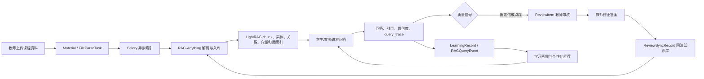

## Abstract

With the continuous growth of digital teaching resources in higher education, course materials such as lecture notes, slides, experiment guides, assignments, announcements and question-answering records have become increasingly heterogeneous and scattered. Although these resources provide an important foundation for autonomous learning, students still spend considerable effort locating relevant knowledge, while teachers face repetitive tutoring tasks. Large language models have strong natural language understanding and generation capabilities, but directly applying them to course question answering may lead to answers that are inconsistent with course materials, lack citations or contain hallucinations. To address these problems, this thesis designs and implements an AI teaching assistant platform based on large language models and retrieval-augmented generation.

The system adopts a front-end/back-end separated architecture. The front end is implemented with React, Vite, TypeScript and Tailwind CSS, providing role-specific interfaces for students, teachers and administrators. The back end is implemented with FastAPI, SQLAlchemy, Celery and Redis, supporting authentication, course management, file processing, question answering, teacher review and learning analytics. The knowledge processing layer takes RAG-Anything and LightRAG as the core frameworks, integrating MinerU, LibreOffice, OCR, vision-language models, embedding models, vector databases and graph databases to construct a course-oriented multimodal knowledge base. Before answering a question, the system performs rule-based intent routing, multi-turn context rewriting and query rewriting. Course-related questions are routed to the RAG-Anything main chain, where graph-enhanced and vector-based retrieval are executed. The answer, citations, confidence score, query trace and user feedback are stored for later review and evaluation.

To improve trustworthiness, a teacher review and knowledge feedback mechanism is introduced. Low-confidence answers and student-disliked answers can be escalated to teacher review. Teachers can inspect the original question, AI answer, feedback reason and supporting evidence, then submit corrected answers and optionally write them back to the course knowledge base. In addition, the platform builds student profiles from question logs, feedback, learning records, flashcard reviews and knowledge graph relations, providing learning progress, mastery radar charts, prompt keyword clouds and personalized recommendations. Finally, this thesis designs a comprehensive testing and evaluation plan covering functional testing, indexing quality, retrieval quality, generation quality, graph quality, ablation experiments and baseline comparison.

The proposed system demonstrates that an AI teaching assistant for course scenarios should not be merely a general chatbot. It should provide course-bounded knowledge retrieval, evidence-grounded generation, graph-based knowledge organization, human review and continuous knowledge updating. This work provides a feasible and extensible technical solution for intelligent tutoring and course knowledge services.

**Keywords**: Large Language Model; Retrieval-Augmented Generation; RAG-Anything; LightRAG; Knowledge Graph; Multimodal Parsing; AI Teaching Assistant

## 第一章 绪论

### 1.1 研究背景与问题提出

高校课程教学正在经历从线下资料分发到数字化资源组织的转变。围绕一门课程，教师通常会持续产生课件、讲义、实验指导书、课堂公告、作业说明、参考资料和答疑记录等资源。这些资料在数量上不断积累，在格式上也日益复杂，包括 PDF、PPT、Word、Markdown、图片、表格、扫描件以及课堂音视频等。资源规模的增长本应提升学生学习效率，但实际教学中却常出现资料分散、文件命名不统一、章节定位困难、跨资料知识关联弱等问题。学生在复习或完成作业时，往往需要在多个文件之间反复查找和理解，难以快速获得与问题直接相关的解释。

与此同时，教师在课程答疑过程中面对大量重复性问题。许多学生的问题集中于概念定义、过程解释、公式使用、实验步骤和作业要求等方面，人工逐一回答不仅消耗教师时间，也难以沉淀为可复用知识。对于规模较大的课程，传统答疑方式在响应速度、个性化支持、知识追溯和持续优化方面存在明显不足。

大语言模型的发展为智能助教系统提供了新的技术可能。大语言模型能够理解自然语言问题，生成结构化解释、总结课程内容、辅助学生复习，并可帮助教师生成教案、题目和学情分析。然而，通用大语言模型并不天然掌握某门课程的具体资料、教师要求和作业上下文。如果直接让模型回答课程问题，回答可能依赖模型参数中的通用知识，而不是课程资料本身；同时，模型输出通常缺少可核验引用，容易产生幻觉。教育场景对准确性、可追溯性和教学可信性要求较高，因此仅依赖通用生成能力难以满足真实课程使用需求。

检索增强生成技术为课程问答提供了较合适的解决思路。RAG 在生成回答前检索外部知识，将课程资料、知识图谱、历史问答和教师审核内容作为证据输入大语言模型，从而降低模型幻觉，提高回答与课程资料的一致性。进一步地，课程资料并不只有文本。课件中的图示、表格、公式、扫描页和视频截图也承载大量教学信息。RAG-Anything 在 LightRAG 的图增强检索基础上扩展复杂文档和多模态资料处理能力，使文本、图片、表格、公式等内容能够被统一组织、索引和检索，为构建课程场景下的多模态 RAG 助教平台提供了工程基础。

基于上述背景，本文设计并实现了一个面向课程教学场景的 AI 助教平台。系统以课程资料知识库为边界，以 RAG-Anything 和 LightRAG 为知识处理核心，以教师审核和学生反馈为质量控制机制，支持课程资料入库、智能问答、知识图谱展示、学习画像和个性化推荐等功能。

**图 1-1 传统课程资料使用方式与本文系统使用方式对比**

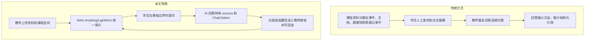

### 1.2 国内外研究现状

#### 1.2.1 大语言模型在教育场景中的应用

大语言模型在教育领域中的应用主要集中于智能问答、内容生成、作业辅导、作文评价、教学设计和个性化反馈等方向。相较于传统规则式问答系统，大语言模型具有更强的语义理解和表达能力，能够根据学生问题生成自然、连贯和分层次的解释。这使其适合作为课程答疑、概念讲解和学习建议生成的基础模型。

然而，教育应用中的大语言模型面临特殊约束。首先，课程回答必须与教师提供的资料、授课范围和作业要求一致；其次，学生需要知道回答依据来自哪里；再次，当模型不确定时，系统应能够提示风险或转交教师，而不是强行生成答案。因此，面向课程场景的大语言模型应用需要与外部知识库、引用溯源和人工审核机制结合。

#### 1.2.2 检索增强生成与课程问答

RAG 技术通过在生成前检索外部文档，将生成模型与知识库相结合。对于课程问答而言，RAG 可以把教材、课件、实验指导和教师答疑记录转化为检索证据，使回答受到课程资料约束。传统 RAG 通常包括文档切分、向量嵌入、相似度检索、上下文拼接和答案生成等环节，适合解决文本资料中的事实问答和概念解释问题。

但普通向量 RAG 也存在不足。一方面，单纯基于 chunk 相似度的检索容易忽略知识点之间的结构关系，面对跨章节、跨文档和多概念综合问题时可能召回不足；另一方面，许多课程资源包含图片、表格和公式，若只处理文本将导致重要信息丢失。此外，如果系统缺少用户反馈和教师修正机制，知识库一旦构建完成便难以根据教学实践持续改进。

#### 1.2.3 多模态资料解析与知识组织

多模态课程资料处理涉及文档版面分析、OCR、表格识别、公式识别、图像理解、语音识别和视频关键帧抽取等技术。多模态处理的目标不是简单地把非文本内容保存为附件，而是要将其转化为可检索、可引用、可与文本知识关联的内容单元。例如，课件中的流程图需要生成文字描述并与对应概念建立联系；实验视频需要通过 ASR 和关键帧描述转化为带时间戳的知识片段。

RAG-Anything 的价值在于提供一套面向复杂文档和多模态内容的统一处理框架。其上层工作流负责解析复杂文档、组织多模态内容项和封装查询入口，底层则复用 LightRAG 的实体、关系、向量索引和图检索能力。本文系统基于这一思想实现课程资料索引和问答链路。

#### 1.2.4 知识图谱与学习分析

知识图谱能够显式表示课程概念、章节、公式、实验步骤和资料之间的关系。在教学场景中，知识图谱不仅可以辅助检索，还可以帮助教师观察课程知识覆盖情况，帮助学生理解知识点之间的前置和关联关系。结合学生提问、错题、反馈和资料浏览记录，系统还可以进一步构建学生画像，识别薄弱知识点并生成个性化推荐。

在原型系统中，推荐算法不必一开始就依赖大规模训练数据。基于规则和可解释特征的推荐方法更适合教学系统初期落地。例如，系统可以结合近期提问主题、知识图谱邻接关系、错题记录、教师重点资源和资料质量分生成推荐结果，并向学生展示推荐理由。

### 1.3 研究目标与主要内容

本文目标是设计并实现一个课程场景下可用的 AI 助教平台，具体包括以下内容。

第一，构建课程资料管理与知识库入库流程。系统支持教师上传多类型课程资料，并通过异步任务完成文件存储、解析、索引和状态管理。

第二，构建基于 RAG-Anything/LightRAG 的 RAG 问答链路。系统通过意图路由、多轮上下文整理、查询改写、图增强检索和答案生成，为学生和教师提供课程上下文中的智能问答。

第三，构建课程知识图谱可视化模块。系统将 RAG-Anything/LightRAG 产生的实体和关系同步到业务图谱层，并在前端展示节点、关系、来源概览和一跳关联。

第四，设计学生反馈、教师审核和知识回流机制。系统支持学生点赞点踩，教师查看反馈、修正答案，并将高质量修正内容同步回课程知识库。

第五，构建学习画像与个性化推荐模块。系统统计学生提问、错题、闪卡复习、学习进度和提示词关键词，形成学习画像并支持周报、月报导出。

第六，设计系统测试和 RAG 效果评估方案。本文从功能、性能、索引质量、检索质量、生成质量、图谱质量、消融实验和 baseline 对比等角度规划评估流程。

### 1.4 研究方法与技术路线

本文采用文献研究、系统分析、原型实现和实验评估相结合的方法。首先分析大语言模型、RAG、LightRAG、RAG-Anything、多模态解析和学习分析等相关技术；其次根据学生、教师和管理员三类角色梳理系统需求；然后完成前后端系统、RAG 知识处理链路和审核回流机制的工程实现；最后设计评测集和实验指标，对系统功能与 RAG 效果进行验证。

系统技术路线如下：教师上传资料后，后端完成权限校验、文件保存和解析任务创建；异步任务调用 RAG-Anything 对课程资料进行解析、内容组织、嵌入和图构建；系统同步部分图谱信息到业务数据库供前端展示；用户提问时，系统先通过规则路由判断是否需要检索，若需要检索则构建独立问题并调用 RAG-Anything 主链；模型基于检索证据生成回答，并保存引用、置信度和查询追踪信息；学生反馈和低置信回答进入教师审核流程，教师修正后可回流知识库；学习分析模块基于行为记录生成画像和推荐结果。

**图 1-2 本文技术路线图**

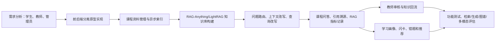

### 1.5 论文组织结构

本文共分为六章。第一章介绍研究背景、研究现状、研究目标、研究方法和技术路线。第二章介绍大语言模型、RAG、LightRAG、RAG-Anything、多模态解析、知识图谱和学习分析等相关理论。第三章从需求分析、总体架构、核心流程和数据库设计角度说明系统设计。第四章详细介绍课程资料入库、RAG 问答、知识图谱、教师审核回流、学习画像和前后端交互等关键模块实现。第五章设计系统测试与 RAG 效果评估方案，包括功能测试、性能测试、检索与生成指标、baseline 对比和消融实验。第六章总结全文工作并展望后续优化方向。

## 第二章 相关理论与关键技术

### 2.1 大语言模型与提示式问答

大语言模型是一类基于大规模语料训练的生成式模型，能够完成问答、摘要、推理和文本生成等任务。在本文系统中，大语言模型并不被视为唯一知识来源，而是作为“证据驱动生成器”使用。也就是说，系统要求模型尽量依据课程资料检索结果、知识图谱关系和教师审核内容生成回答，而不是仅凭模型参数知识自由发挥。

提示式问答技术在系统中主要用于答案生成、问题改写、图谱抽取、回答修复和教师审核辅助等场景。为降低幻觉风险，答案生成提示词需要明确规定：回答应基于证据；证据不足时应说明无法确定；引用应与回答内容对应；不得编造课程资料中不存在的要求。

### 2.2 检索增强生成技术

RAG 的核心流程包括文档预处理、文本切分、向量嵌入、索引构建、查询向量化、候选召回、证据组织和答案生成。与纯大模型问答相比，RAG 的优势在于能够引入外部知识库，使回答更贴合具体领域资料，并能提供引用依据。

课程 RAG 系统需要解决三个关键问题。第一，资料边界问题，即回答应来自当前课程资料，而不是其他课程或通用知识。第二，证据质量问题，即检索结果不仅要相关，还要足以支撑答案。第三，持续更新问题，即教师上传新资料或修正答案后，知识库应支持增量更新。

### 2.3 LightRAG 与 RAG-Anything

LightRAG 是一种图增强 RAG 框架，其思想是将文本块、实体和关系组织为图结构，并结合向量检索和图检索提升复杂问题的检索质量。与单纯向量检索相比，图增强检索更适合处理涉及多个概念、跨文档关系和上下位结构的问题。

RAG-Anything 在 LightRAG 基础上面向复杂文档和多模态资料进行扩展。它将文档解析、多模态内容项组织、图构建和查询流程封装为更高层的工作流，使 PDF、Office 文档、Markdown、图片、表格和公式等内容能够进入统一 RAG 链路。本文系统采用“业务后端 - RAG-Anything - LightRAG”的分层模式：业务后端负责课程、资料、会话和审核等应用逻辑；RAG-Anything 负责复杂文档解析和多模态内容组织；LightRAG 负责底层 chunk、实体、关系、向量索引和图结构检索。

### 2.4 多模态资料解析技术

课程资料中的文本、图片、表格、公式和音视频具有不同的信息表达方式。文档资料可通过版面分析、OCR 和结构化解析提取标题、段落、表格和公式；图片资料可通过 OCR 和视觉语言模型生成文字描述；音频资料可通过 ASR 转化为带时间戳文本；视频资料可通过音频转写和关键帧描述形成片段化内容。系统将这些解析结果统一为可检索文本或多模态内容项，再输入 RAG-Anything。

在实际实现中，系统对临时提问附件和正式课程资料采取不同策略。学生在问答时上传的图片可在当前轮次中通过视觉语言模型生成描述并参与检索，但默认不写入课程知识库；教师上传的正式资料则进入资料管理和索引任务流程，成为课程长期知识来源。

### 2.5 向量数据库、图数据库与对象存储

本文系统采用分层存储架构。关系数据库保存用户、课程、资料、会话、引用、审核项、学习记录和推荐结果等业务数据；对象存储或本地文件系统保存原始文件和解析产物；向量数据库保存文本块、实体描述和多模态文本化表示的嵌入向量；图数据库或业务图谱表保存实体和关系，用于检索增强和前端可视化。

这种分层设计有助于降低模块耦合。业务数据库不直接承担大规模向量相似度检索，向量数据库不保存完整业务权限关系，图数据库不承担文件管理职责。各存储之间通过课程 ID、资料 ID、chunk ID、实体 ID 和来源元数据建立关联。

### 2.6 意图路由、查询改写与多轮上下文

课程问答系统并非所有问题都需要进入 RAG 链路。例如，“你好”“你是谁”“我叫什么”“当前知识库有多少资料”等问题更适合由系统直接回答；教师选择“快速”模式时，也可以不检索课程资料而直接调用 LLM 生成通用回答。本文系统通过规则型意图路由判断问题是否需要检索，并支持自动、检索、快速和教学四种回答模式。

对于多轮对话，系统不会无条件将全部历史传入 RAG-Anything。后端首先根据最近会话判断当前问题是新主题、追问还是澄清，并将短追问改写为独立问题。例如，用户先问“TCP 慢启动是什么”，再问“它什么时候结束”，系统会构造“TCP 慢启动是什么。追问：它什么时候结束”作为检索问题。RAG-Anything 适配层进一步采用 compact history 策略，仅向 `aquery` 提交与当前问题有词项重叠或语义相关的少量历史，避免无关历史影响关键词抽取和检索结果。

### 2.7 教师审核与学习分析技术

教师审核机制用于提高 AI 助教回答的可控性。系统根据置信度、证据数量、学生负反馈等信号创建审核项，教师可查看原始问题、AI 回答、学生反馈和来源证据，并提交修正答案。修正答案可作为教师审核知识写入知识库，后续相似问题优先受益于教师经验。

学习分析模块则从学生提问、资料访问、闪卡复习、错题记录和反馈行为中抽取学习状态。系统可以统计学习时长、学习进度、知识掌握雷达图和历史提问关键词，并支持周报、月报导出。个性化推荐采用可解释规则，结合薄弱知识点、知识图谱关系、近期提问和资料质量生成推荐结果。

### 2.8 本章小结

本章介绍了系统涉及的大语言模型、RAG、LightRAG、RAG-Anything、多模态解析、存储架构、意图路由、查询改写、教师审核和学习分析等技术。这些技术共同构成了本文 AI 助教平台的理论与工程基础。

## 第三章 系统需求分析与总体设计

### 3.1 用户角色与应用场景

系统面向学生、教师和管理员三类用户。

学生主要使用课程学习、资料浏览、AI 问答、知识图谱查看、错题闪卡、学习画像和推荐功能。学生希望能够在课程上下文中快速获得解释，并能查看回答依据。当回答不准确时，学生可以点赞、点踩并填写反馈说明。

教师是课程知识维护者和回答质量监督者。教师需要创建课程、发布通知和作业、上传课程资料、查看解析状态、观察知识图谱、审核学生反馈、修正 AI 回答并将修正内容回流知识库。教师还需要查看学生学习情况和课程运行状态。

管理员负责系统级配置和运行维护，包括用户管理、课程管理、模型配置、知识库任务监控、系统状态查看和 RAG 指标统计。由于系统涉及 LLM、VLM、embedding、RAG-Anything、向量库、图数据库和异步任务队列，管理员端需要提供必要的可观测能力。

**表 3-1 用户角色、功能入口与关联数据实体**

| 角色 | 核心需求 | 主要前端入口 | 主要后端接口/服务 | 关联数据实体 |
|---|---|---|---|---|
| 学生 | 加入课程、查看资料、课程问答、查看图谱、错题闪卡、学习画像和推荐 | 学生工作台、学生课程空间、AI 助教、知识图谱、我的学习 | `classes`、`chat`、`student_learning`、`recommendations`、`flashcards` | `ClassMember`、`Material`、`ChatSession`、`ChatMessage`、`ChatCitation`、`LearningRecord`、`Flashcard`、`StudyMistake` |
| 教师 | 创建课程和班级、上传资料、查看解析状态、审核反馈、维护知识回流、查看学生情况 | 教师工作台、教师课程空间、资料管理、AI 审核、知识图谱 | `courses`、`classes`、`kb`、`reviews`、`analytics`、`tasks` | `Course`、`Class`、`Material`、`FileParseTask`、`ReviewItem`、`ReviewSyncRecord`、`KnowledgeEntity`、`KnowledgeRelation` |
| 管理员 | 用户管理、模型配置、RAG 存储配置、知识库任务监控和系统状态查看 | 管理员控制台 | `admin`、`users`、`kb`、`analytics` | `User`、`AdminSetting`、`FileParseTask`、`KBSpace`、`RAGQueryEvent` |

### 3.2 功能需求分析

系统功能需求可划分为六类。

第一，用户与课程管理。系统支持学生、教师和管理员登录，支持教师创建课程，学生通过邀请码加入课程，课程作为资料、问答、图谱和推荐的权限边界。

第二，课程资料管理。系统支持教师上传课程资料，记录文件名、类型、大小、上传者、所属课程、存储路径和解析状态。资料上传后触发解析任务，教师可查看任务状态和预览原始文本。

第三，RAG 问答。系统支持学生和教师在课程内进行多轮问答，支持自动、检索、快速和教学模式。课程相关问题进入 RAG-Anything 主链，快速问题直接调用 LLM，闲聊和系统状态问题由后端直接回答。

第四，知识图谱展示。系统将课程图谱节点和关系展示在前端，支持搜索、高亮、节点展开、一跳关联查看、来源概览和置信度筛选。图谱用于帮助学生理解知识结构，也帮助教师检查资料覆盖情况。

第五，审核与知识回流。学生点踩后可填写反馈原因，系统生成 ReviewItem；教师在反馈页面查看详情，填写修正答案并选择是否回流课程知识库。回流记录通过 ReviewSyncRecord 记录同步状态。

第六，学习分析与个性化推荐。系统统计学生学习行为，展示学习时长、学习进度、知识掌握雷达图、历史提示词云，并支持导出周报和月报。推荐模块根据学生画像和课程资源生成学习建议。

### 3.3 非功能需求分析

系统需要满足可用性、可靠性、可扩展性、安全性和可观测性要求。可用性方面，界面应符合学生和教师的操作习惯，复杂 RAG 处理过程应通过进度提示降低等待不确定性。可靠性方面，资料解析失败应记录错误并支持重试，问答失败应返回友好提示。可扩展性方面，模型、向量库、图数据库和对象存储应通过配置切换。安全性方面，所有课程资料和问答记录均需校验用户角色和课程权限。可观测性方面，系统应记录检索耗时、生成耗时、置信度、来源数量、查询改写状态和是否触发审核等指标。

### 3.4 系统总体架构

系统采用前后端分离的模块化单体架构。所谓模块化单体，是指后端以一个 FastAPI 服务作为统一运行入口，但在代码组织上按照接入层、业务服务层、AI 知识处理层、数据模型层和异步任务层划分模块。这样既避免了毕业设计阶段过早引入微服务带来的部署复杂度，又保留了后续将知识处理、模型调用或评测运维独立拆分的可能性。

从用户入口看，前端基于 React、Vite 和 TypeScript 实现，路由层按照角色划分为学生端、教师端和管理员端。学生端主要访问学生工作台、课程空间、AI 助教、知识图谱、错题闪卡和我的学习页面；教师端主要访问教师工作台、课程空间、资料管理、任务通知、知识图谱和审核反馈页面；管理员端主要访问用户管理、模型配置、RAG 状态和系统监控页面。前端通过 `services` 目录中的 API 封装访问后端 REST 接口，AI 问答过程中的阶段进度由后端以 progress 事件形式返回给前端展示。

后端接入层由 `main.py` 和 `api/v1` 路由组成，统一处理 CORS、异常、响应格式、健康检查、鉴权依赖和请求追踪。业务服务层位于 `services` 目录，包含用户认证、课程管理、知识库任务、聊天问答、教师审核、学习分析、推荐和管理员配置等服务。该层不直接实现底层 RAG 算法，而是负责编排业务对象、权限边界和调用顺序。例如，资料上传接口先写入 `Material` 和 `FileParseTask`，再通过 Celery 提交索引任务；聊天接口先保存 `ChatMessage` 和学习记录，再通过问题路由决定是否进入 RAG 主链。

AI 知识处理层以 `RAGAnythingAdapter` 为核心。索引阶段，适配器根据文件类型选择 `process_document_complete` 或 `insert_content_list` 入口：PDF、Word、PPT 等文档优先交给 RAG-Anything 官方流程解析，Markdown/TXT、图片以及音视频预处理结果以 content list 形式进入知识库。RAG-Anything 负责复杂文档解析和多模态内容组织，LightRAG 负责底层文本 chunk、实体关系、向量索引和图检索。查询阶段，`chat_service` 会先调用 `question_router`、`conversation_context_service` 和查询改写逻辑，再由适配器调用 LightRAG/RAG-Anything 官方查询接口，并将回答、来源、置信度和 query trace 标准化返回。

数据存储层由业务数据库、文件存储、索引文件存储和可选外部向量/图数据库共同组成。SQLAlchemy 管理用户、课程、班级、资料、解析任务、聊天消息、引用、审核项、学习记录、推荐事件和图谱投影等业务表；本地文件系统或 MinIO 保存原始课程资料和临时聊天附件；RAG-Anything/LightRAG 的索引文件存储保存官方索引产物；当配置启用外部存储时，LightRAG 可使用 Qdrant 作为向量存储、Neo4j 作为图存储，否则使用本地默认的 NanoVectorDB 和 NetworkX 存储。系统以 `class_id` 作为课程知识空间的重要隔离粒度，避免不同班级资料、会话和索引结果相互混淆。

异步与运维层主要服务于耗时任务和质量观测。资料索引通过 Celery worker 执行，Redis 用作 broker 和 result backend；索引任务状态写入 `FileParseTask`，并记录重试轮次、错误类型、chunk 数、图谱投影和索引质量信息。问答链路会写入 `RAGQueryEvent`，记录 RAG 引擎、查询模式、调用方法、是否使用多模态、是否 fallback、延迟、置信度、来源数量和查询改写信息。管理员端可基于这些数据查看系统健康状态、模型路由配置、RAG 存储配置和知识库任务状态。

**图 3-1 系统总体架构图**

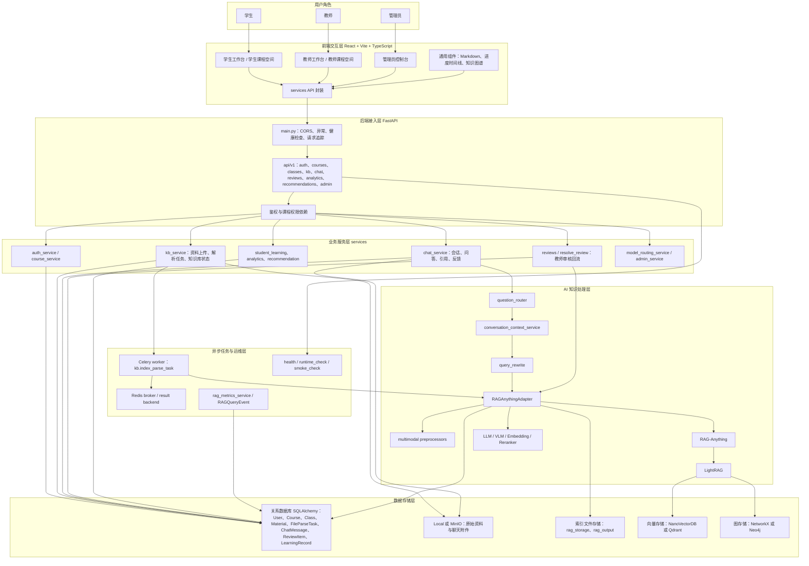

从图 3-1 可以看出，系统中存在两条最核心的数据流。第一条是资料入库流：教师上传课程资料后，系统完成权限校验、原始文件保存、资料解析、知识索引和图谱信息生成，使资料从普通文件转化为可检索、可引用的课程知识。第二条是问答检索流：学生或教师在课程空间中提问后，系统判断问题类型，必要时检索当前班级知识库，并生成带引用依据的回答。教师审核回流和学习推荐则依托这两条主链产生的资料状态、问答记录、引用来源、反馈结果和学习行为继续运行。

### 3.5 核心业务流程设计

#### 3.5.1 课程创建与班级管理流程

课程创建与班级管理是系统基础教学功能的入口。用户首先完成学生或教师账号注册，并在登录后进入对应角色工作台。教师可创建课程和班级，系统为班级生成邀请码，并将教师设为该班级管理者。学生通过邀请码加入班级后，才能访问该班级下的课程资料、通知任务、AI 助教、知识图谱和学习画像等功能。

在班级空间中，教师可以维护班级公告、发布通知和创建任务。通知发布后会推送给指定范围内的班级成员，学生可在通知中心查看并标记已读。教师创建作业、测验或考试任务后，可选择是否发布；学生端仅展示已发布任务，学生完成后提交文本或文件形式的作业记录。系统在这些基础教学操作中持续维护班级成员关系、任务提交状态和学习行为记录，为后续资料入库、智能问答、学习分析和个性化推荐提供基础数据。

**算法 3-1 课程创建与班级管理流程**

```text
Input: 用户注册信息、课程班级信息、邀请码、通知或任务内容
Output: 用户账号、班级空间、通知记录、任务提交记录
1. 学生或教师注册账号并登录系统
2. 教师创建课程和班级，系统生成班级邀请码
3. 学生输入邀请码加入对应班级空间
4. 教师维护班级公告并发布课程通知
5. 教师创建并发布作业、测验或考试任务
6. 学生查看已发布任务并提交完成结果
7. 系统记录成员关系、通知状态、任务提交和学习行为
```

**图 3-2 课程创建、加入班级与基础教学活动流程图**

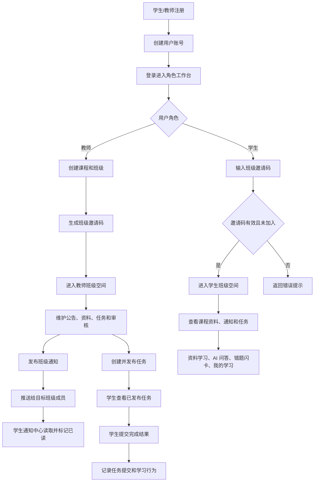

#### 3.5.2 课程资料入库流程

教师上传课程资料后，系统首先校验教师是否具有该班级的管理权限。校验通过后，系统保存原始文件和资料基本信息，并创建后台解析任务。资料解析过程不要求教师在页面停留等待，而是由系统在后台完成文件识别、内容解析、知识切分、索引构建和图谱信息生成。解析完成后，资料状态从“待处理”或“处理中”更新为“已索引”；若解析失败，则记录失败原因并允许后续重试。

该流程的设计目标是把“文件上传成功”和“知识库可检索”区分开。教师上传资料后，可以在资料管理页面查看每份资料的处理状态、解析摘要、知识片段数量和错误信息。只有完成索引的资料才会作为课程问答和知识图谱展示的有效知识来源，从而避免尚未解析或解析失败的资料影响学生问答结果。

**算法 3-2 课程资料入库流程**

```text
Input: 班级 ID、课程资料文件、教师身份
Output: 资料记录、解析状态、可检索知识内容
1. 校验教师是否具有该班级资料管理权限
2. 保存原始文件并记录资料名称、类型、大小和上传者
3. 创建资料解析任务，初始状态为待处理
4. 后台任务识别文件类型并解析资料内容
5. 将解析内容转化为可检索的知识片段
6. 构建课程知识索引并生成图谱展示所需信息
7. 更新资料处理状态、解析摘要和错误信息
8. 教师在资料管理页面查看处理结果
```

**图 3-3 课程资料上传与索引状态流转图**

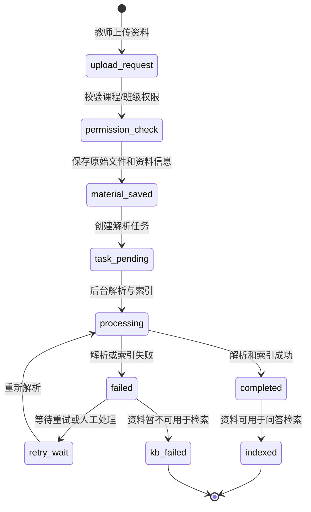

#### 3.5.3 AI 助教问答流程

用户在课程空间中发送问题后，系统首先确认会话所属班级，并保存用户问题和学习行为。随后系统根据问题内容、回答模式和附件情况判断是否需要检索课程知识库。对于问候、身份、系统状态等非课程问题，系统直接返回简短回复；对于不要求课程证据的快速问答，系统生成普通回答；对于课程相关问题，系统进入课程知识检索流程。

课程问答流程强调“先找证据，再生成回答”。系统会结合最近对话内容理解追问含义，将问题整理成相对完整的检索问题；若用户上传图片或附件，系统会将附件内容转化为当前轮可用的辅助信息。随后系统从当前班级的课程知识库中检索相关资料片段和图谱信息，并基于检索证据生成回答。回答返回给用户时，同时展示引用来源、置信度和反馈入口，便于学生核验依据，也便于后续教师审核。

**算法 3-3 课程问答流程**

```text
Input: 用户问题、班级 ID、回答模式、附件
Output: AI 回答、引用来源、置信度、反馈入口
1. 保存用户问题并记录学习行为
2. 根据历史对话判断当前问题是否为追问
3. 根据问题内容和回答模式判断是否需要课程检索
4. 若无需检索，则返回系统直接回复或快速回答
5. 若需要检索，则整理独立问题并处理附件信息
6. 从当前班级知识库中检索相关证据
7. 基于检索证据生成带引用的回答
8. 保存 AI 回答、引用来源和置信度
9. 若回答置信度较低，则进入教师审核流程
```

#### 3.5.4 教师审核回流流程

当 AI 回答置信度较低，或学生对回答点踩并填写反馈原因时，系统会将该问答标记为待审核。教师在审核页面查看学生原始问题、AI 回答、学生反馈和引用来源，判断回答是否需要修正。教师可以提交更准确的标准答案，并选择是否将修正内容回流到课程知识库。

教师审核流程形成了系统质量控制闭环。未回流的修正答案仅作为本次审核记录保存；选择回流的修正答案会作为课程补充知识进入知识库，后续学生提出相似问题时，系统可以优先利用教师确认过的内容。这样，学生反馈不只是一次性评价，而是能够推动课程知识库持续更新。

**图 3-4 教师审核与知识回流闭环图**

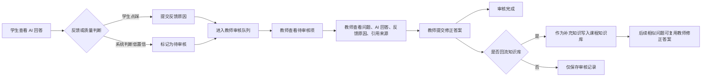

### 3.6 数据库设计

系统核心业务表包括用户表、课程表、班级表、班级成员表、通知表、任务表、提交记录表、课程资料表、解析任务表、聊天会话表、聊天消息表、引用表、审核项表、审核同步记录表、知识实体表、知识关系表、学习行为表、学生知识掌握表和推荐记录表。

聊天相关数据结构体现了 RAG 问答可追溯设计。ChatSession 保存会话边界；ChatMessage 保存用户消息和 AI 回答，其中 AI 消息包含 sources、suggestions、confidence、feedback 和 needs_review 等字段；ChatCitation 将回答与具体来源文件、页码、分数和 chunk ID 关联；ReviewItem 保存低置信或点踩回答的审核状态；ReviewSyncRecord 保存教师修正内容回流知识库的同步状态。

**图 3-5 核心业务实体关系图**

```mermaid
erDiagram
    USER ||--o{ COURSE : creates
    USER ||--o{ CLASS : teaches
    USER ||--o{ CLASS_MEMBER : joins
    COURSE ||--o{ CLASS : contains
    CLASS ||--o{ CLASS_MEMBER : has
    CLASS ||--o{ MATERIAL : owns
    CLASS ||--o{ TASK : publishes
    CLASS ||--o{ CHAT_SESSION : has
    CLASS ||--o{ KNOWLEDGE_ENTITY : projects
    CLASS ||--o{ KNOWLEDGE_RELATION : projects
    CLASS ||--o{ LEARNING_RECORD : records
    MATERIAL ||--o{ FILE_PARSE_TASK : parsed_by
    MATERIAL ||--o{ KNOWLEDGE_ENTITY : source
    TASK ||--o{ SUBMISSION : receives
    CHAT_SESSION ||--o{ CHAT_MESSAGE : contains
    CHAT_MESSAGE ||--o{ CHAT_CITATION : cites
    CHAT_MESSAGE ||--o| REVIEW_ITEM : triggers
    REVIEW_ITEM ||--o{ REVIEW_SYNC_RECORD : syncs
    KNOWLEDGE_ENTITY ||--o{ KNOWLEDGE_RELATION : source
    KNOWLEDGE_ENTITY ||--o{ KNOWLEDGE_RELATION : target
    USER ||--o{ LEARNING_RECORD : produces
    USER ||--o{ NOTIFICATION : receives
    USER ||--o{ SUBMISSION : submits
    USER ||--o{ STUDENT_CONCEPT_MASTERY : has
    CLASS ||--o{ STUDENT_CONCEPT_MASTERY : scopes
    CLASS ||--o{ RECOMMENDATION_EVENT : tracks
    USER ||--o{ RECOMMENDATION_EVENT : receives
```

### 3.7 本章小结

本章完成了系统需求分析与总体设计。系统以课程为知识边界，以 RAG-Anything 为知识处理主链路，以教师审核和学生反馈作为质量控制机制，并通过学习分析和知识图谱实现可解释的教学支持。

## 第四章 系统关键模块设计与实现

本章围绕系统关键模块的实现过程展开说明。章节组织按照课程资料入库、多模态索引构建、课程化知识抽取、RAG 检索问答、审核回流、知识图谱可视化、学习画像和前端交互的顺序展开。每个模块从功能定位、输入输出、处理流程、数据存储和实现结果等方面进行描述，使第三章的总体设计能够落实到具体模块实现。

### 4.1 课程资源管理与知识库构建

#### 4.1.1 模块功能概述

课程资源管理模块负责接收教师上传的课程资料，并将资料纳入课程知识库构建流程。该模块的输入包括资料文件、文件名称、MIME 类型、课程或班级标识以及上传教师身份信息；输出包括课程资料元数据记录、文件解析任务记录、知识库索引状态和前端可展示的资料预览信息。

在后端实现中，课程资料元数据记录用于保存文件名称、文件路径、文件类型、上传者、所属班级和知识库状态等字段；文件解析任务记录用于保存解析状态、解析摘要、文本片段、图谱同步信息和错误信息等字段。两类记录分别对应业务数据库中的资料表和解析任务表。系统完成权限校验和原始文件保存后，创建解析任务并提交至异步任务队列，由后台任务进程执行后续解析与索引构建。

#### 4.1.2 解析任务状态管理

资料解析任务采用状态字段记录处理进度。任务创建后状态为 `pending`，后台任务进程开始处理后状态更新为 `processing`，解析和索引完成后状态更新为 `completed`，处理异常时状态更新为 `failed`。任务记录中保存队列任务编号、当前处理阶段、重试次数、错误信息、开始时间、结束时间、文本分块数量、图谱节点数量、图谱边数量、解析摘要和质量提示等信息。

课程资料自身也维护知识库状态字段。资料上传后状态为 `pending`，解析进行中更新为 `processing`，索引完成后更新为 `indexed`，失败时更新为 `failed`。前端资料列表、教师端知识库页面和管理员监控页面均依据该状态展示资料处理进度。

#### 4.1.3 文件上传、存储与预览

系统将课程资料相关数据划分为原始文件、业务元数据和索引产物三类。原始文件保存于本地文件系统或对象存储，用于资料下载、页面预览、重新解析和引用溯源。业务元数据保存于关系型数据库，包括资料标题、文件路径、文件类型、上传者、班级、知识库状态、解析任务状态、解析摘要和前端展示所需的图谱投影信息。索引产物保存于 RAG-Anything/LightRAG 的索引文件存储或外部向量、图数据库，包括文本分块、文档状态、实体描述、关系描述、向量索引和图结构。

资料预览接口按照文件类型和解析结果确定展示内容。对于 TXT、MD、CSV、JSON、代码文件等可直接读取的文本类资料，系统读取原始文件文本作为预览内容。对于 PDF、PPT、图片、音频和视频等复杂资料，系统使用解析任务记录中的完整解析文本作为预览内容；当完整解析文本为空时，系统拼接解析任务中保存的文本分块作为预览内容。预览结果同时返回资料类型、预览来源和文本分块数量，供教师判断资料解析结果。

#### 4.1.4 文件解析与索引构建

系统根据文件扩展名和 MIME 类型选择资料入库方式。PDF、DOCX、PPT 等文档类资料使用文档处理入口，系统传入原始文件路径、解析输出目录、解析方法、资料标识和文件名称，由文档解析流程生成文本内容、多模态内容项和索引状态。MD 和 TXT 文件在进入索引前由预处理模块读取原始文本，并从 Markdown 文本中抽取表格等结构化内容项，随后以内容列表形式写入知识库。图片资料被构造为图像内容项，并保留图片路径、图像说明和来源元数据。音频资料通过 ASR 生成带时间戳的转写片段，视频资料通过 ASR 和关键帧抽取生成字幕片段、关键帧路径和视觉描述，随后统一以内容列表形式写入知识库。

索引构建过程包括内容解析、文本分块、实体关系抽取、向量化和图结构写入。系统首先将课程资料转化为可处理的文本或多模态内容项，再将文本内容切分为分块并写入文档状态存储。随后，模型从文本分块中抽取课程实体、实体关系和摘要信息，并将文本分块、实体描述和关系描述分别写入向量索引；实体与关系同时写入图存储。索引完成后，系统读取文本分块、内容项、关键词、实体、关系和处理质量信息，并同步到业务数据库中的解析任务记录和知识图谱投影表。

#### 4.1.5 数据分层与知识库同步

原始文件、索引文件和业务数据库记录在系统中承担不同职责。原始文件提供资料预览、教师核验、重新解析、引用溯源和评测集标注所需的数据来源；索引文件存储提供问答检索、向量召回、实体关系检索和图谱扩展所需的底层数据；业务数据库保存权限控制、任务展示、图谱可视化、问答引用和实验统计所需的结构化记录。系统在索引完成后将底层实体和关系同步为面向教学展示的业务图谱节点和边，使前端能够在不暴露底层索引细节的情况下展示课程知识结构。

**图 4-1 课程资料从上传到索引完成的数据流图**

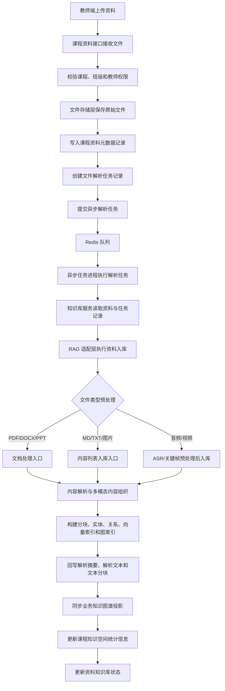

### 4.2 多模态原子单元与 RAG 索引实现

#### 4.2.1 原子单元设计与构建

课程资料进入检索系统前需要转换为粒度适中的知识单元。本文将资料解析后形成的最小可追溯知识对象定义为原子单元。原子单元包括文本段落、表格、公式、图片区域、音频转写片段和视频关键帧片段等类型。每个原子单元保存内容本体、来源文件、页码或时间戳、模态类型、原始位置和扩展元数据，用于后续向量嵌入、检索召回、引用溯源和前端展示。

文本原子单元来源于文档解析结果中的标题、段落、列表项、代码块和原生文本文件。系统在构建文本原子单元时保留章节层级、来源文件、页码和资料标识等信息，并将文本内容转换为 LightRAG 可处理的文本分块。文本分块是向量检索、实体抽取和关系构建的基本输入。

对于 Markdown 和 TXT 文件，系统先读取原始文本，再构造文本内容项；当文本中存在 Markdown 表格时，系统抽取表格结构并生成独立的结构化内容项。该处理方式保留了表格表头、行列关系和事实描述，减少普通文本切分对表格语义的破坏。

多模态原子单元用于表达表格、公式、图片、音频和视频等非普通段落内容。表格原子单元保存表格 Markdown、表头、行数据和表格事实描述。公式原子单元保存公式文本、LaTeX 或识别结果，并关联公式所在上下文。图片原子单元保存图片路径、OCR 文本、视觉描述和来源页码。音频原子单元保存 ASR 转写文本、开始时间、结束时间和来源音频路径。视频原子单元保存字幕转写片段、关键帧路径、OCR 文本、视觉描述和时间戳。

音频和视频资料在入库前由预处理模块转换为文本和图像内容项。音频资料经过 ASR 生成可检索的转写片段；视频资料先抽取音频并生成字幕转写，再抽取关键帧并生成视觉或 OCR 信息。转换后的内容项与普通文本分块共同进入后续索引流程，使系统能够依据转写文本和关键帧描述定位课程视频中的知识片段。

原子单元字段包括稳定标识、内容类型、模态类型、文本内容、来源文件、页码、时间戳、页面区域、图片路径、表格 Markdown、表格行数据、公式文本、OCR 文本和扩展元数据。稳定标识用于建立文本分块、引用来源和图谱节点之间的关联；模态类型用于区分文本、表格、公式、图片、音频和视频；扩展元数据用于保存解析器名称、来源位置、质量提示和跨模态关联信息。

#### 4.2.2 文本化表示、向量索引与形式化描述

在向量嵌入时，系统将可文本化表达的证据送入向量嵌入模型。普通段落以文本分块形式嵌入；表格以表格 Markdown、表头行列信息和表格事实描述形式嵌入；公式以公式文本、变量说明和所在上下文形式嵌入；图片以 OCR 文本和视觉描述形式嵌入；音频和视频以 ASR 转写文本、关键帧描述和时间戳上下文形式嵌入。原始图片文件、视频文件和 PDF 文件作为来源文件保存，用于预览、溯源和重新解析。

系统将非文本模态转换为带来源信息的文本化原子单元，再将文本化表示送入文本分块检索、实体关系抽取和图谱构建流程。回答引用表格、图片或视频片段时，前端依据原子单元中的来源文件、页码、时间戳或图片路径展示证据位置。

为了更清楚地描述索引对象，本文将第 $j$ 个原子单元形式化表示为：

$$
c_j=(id_j,m_j,x_j,d_j,l_j,p_j,r_j,\mu_j)
$$

其中，$id_j$ 表示系统生成的稳定原子单元标识；$m_j$ 表示模态类型，包括 text、table、formula、image、audio、video 等；$x_j$ 表示原始或结构化内容，如段落文本、表格 Markdown、公式 LaTeX、图片路径、ASR 文本或关键帧路径；$d_j$ 表示可检索的语义描述，如视觉描述、表格事实描述或公式变量解释；$l_j$ 表示定位信息，如文件名、页码、bbox、时间戳或帧序号；$p_j$ 表示来源与解析过程信息，包括资料标识、解析器、任务标识和原始来源标识等；$r_j$ 表示与其他原子单元或知识实体之间的局部关系；$\mu_j$ 表示扩展元数据，如 OCR 文本、表头、行数据、置信提示和质量标签等。

原子单元进入 LightRAG 前会进一步形成文本化检索片段：

$$
t_j = \operatorname{Textify}(c_j)=\operatorname{concat}(title_j,x_j,d_j,l_j,\mu_j)
$$

其中 $\operatorname{Textify}$ 表示结构化文本化函数。表格片段将表头、行列值和表格事实描述组织为同一文本表达；公式片段将公式、变量和上下文说明组织为同一文本表达；图片片段将 OCR 文本、视觉描述和图注组织为同一文本表达。$t_j$ 可继续切分为文本分块，也可作为实体关系抽取的输入证据。

向量索引保存可语义匹配的向量项，可表示为：

$$
z_i=(key_i,\mathbf{e}_i,type_i,text_i,payload_i)
$$

其中 $\mathbf{e}_i=\operatorname{Embed}(text_i)$。当 $type_i$ 表示文本分块时，$text_i$ 为文本化分块内容；当 $type_i$ 表示实体时，$text_i$ 为实体名称与实体描述；当 $type_i$ 表示关系时，$text_i$ 为关系关键词与关系描述。$payload_i$ 保存资料标识、原子单元标识、分块标识、页码、模态、来源文件和检索分数等信息。检索命中向量项后，系统依据 $payload_i$ 回溯到结构化来源和原始资料。

**算法 4-1 多模态原子单元构建流程**

```text
Input: 课程资料文件、文件类型、班级标识
Output: 内容项、文本分块
1. 根据扩展名和 MIME 类型识别资料类型
2. if PDF/DOCX/PPT:
       调用文档处理入口生成内容项和索引状态
3. else if MD/TXT:
       读取原始文本并抽取 Markdown 表格内容项
4. else if 图片:
       构造图像内容项并保留图片路径和来源信息
5. else if 音频:
       调用 ASR 生成带时间戳转写文本
       将转写片段构造为音频内容项
6. else if 视频:
       抽取音频并执行 ASR
       抽取关键帧并生成视觉/OCR 信息
       将字幕片段和关键帧构造为视频内容项
7. 对表格、公式、图片区域补充结构化字段
8. 为每个内容项生成稳定标识和来源元数据
9. 将内容项转换或合并为检索用文本分块
```

**图 4-2 多模态资料转化为原子单元的流程图**

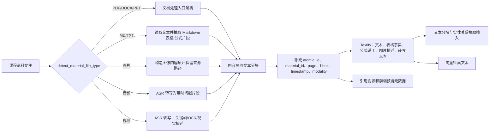

#### 4.2.3 RAG 索引框架与课程知识空间

在原子单元构建完成后，系统需要将内容项接入 RAG-Anything 和 LightRAG 组成的索引框架。本节将资料预处理、内容项组织、文本分块、实体关系抽取、向量索引和图结构维护放在同一模块中描述，以体现课程资料从多模态内容到可检索知识结构的完整转换过程。

系统在业务后端和 RAG-Anything 之间设置适配层。适配层负责课程知识空间初始化、模型配置读取、索引目录配置、资料入库调度、问答请求封装和结果标准化。每个班级使用独立的索引文件存储目录和解析输出目录，课程资料、检索会话和图谱投影均以班级标识作为隔离粒度。

#### 4.2.4 RAG-Anything 与 LightRAG 的职责分工

RAG-Anything 在系统中承担多模态资料组织和多模态查询接入职责。其处理对象包括文档、图片、表格、公式以及由系统预处理得到的音视频内容项。资料入库阶段，RAG-Anything 接收原始文档或内容列表，并组织出可进入 LightRAG 索引流程的内容项；问答阶段，RAG-Anything 接收文本问题、图片描述和附件上下文，并将查询请求转交至底层检索流程。

LightRAG 在系统中承担知识索引和检索执行职责。其核心数据包括文本分块、实体描述、关系描述、实体向量、关系向量、文本分块向量和图结构。资料入库阶段，LightRAG 完成文本分块、实体关系抽取、向量写入和图结构维护；问答阶段，LightRAG 完成关键词抽取、文本召回、实体召回、关系召回、图谱扩展和检索上下文组合。

RAG-Anything 与 LightRAG 的分工使系统能够同时处理多模态资料组织和图增强检索。RAG-Anything 负责将课件、扫描文档、图片、表格、公式和预处理后的音视频片段纳入统一知识空间；LightRAG 负责构建文本分块、实体、关系、向量索引和图结构，并在问答阶段完成混合检索。

#### 4.2.5 入库查询流程与底层索引存储

入库阶段的数据流为：课程资料经过文件类型识别和必要预处理后进入 RAG-Anything；RAG-Anything 输出内容项和解析状态；LightRAG 将内容项转换为文本分块，并基于文本分块抽取实体和关系；向量嵌入模型对文本分块、实体描述和关系描述进行向量化；索引文件存储或外部向量、图数据库保存向量项和图结构。查询阶段的数据流为：系统构造有效查询文本，RAG-Anything 接收查询请求，LightRAG 进行关键词抽取和混合检索，并将检索到的文本、实体、关系和局部图结构组合为模型上下文。

底层索引存储维护文本分块、文档状态、实体、关系、向量项和图结构。采用本地默认存储时，文本分块和文档状态保存为键值或 JSON 文件，向量项保存于 NanoVectorDB，图结构保存于 NetworkX 文件；启用外部存储时，向量项可写入 Qdrant，图结构可写入 Neo4j。业务数据库中的知识图谱表保存从底层图谱同步得到的教学展示投影。底层图谱用于检索和上下文组合，业务图谱用于前端展示、节点详情、来源概览和学习画像关联。

LightRAG 的索引机制将文本向量检索与图结构检索结合。索引阶段，系统先将文本切分为分块，再基于抽取提示生成实体记录和关系记录。实体记录包含实体名称、实体类型和实体描述；关系记录包含源实体、目标实体、关系关键词和关系描述。实体和关系进入图结构后，同时以描述文本的形式进入向量索引，使查询能够同时命中文本证据、概念节点和关系说明。

查询阶段采用高层关键词和低层关键词两类检索线索。高层关键词表示主题、意图和抽象概念，主要用于关系检索和全局知识发现；低层关键词表示具体实体、术语和细节，主要用于实体检索和文本分块召回。系统在外层完成查询改写和焦点词补充，再将有效查询文本提交给 LightRAG 的关键词抽取流程。

**图 4-3 业务后端、RAG-Anything 与 LightRAG 的分层关系图**

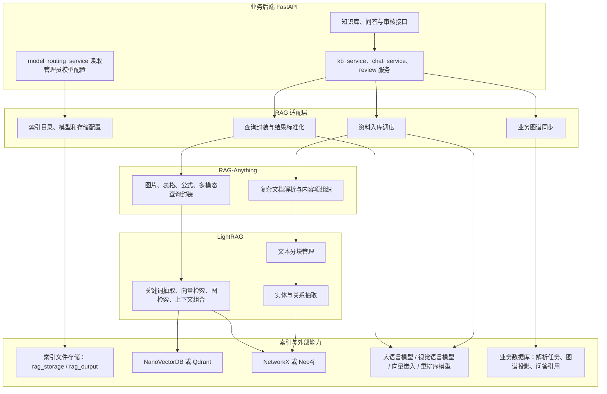

### 4.3 课程化知识抽取与知识图谱构建

#### 4.3.1 提示词设计与知识抽取约束

系统在知识抽取和答案生成提示词中加入课程场景约束，用于限定实体类型、关系语义、证据边界和回答风格。课程实体类型包括课程概念、先修知识、学习目标、公式、定理、算法、例题、习题、易错点、实验步骤、工具、数据集和考核点等。课程关系语义包括先修、组成、解释、公式使用、算法应用、案例说明、考查、因果、对比、等价和相关等类型。

实体关系抽取沿用 LightRAG 的官方联合抽取模板。实体记录由实体名称、实体类型和实体描述组成；关系记录由源实体、目标实体、关系关键词和关系描述组成。系统追加的课程约束要求模型优先抽取具有教学意义且能够由资料内容支撑的概念、公式、算法、实验步骤、例题和考核点，并过滤文件名、路径、页码、chunk 编号、随机哈希和上传索引过程产生的技术性标识。

系统涉及的提示词配置如表 4-1 所示。表中“追加”表示保留 LightRAG 或 RAG-Anything 官方模板的字段、分隔符、JSON 结构和调用流程，仅在模板末尾补充课程化指导语；“单独传入”表示由业务后端构造提示词，并在对应场景中作为参数或普通模型调用消息传入。

**表 4-1 系统课程场景提示词配置**

| 提示词类型 | 作用阶段 | 组成方式 | 主要约束内容 |
|---|---|---|---|
| LightRAG 回答生成提示词 | RAG 检索后的答案生成 | 官方 `rag_response`、`naive_rag_response`、`mix_rag_response` 模板 + 课程回答指导语 | 要求回答优先依据课程资料，证据不足时说明不确定；学生端强调循序渐进解释，教师端强调教学设计价值 |
| LightRAG 实体关系抽取提示词 | 索引阶段的实体、关系和描述汇总 | 官方实体关系抽取、继续抽取和描述汇总模板 + 课程知识图谱抽取指导语 | 限定优先实体类型为课程概念、先修知识、学习目标、公式、定理、算法、例题、习题、易错点、实验步骤、工具、数据集和考核点；限定优先关系语义为先修、组成、解释、公式使用、算法应用、案例说明、考查、因果、对比、等价和相关；过滤文件名、路径、页码、chunk 编号、UUID、哈希和泛化词 |
| RAG-Anything 多模态解析提示词 | 图片、表格、公式和通用多模态内容解析 | 官方 `vision_prompt`、`image_prompt`、`table_prompt`、`equation_prompt`、`figure_prompt`、`generic_prompt` 模板 + 多模态教育指导语 | 要求识别可见文字、标题、坐标轴、图例、变量、单位、步骤和学习相关关系，并关注课程概念、公式、算法、例题、易错点和实验步骤 |
| 查询阶段角色化提示词 | 课程问答查询参数 | 后端按用户角色生成，底层接口支持 `user_prompt` 时单独传入 | 学生角色强调理解思路、关键概念和易错点；教师角色强调课堂讲解重点、学生困惑位置和补充练习建议 |
| 本轮图片附件理解提示词 | 用户聊天时上传图片的当前轮辅助理解 | 后端单独调用视觉模型生成图片描述 | 要求提取图片中的题目内容、可见文字、图示和解题线索；该结果作为当前轮查询辅助信息，不默认写入课程知识库 |
| 答案修复提示词 | 回答出现乱码、重复或结构异常后的质量修复 | 后端基于已检索资料单独构造修复提示词 | 要求仅依据已检索课程资料重新生成简体中文回答，先给结论，再用 2 至 4 个要点解释，资料不足时明确说明 |
| 快速回答与教师工具提示词 | 不进入课程知识库检索的直接回答场景 | 后端单独构造系统提示词 | 快速回答不得声称来自课程资料；教师工具模式面向教师输出结构化教学内容，系统上下文不足时提示需要教师补充 |

#### 4.3.2 答案生成、模板兼容与角色化约束

答案生成提示词强调证据约束和角色差异。模型根据检索到的课程资料回答问题，证据不足时输出资料依据不足的提示。学生端回答侧重概念解释、步骤说明和易错点提示；教师端回答侧重教学设计、课堂讲解重点、学生困惑点和补充练习建议。回答修复流程仅在回答严重乱码、结构缺失、表格证据需要重组或回答与证据呈现不匹配时触发。

系统采用模板追加方式实现课程化提示词配置。后端初始化 RAG 适配层时，对回答模板、实体抽取模板、关系抽取模板、实体描述总结模板，以及视觉、图片、表格、公式和通用多模态模板追加课程化指导语。该方式保留底层框架所需的字段名、分隔符、JSON 结构和循环抽取格式，同时增加课程实体、教学证据和角色化回答要求。

系统同时向底层检索框架传入回答语言和课程实体类型集合。实体类型集合包括课程概念、先修知识、学习目标、公式、定理、算法、例题、习题、易错点、实验步骤、工具、数据集和考核点等。该集合用于索引阶段的实体类型约束，也用于业务图谱同步阶段的类型映射。

查询阶段的角色化提示词根据用户身份生成。学生角色提示词要求回答循序渐进、说明关键概念、提示易错点，并避免直接代替学生完成作业；教师角色提示词要求回答体现教学设计价值、课堂讲解重点、学生困惑点和补充练习建议。系统在查询参数支持角色提示词时将该内容传入检索生成流程。

底层回答模板包含上下文、知识图谱数据、文档分块和引用列表等字段。系统将课程化要求写入附加指令位置，使模型在保留引用格式和上下文组织方式的前提下生成教学化回答。对于不经过图谱的朴素检索模式，回答模板仅使用文档分块作为证据来源，并保留引用输出格式。

多模态提示词分别约束图片、表格和公式的解析输出。图片解析输出包含详细视觉描述和实体信息；表格解析输出包含表格结构、列含义、关键数据、模式和关系；公式解析输出包含数学含义、变量定义、运算过程、应用领域和相关概念。课程化追加内容要求模型识别课程概念、学习目标、公式、算法、例题、易错点和实验步骤。

**图 4-4 提示词追加与底层模板协同流程图**

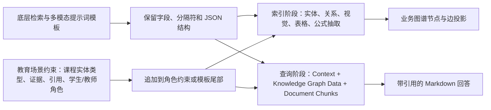

#### 4.3.3 图谱构建概述与节点边定义

前述提示词约束决定了系统抽取哪些实体、关系和证据字段，本节进一步说明这些抽取结果如何组织为课程知识图谱。图谱构建既服务于问答检索中的关系扩展，也服务于前端知识结构展示和学生学习画像分析。

系统知识图谱包括文本知识图谱和跨模态知识图谱。文本知识图谱由文本分块中抽取的课程概念、术语、公式、算法、实验步骤和考核点构成，边表示实体之间的定义、组成、先修、比较和使用关系。跨模态知识图谱在文本实体基础上连接图片、表格、公式、音频片段和视频关键帧，用于表达文本实体与多模态证据之间的说明、出现、比较和来源关系。

文本知识图谱可表示为：

$$
G_t=(V_t,E_t)
$$

其中，文本实体节点 $v\in V_t$ 可以表示为：

$$
v=(name,type,desc,alias,S_v,\gamma_v)
$$

$name$ 为规范化实体名，$type$ 为课程实体类型，$desc$ 为实体描述，$alias$ 为别名集合，$S_v$ 为支持该实体的来源集合，$\gamma_v$ 为抽取质量或置信度估计。文本关系边 $e\in E_t$ 可表示为：

$$
e=(h,t,rel,kw,desc,S_e,w_e)
$$

其中 $h$ 和 $t$ 分别为头尾实体，$rel$ 为关系类型，$kw$ 为关系关键词，$desc$ 为关系说明，$S_e$ 为证据来源集合，$w_e$ 为关系权重。系统在业务同步时将底层关系关键词映射为教学关系类型，包括先修、组成、解释、使用公式、例题说明、考核和对比等关系。

跨模态知识图谱可表示为：

$$
G_m=(V_m,E_m)
$$

其中 $V_m=V_t\cup U$，$U$ 表示图片、表格、公式、音频片段和视频关键帧等多模态节点集合。跨模态边 $E_m$ 描述文本实体与多模态原子单元之间的说明、定义、出现、解释、比较、来源和归属关系。TCP 拥塞窗口图可分别连接“慢启动”和“拥塞避免”两个概念节点；吞吐量公式可连接“吞吐量计算”概念节点和公式所在章节节点。

#### 4.3.4 文本图谱与跨模态图谱构建

文本知识图谱构建包括实体关系获取、低质量项过滤、实体归并和业务图谱同步四个步骤。系统首先从解析和索引结果中读取文本分块、关键词、实体和关系；随后过滤文件名、随机哈希、过短词、页码和无教学意义符号；再对同名实体和别名实体进行基础归并；最后将实体描述、关系描述和证据来源同步到业务图谱表，供前端展示和学习分析使用。

跨模态知识图谱基于多模态原子单元构建。图片、表格、公式和视频片段在入库前转换为带文本描述的内容项，因此可以同时作为向量检索对象、图谱节点和引用证据。表格节点保存表格 Markdown、表头、行数据和事实描述；图片节点保存 OCR 文本、视觉描述和截图路径；公式节点保存公式文本和变量说明。系统依据来源页码、相邻文本、标题层级和实体共现信息建立跨模态连接。

视觉语言模型用于生成图片和截图的语义描述。OCR 提供图片中的可见文字，视觉语言模型补充流程图、曲线图、拓扑图和实验截图的整体含义。对于 TCP 拥塞窗口变化图，视觉描述包含坐标含义、窗口变化趋势、慢启动阶段、拥塞避免阶段和关键事件等信息。该描述作为图片原子单元的文本化表示参与向量嵌入、实体抽取和检索。

跨模态图谱中的描述包括原子单元描述和图谱节点描述两类。原子单元描述保存图片详细说明、表格事实描述和公式变量解释，参与向量嵌入和证据检索；图谱节点描述保存课程概念层面的概括性说明，用于图谱可视化和图检索。系统将详细视觉描述作为证据文本保存，将抽象后的课程概念说明作为节点描述。

#### 4.3.5 图谱合并、过滤与前端投影

文本图谱与跨模态图谱的合并可以表示为：

$$
G=Merge(G_t,G_m)=(V,E)
$$

合并过程包括实体规范化、来源聚合、边类型映射和质量过滤。实体规范化处理大小写、空白符、全角半角和中英文别名，合并明显重复节点；来源聚合将来自多个文本分块、表格、公式或图片的来源信息合并到同一实体或关系；边类型映射将底层关系关键词、共现关系和跨模态关系映射为课程侧关系类型；质量过滤去除文件名、UUID、页码、随机哈希、泛化词和证据不足的边。合并后的 $G$ 支持前端可视化和辅助检索，并保留与底层索引图谱的来源联系。

图谱同步到前端时，系统构造面向教学展示的节点和边。节点包含名称、类型、描述、来源概览、置信度估计、邻居数量和学生掌握状态；边包含关系类型、描述、来源材料和权重。来源概览将底层来源标识映射为原始文档名、页码或资料标题，便于教师核验图谱节点的资料依据。

**图 4-5 文本知识图谱与跨模态知识图谱关系图**

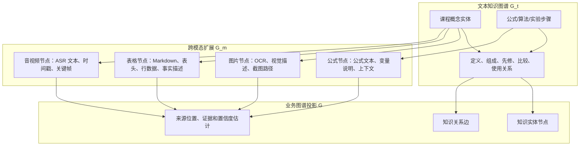

**图 4-6 图片原子单元连接课程概念示意图**

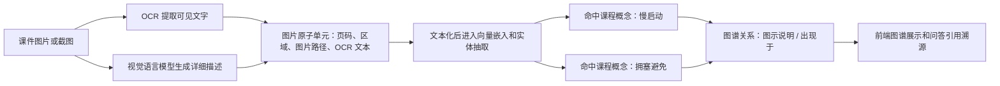

### 4.4 问题路由、查询改写与混合检索实现

#### 4.4.1 问题路由与回答模式

系统在问答请求进入检索流程前执行问题路由。路由模块根据规则将问题划分为问候、身份询问、能力询问、知识库状态、用户信息、无关问题、快速问答、教师工具和课程检索等类型。问候、身份询问和知识库状态类问题由后端直接生成回答；通用开放问题可进入快速问答；与课程资料相关的问题进入 RAG 检索流程。

前端提供自动、检索、快速和教学四种问答模式。自动模式由系统根据问题内容选择路由；检索模式要求回答依据课程资料，适用于学生复习和教师核验资料；快速模式直接调用大模型生成通用回答，适用于不需要课程证据的开放性问题；教学模式面向教师备课、教案、课堂活动和教学建议生成，并在需要时结合课程上下文。

#### 4.4.2 多轮上下文整理与查询改写

课程检索类问题进入检索前需要形成独立问题。多轮上下文模块读取最近若干轮会话，判断当前问题属于新主题、追问或澄清。对于包含指代词或省略主语的追问，系统提取最近用户问题作为上下文锚点，并生成包含主题信息的独立问题。例如，用户在讨论 TCP 慢启动后继续提问“那它什么时候结束”，系统将查询文本整理为围绕 TCP 慢启动结束条件的完整问题。

查询改写模块根据问题触发词识别定义、比较、过程、公式计算、作业帮助、示例应用、因果解释和总结复习等意图，并生成检索焦点词。比较类问题补充相同点、不同点和适用场景等焦点词；公式计算类问题补充变量、推导、单位和计算步骤等焦点词；涉及 TCP/IP、三次握手和拥塞控制等课程领域词的问题补充领域扩展词。最终提交给检索流程的有效查询文本由独立问题和简短检索焦点词组成。

关键词处理包括业务层焦点词生成和检索层关键词抽取。业务层查询改写生成检索焦点词和问题变体，用于增强课程场景下的召回；检索层关键词抽取生成高层关键词和低层关键词，用于文本分块、实体、关系和图结构检索。业务层处理结果作为检索层输入，不改变底层混合检索的关键词抽取机制。

历史消息筛选用于控制多轮对话对检索的影响。系统先在业务层构建最近会话摘要和独立问题，再根据当前查询文本筛选少量相关历史消息。筛选依据包括与当前问题存在词项重叠、消息长度在限制范围内、回答内容可读等条件。最终提交给检索流程的历史消息数量和总字符数均受到限制，以减少旧主题、闲聊内容和模式切换信息对关键词抽取的干扰。

#### 4.4.3 查询处理形式化描述

形式化地，用户原始问题记为 $q$，多轮上下文整理后得到独立问题 $q_s$，查询改写产生的焦点词集合记为 $F=\{f_1,f_2,\cdots,f_n\}$，最终提交给 RAG-Anything/LightRAG 的问题为：

$$
q_e=q_s \oplus \operatorname{Compact}(F)
$$

其中 $\oplus$ 表示轻量拼接，$\operatorname{Compact}$ 表示去除泛化词、噪声词和与原问题无关的扩展词。检索层关键词抽取随后在 $q_e$ 上生成：

$$
K_h,K_l=\operatorname{KeywordExtract}(q_e)
$$

其中 $K_h$ 为高层关键词集合，偏向主题和意图；$K_l$ 为低层关键词集合，偏向实体和细节。业务层焦点词集合 $F$ 用于增强有效查询文本，检索层关键词集合 $K_h,K_l$ 直接参与图谱和向量检索。

**算法 4-2 从用户问题到有效查询文本的处理流程**

```text
Input: 原始问题、聊天历史、回答模式、附件
Output: 问题路由、有效查询文本、筛选后的历史消息
1. 根据问题内容判断问答路由
2. if route 不需要检索:
       返回直接回答或快速生成结果
3. 构建多轮会话上下文
4. 判断当前问题是否为追问或澄清
5. 若是追问，则将最近用户问题作为上下文锚点生成独立问题
6. 分析独立问题的问题意图
7. 根据意图生成检索焦点词和领域扩展词
8. 拼接独立问题与紧凑检索词，得到有效查询文本
9. 根据有效查询文本从历史消息中筛选相关消息
10. 将有效查询文本与筛选后的历史消息提交给检索流程
```

**图 4-7 问题路由、上下文改写与两级关键词处理流程图**

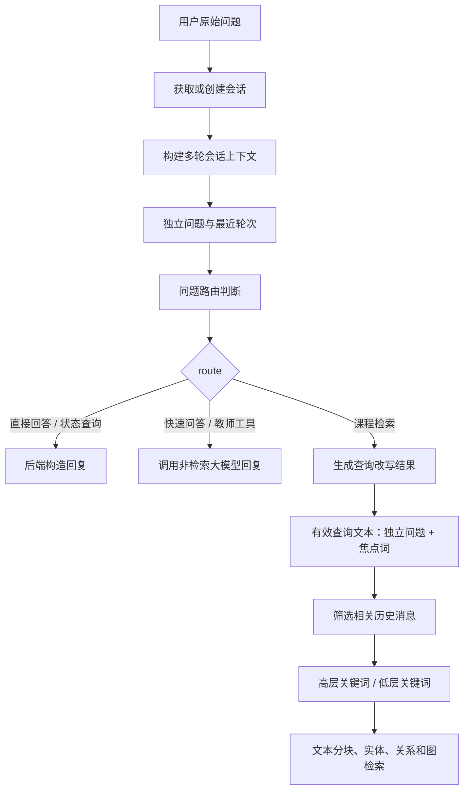

#### 4.4.4 检索输入、接口调用与混合检索

问题经过路由、上下文整理和查询改写后，课程相关问题进入检索生成流程。本节继续说明有效查询文本如何连接课程知识库，并通过文本分块召回、实体关系召回和图结构扩展形成可供模型使用的检索上下文。

课程检索类问题进入检索生成流程后，系统连接对应班级的知识库实例，并检查检索引擎状态。查询输入由有效查询文本、图片描述、附件文本和筛选后的历史消息组成。普通文本问题以有效查询文本作为主要输入；带图片的问题附加视觉语言模型生成的图片描述；带其他附件的问题附加附件解析得到的文本内容。临时附件内容仅参与当前轮问答，不写入课程正式知识库。

查询接口调用按照文本检索优先、多模态检索补充的策略执行。普通文本问题优先调用支持引用返回的 LightRAG 查询路径，并传入检索模式、引用开关、筛选后的历史消息和角色化回答约束；当该路径不可用时，系统调用 RAG-Anything 的通用查询入口。带图片的问题优先调用多模态查询入口，使图片描述和课程知识库内容共同参与回答生成。

混合检索由关键词抽取、文本分块召回、实体召回、关系召回和图结构扩展组成。系统首先从查询文本中抽取高层关键词和低层关键词；随后基于查询向量召回语义相近的文本分块；接着基于实体向量和关系向量召回相关概念节点和关系说明；最后以召回到的实体和关系为种子进行局部图扩展。图片、表格、公式、音频和视频片段经过文本化后参与文本分块召回，并可通过跨模态关系参与图检索。

检索上下文由候选证据集合在 token 预算内组合得到。上下文内容包括相关文本分块、相关实体描述、相关关系描述和局部图结构信息。表格问题的上下文包含表格事实描述，图片问题的上下文包含 OCR 文本和视觉描述。生成模型根据用户问题、检索上下文、角色约束和历史消息生成回答。

#### 4.4.5 混合检索形式化描述与结果后处理

可以将混合检索过程表示为：

$$
R_c=\operatorname{TopK}_{c_i\in C}\operatorname{sim}(\operatorname{Embed}(q_e),\operatorname{Embed}(t_i))
$$

$$
R_v=\operatorname{TopK}_{v_i\in V}\operatorname{sim}(\operatorname{Embed}(q_e\cup K_l),\operatorname{Embed}(name_i\oplus desc_i))
$$

$$
R_e=\operatorname{TopK}_{e_i\in E}\operatorname{sim}(\operatorname{Embed}(q_e\cup K_h),\operatorname{Embed}(kw_i\oplus desc_i))
$$

其中 $R_c$ 表示文本分块召回结果，$R_v$ 表示实体召回结果，$R_e$ 表示关系召回结果。随后图检索以 $R_v$ 和 $R_e$ 为种子进行局部扩展：

$$
R_g=\operatorname{Expand}(G,R_v,R_e,h)
$$

其中 $h$ 表示扩展跳数或预算。最终候选证据集合为：

$$
R=R_c\cup R_v\cup R_e\cup R_g
$$

系统在 token 预算内将候选证据组织为模型上下文。上下文包括知识图谱实体数据、知识图谱关系数据、文档分块和引用文档列表。每个文本分块带有引用标识，回答中的事实可与引用标识建立对应关系。因此，最终输入生成模型的内容可以表示为：

$$
\mathcal{P}=\operatorname{Prompt}_{rag}(q_e,\mathcal{C},u,hist)
$$

其中 $\mathcal{C}=\operatorname{Assemble}(R,B)$ 表示在 token 预算 $B$ 下组合后的证据上下文，$u$ 表示角色化回答约束，$hist$ 表示经过筛选的对话历史。生成模型输出答案为：

$$
a_0=\operatorname{LLM}(\mathcal{P})
$$

系统随后解析 $a_0$ 中的引用标记和引用列表，将其映射为结构化来源记录和问答引用记录。

检索生成流程返回后，系统对结果进行标准化处理。标准化字段包括回答正文、引用来源、回答可信度估计和查询追踪信息。系统根据表格结构补充表格证据，对引用来源进行排序、资料元数据补全和已删除资料过滤，并根据回答中的引用标记调整来源展示顺序。当回答为空、来源均来自已删除资料或检索流程不可用时，系统返回资料依据不足或服务不可用提示。

**算法 4-3 RAG-Anything 主链检索与答案生成流程**

```text
Input: 有效查询文本、筛选后的历史消息、附件、班级标识、用户角色
Output: 回答正文、引用来源、可信度估计、查询追踪信息
1. 构造查询文本：有效查询文本 + 图片描述 + 附件上下文
2. 根据查询文本筛选历史消息
3. 加载课程对应的 RAG-Anything 实例并检查查询引擎状态
4. if 普通文本问题:
       优先调用支持引用返回的文本查询路径
   else if 带图片问题:
       优先调用多模态查询路径
5. 检索层执行关键词抽取、文本分块检索、实体检索、关系检索和图扩展
6. 组合检索上下文并调用大模型生成 Markdown 回答
7. 标准化回答正文、引用来源和可信度估计
8. 补充表格证据、重排引用来源、过滤已删除资料
9. 根据回答中的 [1][2] 标记映射结构化引用
10. 必要时触发回答修复
11. 保存查询追踪信息，返回最终回答和引用
```

**图 4-8 RAG-Anything/LightRAG 查询主链图**

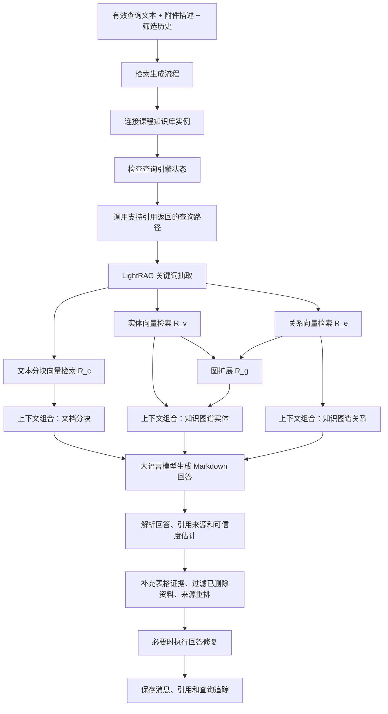

### 4.5 答案生成、引用溯源与审核回流

#### 4.5.1 答案生成与引用溯源

答案生成阶段由大语言模型根据用户问题、检索上下文、角色约束和教育场景提示词生成 Markdown 回答。回答内容包含概念解释、分点说明、必要步骤和资料引用。学生端回答侧重可理解性和学习提示；教师端回答侧重资料定位、教学重点和审核诊断信息。

引用溯源由回答正文中的引用标识和结构化来源记录共同完成。回答正文使用 `[1]`、`[2]` 等引用标识标注证据位置；结构化来源记录保存来源文件名、文件类型、页码、文本分块标识、原子单元标识、检索分数和来源元数据。系统将结构化来源记录写入问答引用表，前端依据该表展示引用卡片、资料跳转入口和审核证据。

#### 4.5.2 回答修复与质量记录

回答修复属于异常处理环节。系统仅在回答严重乱码、可读性不足、基本结构缺失、结构化表格证据需要重组或回答与证据呈现明显不匹配时触发修复。回答内容已经完整且引用结构可解析时，系统保存该回答并进入引用映射和质量记录流程。

回答生成完成后，系统保存 AI 消息、引用来源、回答可信度估计和查询追踪元数据。可信度估计由返回结果中的置信度或分数、来源数量、来源质量和证据覆盖情况综合得到，属于启发式质量指标。查询追踪记录问答模式、查询方法、多模态输入状态、候选来源数量、重排序信息、历史消息数量、查询改写状态、各阶段耗时和回答修复状态。这些数据用于管理员监控和第五章 RAG 效果评估。

#### 4.5.3 教师审核与学生反馈

回答生成后的质量控制不仅依赖自动指标，还需要引入学生反馈和教师审核。系统将负向反馈、低可信度回答和教师修正内容纳入同一闭环，使回答质量问题能够被记录、审核并在必要时转化为课程知识库的增量内容。

学生端支持对 AI 回答提交正向或负向反馈。负向反馈包含反馈标签和补充说明，后端将反馈结果写入聊天消息记录。系统根据负向反馈创建或更新教师审核项，使该回答进入教师审核队列。回答可信度估计较低、来源数量不足或证据质量较弱时，系统也会自动生成审核项。

教师审核页面展示学生原始问题、AI 回答、学生反馈原因、触发类型、审核状态和引用来源。教师提交修正答案后，系统保存教师答案、审核人和审核时间，并将审核项状态更新为已解决。教师可选择将修正答案回流课程知识库；选择回流时，系统创建审核同步记录，保存问题内容、最终答案、同步状态和同步备注。

#### 4.5.4 教师修正内容回流

教师修正内容回流时，系统将学生原问题、教师标准答案、来源标记和课程标识组织为补充问答知识。补充知识以内容列表形式写入课程知识库，后续相似问题可检索到教师修正答案。该流程将学生反馈和教师审核结果转化为知识库增量更新数据。

**图 4-9 教师审核回流数据流图**

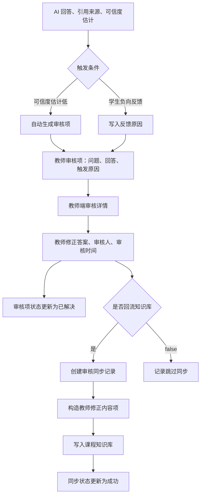

### 4.6 知识图谱可视化实现

#### 4.6.1 图谱数据构造

知识图谱可视化模块面向学生和教师展示课程知识结构。后端从业务图谱实体表和关系表读取节点、边和来源信息，构造前端图谱数据。构造过程中，系统规范化节点类型，过滤低质量节点，补充来源材料名称，计算邻居数量，并为学生端补充概念掌握状态。

#### 4.6.2 前端搜索、选择与一跳高亮

前端图谱组件支持节点搜索、节点高亮、节点选择和一跳邻居强调。搜索关键词与节点名称和描述进行匹配，匹配节点在图中高亮显示。用户点击节点后，图谱突出显示该节点及其一跳邻居关系；再次点击同一节点时取消选中状态。对于课程根节点等通用连接，前端在一跳强调时降低其视觉权重，以突出真实知识关系。

#### 4.6.3 布局稳定与节点详情

图谱布局采用稳定化策略。节点点击、搜索和高亮操作不触发随机重排，用户可持续观察同一局部结构。节点大小和颜色根据节点类型、学习状态和置信度估计进行区分。右侧详情面板展示节点类型、置信度估计、概念说明、相关节点和来源概览。来源概览显示原始文档名、页码或资料标题，用于支持教师核验。

#### 4.6.4 图谱质量注意事项

图谱置信度属于启发式质量估计，由底层抽取结果、同步字段和系统规则综合得到。该值用于前端展示排序和质量提示，不表示严格概率。第五章评估部分将从实体准确率、关系准确率、来源绑定准确率、未知类型比例和重复实体比例等方面评估图谱质量。

**图 4-10 知识图谱可视化交互流程图**

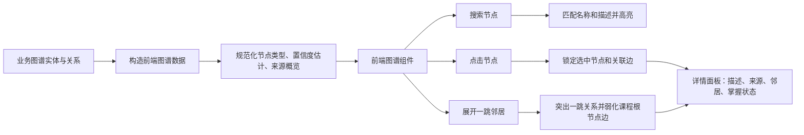

### 4.7 学习画像与个性化推荐实现

#### 4.7.1 学习画像数据来源

学习画像模块汇总学生在课程中的学习行为。数据来源包括课程进度、学习时长、提问记录、反馈行为、错题记录、闪卡复习记录和推荐点击记录。系统基于这些数据生成个人学习概览，并在学生端展示知识掌握雷达图、学习进度、学习时长、历史提问关键词云和推荐内容。

#### 4.7.2 历史提问关键词提取

历史提问关键词云基于学生问题文本生成。系统先对问题文本进行清洗，去除问候语、常见疑问词和无信息量表达，再抽取课程概念、协议名称、机制名称、公式名称和实验关键词。提取结果用于展示学生近期关注主题，也为个性化推荐提供特征输入。

#### 4.7.3 个性化推荐候选与排序

个性化推荐采用基于规则的可解释排序方法。候选内容来自课程资料、知识图谱节点、教师审核问答、错题和闪卡。系统根据学生近期提问、薄弱知识点、图谱关联、资料质量和推荐多样性计算候选内容优先级，并返回推荐理由。推荐理由用于说明推荐内容与学生学习状态之间的关系。

**图 4-11 学习画像与个性化推荐数据流图**

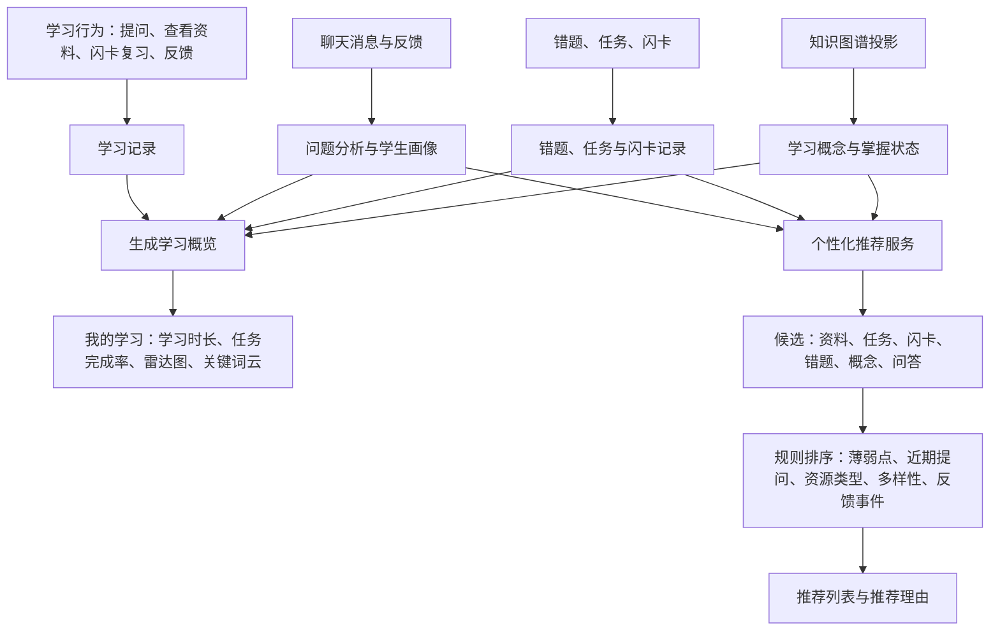

### 4.8 前端页面与交互实现

#### 4.8.1 角色化页面组织

前端按照学生、教师和管理员三类角色组织页面。学生端包括学习空间、我的课程、通知中心、课程空间、AI 助教、资料预览、知识图谱、错题本、闪卡和我的学习页面。教师端包括工作台、课程创建、资料上传、知识图谱、任务发布、学生管理、AI 审核和个人设置页面。管理员端包括用户管理、课程管理、模型配置和系统监控页面。

#### 4.8.2 前后端交互一致性

前端交互与后端状态保持一致。课程资料页面根据知识库状态展示待解析、解析中、已索引和失败等状态；资料预览页面按照后端返回的预览来源展示原始文本、解析文本或分块文本；AI 助教页面使用 Markdown 渲染回答，并展示结构化引用卡片；学生反馈页面提交反馈标签和补充说明；教师审核页面展示学生反馈、引用来源和修正入口；问答过程通过进度事件展示检索、生成和引用整理等阶段。

#### 4.8.3 RAG 问答体验与反馈闭环

RAG 问答交互围绕检索进度、引用验证和反馈闭环展开。多模态索引和课程检索耗时较长，前端通过阶段提示降低用户等待不确定性。引用卡片将回答依据与课程资料关联，支持学生和教师核验答案来源。学生反馈和教师审核结果回写后端，为后续知识库更新和系统评估提供数据。

### 4.9 本章小结

本章说明了系统关键技术模块的实现过程。课程资料入库阶段，系统完成文件存储、预处理、原子单元构建、文本分块、向量索引和图谱索引。问答阶段，系统通过问题路由、多轮上下文整理、查询改写和历史消息筛选生成有效查询文本，再完成关键词抽取、文本分块召回、实体关系召回、图结构扩展、检索上下文组合和答案生成。质量控制阶段，系统通过引用溯源、回答修复、学生反馈、教师审核和知识回流形成持续优化闭环。

## 第五章 系统测试与 RAG 效果评估方案

### 5.1 测试目标与测试范围

系统测试的目标是验证平台是否能够稳定完成课程资料管理、知识库构建、AI 问答、引用溯源、教师审核回流、学习画像和前端交互等核心功能。同时，本文重点关注 RAG 相关效果，即系统是否能够正确索引课程资料、准确召回证据、生成基于证据的回答，并在图谱和多模态场景中体现相对于普通 RAG 的优势。

测试范围分为功能测试、性能测试和效果评估三部分。功能测试验证系统各模块是否按照需求工作；性能测试关注资料索引耗时、问答延迟和服务稳定性；效果评估关注检索质量、生成质量、图谱质量、多模态质量和 baseline 对比。

**表 5-1 测试范围、测试对象、测试方法与预期输出**

| 测试范围 | 测试对象 | 测试方法 | 预期输出 |
|---|---|---|---|
| 功能测试 | 登录注册、课程、资料、问答、审核、学习画像、推荐 | 按学生、教师、管理员真实操作流程设计黑盒用例 | 功能是否通过、关键截图、异常记录 |
| 索引质量 | `Material`、`FileParseTask`、RAG-Anything 入库结果、业务图谱投影 | 上传不同格式资料，检查任务状态、chunk、content items、实体关系和错误信息 | 解析成功率、索引耗时、chunk 数、实体/关系数量、主要问题 |
| 检索质量 | RAG-Anything/LightRAG 查询主链和结构化 sources | 使用标准问题集和 gold evidence 计算 Recall@K、MRR、nDCG | 检索指标表和 Top-K 曲线数据 |
| 生成质量 | AI 回答、引用、置信度和教师审核结果 | 教师评分、LLM-as-Judge、引用人工核查 | Correctness、Faithfulness、Citation Accuracy 等指标 |
| 图谱与多模态质量 | `KnowledgeEntity`、`KnowledgeRelation`、图片/表格/公式问题 | 人工抽样实体关系和多模态题回答 | 实体准确率、关系准确率、来源绑定准确率、多模态题正确率 |
| 性能测试 | 索引任务、问答请求、RAG 查询阶段 | 记录平均耗时、P95、失败率和并发情况 | 延迟统计、失败率、资源瓶颈说明 |

### 5.2 测试环境

测试环境包括前端服务、后端服务、关系数据库、Redis、Celery worker、向量数据库、图数据库和文件存储。模型侧包括 LLM、VLM、embedding 和可选 reranker。由于不同硬件和模型配置会显著影响耗时，论文中应明确记录测试时使用的模型名称、部署方式、显存或 API 配置、数据库版本和并发参数。

| 项目 | 配置 |
|---|---|
| 前端框架 | React + Vite + TypeScript |
| 后端框架 | FastAPI + SQLAlchemy |
| 异步任务 | Celery + Redis |
| 关系数据库 | PostgreSQL 或 SQLite |
| 向量数据库 | Qdrant |
| 图数据库 | Neo4j |
| 文件存储 | 本地存储或 MinIO |
| RAG 框架 | RAG-Anything + LightRAG |
| LLM | 待填写 |
| VLM | 待填写 |
| Embedding | 待填写 |
| Reranker | 待填写 |

### 5.3 功能测试

功能测试采用黑盒测试方式，以学生、教师和管理员真实操作流程为基础设计测试用例。主要测试项如下。

| 编号 | 功能模块 | 测试内容 | 预期结果 | 测试结果 |
|---|---|---|---|---|
| F01 | 用户认证 | 学生、教师、管理员登录 | 登录成功并跳转对应首页 | 待填写 |
| F02 | 课程管理 | 教师创建课程，学生通过邀请码加入 | 课程创建成功，学生课程列表更新 | 待填写 |
| F03 | 资料上传 | 上传 PDF、MD、图片等资料 | 资料保存成功，解析任务进入队列 | 待填写 |
| F04 | 资料预览 | 点击课程资料预览 | 展示原始文本或解析文本 | 待填写 |
| F05 | 索引状态 | 查看资料解析状态 | 显示 pending/processing/completed/failed | 待填写 |
| F06 | AI 问答 | 学生提问课程问题 | 返回 Markdown 回答、引用和置信度 | 待填写 |
| F07 | 回答模式 | 自动、检索、快速、教学模式切换 | 路由策略符合模式定义 | 待填写 |
| F08 | 附件问答 | 上传图片后提问 | 图片描述参与当前轮问答 | 待填写 |
| F09 | 知识图谱 | 搜索节点、点击节点、一跳高亮 | 节点和关系正确高亮 | 待填写 |
| F10 | 学生反馈 | 学生点踩并填写原因 | 教师端可查看具体反馈 | 待填写 |
| F11 | 教师审核 | 教师提交修正答案并选择回流 | 审核项状态更新，生成同步记录 | 待填写 |
| F12 | 通知删除 | 教师删除通知 | 教师端和学生端不再显示 | 待填写 |
| F13 | 学习画像 | 查看我的学习页面 | 显示学习进度、雷达图、词云 | 待填写 |
| F14 | 周报月报 | 导出学习报告 | 生成可下载报告 | 待填写 |

功能测试截图应在系统按测试账号实际运行后截取，不能用示意图替代。建议保留学生课程首页、AI 问答结果、引用来源、教师资料管理、知识图谱和教师审核反馈详情六类截图，并在截图标题中标注对应测试用例编号。

### 5.4 索引质量评估

索引质量评估用于判断课程资料是否被正确解析和进入知识库。测试文件集应覆盖 PDF、PPT、Word、MD/TXT、图片、表格、公式和扫描件等类型。对于每个文件，记录解析状态、索引耗时、文本覆盖率、chunk 数量、实体数量、关系数量和错误信息。

| 文件类型 | 文件数量 | 解析成功率 | 平均索引耗时 | 平均 chunk 数 | 平均实体数 | 平均关系数 | 主要问题 |
|---|---:|---:|---:|---:|---:|---:|---|
| PDF |  |  |  |  |  |  |  |
| PPT/PPTX |  |  |  |  |  |  |  |
| DOC/DOCX |  |  |  |  |  |  |  |
| MD/TXT |  |  |  |  |  |  |  |
| 图片 |  |  |  |  |  |  |  |
| 表格 |  |  |  |  |  |  |  |
| 公式材料 |  |  |  |  |  |  |  |

索引质量还可以通过人工抽样检查。抽取若干文件，对比原文和解析结果，判断标题层级、段落顺序、表格结构、公式文本和图片描述是否正确。

### 5.5 RAG 评测集构建

为了评估 RAG 效果，需要构建课程问答评测集。评测集至少包含问题、标准答案、标准证据、问题类型、难度、模态和是否可回答等字段。建议先构建 100 道问题，其中包括定义题、机制题、对比题、计算题、图表题、表格题、跨文档综合题、无答案题和闲聊题。

每条样本建议采用如下格式。

```json
{
  "question_id": "q001",
  "question": "TCP 三次握手的主要目的是什么？",
  "question_type": "mechanism",
  "difficulty": "easy",
  "modality": "text",
  "gold_answer": "TCP 三次握手用于确认双方收发能力、同步初始序列号，并建立连接状态。",
  "gold_evidence": [
    {
      "doc_id": "doc002",
      "file_name": "CN_02_TCP与UDP.pptx",
      "page": 12,
      "section": "TCP连接建立",
      "evidence_text": "TCP通过三次握手建立连接，双方确认收发能力并同步初始序列号。"
    }
  ],
  "answerable": true
}
```

| 问题类型 | 数量建议 | 评估目标 |
|---|---:|---|
| definition | 15 | 基础概念召回 |
| mechanism | 20 | 过程解释能力 |
| comparison | 15 | 多概念比较 |
| calculation | 10 | 公式与推理 |
| image_understanding | 10 | 图表和图片理解 |
| table_qa | 5 | 表格解析与检索 |
| multi_doc | 10 | 跨文档综合 |
| teaching | 5 | 教学表达 |
| unanswerable | 5 | 拒答与边界控制 |
| chitchat | 5 | 意图路由 |

### 5.6 检索质量评估指标

检索质量关注系统是否找到了正确证据。设每个问题的标准证据集合为 $G$，系统返回前 $K$ 个证据为 $R_K$，则可使用以下指标。

$$
\operatorname{Recall@K}=\frac{|R_K \cap G|}{|G|}
$$

$$
\operatorname{Precision@K}=\frac{|R_K \cap G|}{K}
$$

MRR 用于衡量第一个相关证据的排序位置：

$$
\operatorname{MRR}=\frac{1}{N}\sum_{i=1}^{N}\frac{1}{rank_i}
$$

nDCG@K 综合考虑证据相关性和排序位置，适合多证据问题。本文建议重点报告 Recall@5、Recall@10、MRR@10 和 nDCG@10。

| 方法 | Recall@5 | Recall@10 | MRR@10 | nDCG@10 |
|---|---:|---:|---:|---:|
| BM25 |  |  |  |  |
| Vector RAG |  |  |  |  |
| LightRAG text-only |  |  |  |  |
| 本系统 Full |  |  |  |  |

### 5.7 生成质量评估指标

生成质量关注答案是否正确、相关、完整和基于证据。可采用自动指标、LLM-as-Judge 和教师人工评分相结合的方式。核心指标包括 Answer Correctness、Answer Relevancy、Faithfulness、Completeness、Citation Accuracy 和 Unsupported Claim Rate。

| 指标 | 含义 | 评估方式 |
|---|---|---|
| Answer Correctness | 答案是否与标准答案一致 | 教师评分或 LLM-as-Judge |
| Answer Relevancy | 是否围绕问题回答 | 自动评估或人工评分 |
| Faithfulness | 回答是否被检索证据支持 | RAGAS/人工核查 |
| Completeness | 是否覆盖标准答案要点 | 人工评分 |
| Citation Accuracy | 引用是否支撑对应内容 | 人工核查 |
| Citation Coverage | 关键结论是否有引用 | 人工核查 |
| Unsupported Claim Rate | 无证据断言比例 | 人工抽样 |

生成质量结果表可设计如下。

| 方法 | Correctness | Relevancy | Faithfulness | Completeness | Citation Accuracy |
|---|---:|---:|---:|---:|---:|
| LLM-only |  |  |  |  |  |
| Vector RAG |  |  |  |  |  |
| LightRAG text-only |  |  |  |  |  |
| 本系统 Full |  |  |  |  |  |

### 5.8 图谱与多模态质量评估

图谱质量评估关注实体和关系是否正确。可从知识图谱中抽样节点和边，由教师判断是否为有效课程概念、描述是否准确、来源是否正确。指标包括 Entity Precision、Relation Precision、Source Linking Accuracy、Unknown Type Rate 和 Duplicate Entity Rate。

| 指标 | 计算方式 | 说明 |
|---|---|---|
| Entity Precision | 正确实体数 / 抽样实体数 | 判断节点是否有教学意义 |
| Relation Precision | 正确关系数 / 抽样关系数 | 判断边是否有证据支持 |
| Source Linking Accuracy | 来源正确数 / 抽样数 | 判断是否能追溯到原资料 |
| Unknown Type Rate | UNKNOWN 节点数 / 总节点数 | 衡量类型规范化效果 |
| Duplicate Entity Rate | 重复实体数 / 总实体数 | 衡量实体合并效果 |

多模态质量评估则关注图片、表格和公式是否被正确理解。图表题和表格题应单独统计正确率，以证明多模态索引的贡献。

| 模态 | 问题数量 | 检索命中率 | 回答正确率 | 主要错误类型 |
|---|---:|---:|---:|---|
| 文本 |  |  |  |  |
| 图片/图表 |  |  |  |  |
| 表格 |  |  |  |  |
| 公式 |  |  |  |  |
| 跨文档 |  |  |  |  |

### 5.9 Baseline 对比与消融实验

为了证明系统方法有效，需要与多个 baseline 对比。

| Baseline | 说明 | 对比目的 |
|---|---|---|
| LLM-only | 不检索课程资料，直接回答 | 验证课程知识库价值 |
| BM25 + LLM | 关键词检索后生成 | 对比传统检索 |
| Vector RAG | 仅使用 chunk 向量检索 | 对比图增强效果 |
| Vector RAG + Rerank | 向量召回后精排 | 对比普通强 RAG |
| LightRAG text-only | 文本图谱 RAG | 对比多模态处理 |
| 本系统 Full | 当前完整系统 | 主方法 |

消融实验用于分析各模块贡献。

| 实验组 | 关闭或替换内容 | 预期观察 |
|---|---|---|
| Full | 完整系统 | 综合效果最好 |
| w/o Graph | 不使用图谱关系 | 跨文档和关系题下降 |
| w/o Multimodal | 不使用图片/表格/公式描述 | 多模态题下降 |
| w/o Query Rewrite | 关闭查询改写 | 追问和复杂题召回下降 |
| w/o History Control | 向 aquery 提交完整历史 | 检索噪声可能增加 |
| w/o Intent Router | 所有问题都走 RAG | 闲聊和系统问题效率下降 |
| w/o Teacher Feedback | 不使用教师回流内容 | 相似问题修正效果下降 |

主结果表可设计如下，具体数值在实验完成后填写。

| 方法 | Recall@5 | nDCG@10 | Faithfulness | Correctness | Citation Accuracy | Avg Latency |
|---|---:|---:|---:|---:|---:|---:|
| LLM-only | - | - |  |  | - |  |
| BM25 + LLM |  |  |  |  |  |  |
| Vector RAG |  |  |  |  |  |  |
| Vector + Rerank |  |  |  |  |  |  |
| LightRAG text-only |  |  |  |  |  |  |
| 本系统 Full |  |  |  |  |  |  |

### 5.10 性能测试

性能测试关注系统是否具有实际使用可行性。主要指标包括资料索引耗时、单次问答端到端延迟、RAG 检索耗时、生成耗时、P95 延迟、失败率和并发能力。由于 RAG-Anything 多模态解析和 LLM/VLM 调用成本较高，性能测试应区分索引阶段和问答阶段。

| 指标 | 含义 | 结果 |
|---|---|---:|
| Indexing Time/File | 单文件平均索引耗时 |  |
| Query Latency Avg | 平均问答耗时 |  |
| Query Latency P95 | P95 问答耗时 |  |
| Retrieval Latency | 检索阶段耗时 |  |
| Generation Latency | 生成阶段耗时 |  |
| Failure Rate | 失败请求比例 |  |
| Timeout Rate | 超时比例 |  |
| Concurrent Users | 可支持并发用户数 |  |

量化结果图需要在评测集标注和批量实验完成后由真实结果生成，本文初稿不填入虚构数值。实验脚本可读取第五章中设计的结果表，分别生成 Correctness/Faithfulness 对比柱状图、问答延迟箱线图和 Top-K Recall 曲线。

**图 5-1 RAG 效果评估结果图生成流程**

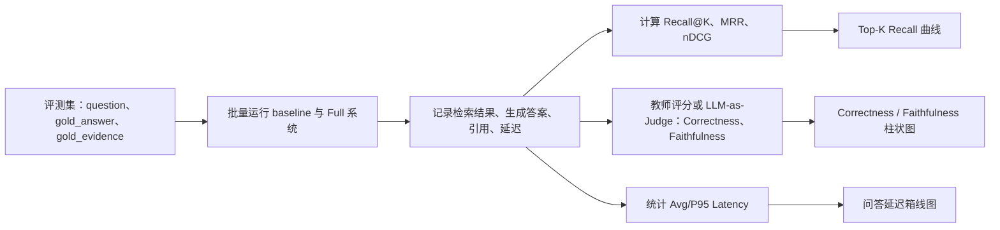

### 5.11 测试结论

本章从功能完整性、索引质量、检索质量、生成质量、图谱质量、多模态质量、baseline 对比、消融实验和性能表现等方面设计了系统测试方案。由于最终量化实验需要依赖标准评测集和批量实验脚本，本文在初稿阶段先给出评测指标、实验流程和结果表结构。后续完成评测集标注后，可直接按照本章方案填入实验数据并进行结果分析。

## 第六章 总结与展望

### 6.1 全文总结

本文围绕高校课程场景中资料分散、检索困难、教师重复答疑压力大和通用大模型回答缺少课程证据等问题，设计并实现了一个基于大语言模型和检索增强生成的 AI 助教平台。系统以课程知识库为边界，以 RAG-Anything 和 LightRAG 为核心知识处理框架，结合前后端分离架构、异步任务、向量检索、图谱可视化、教师审核和学习画像，形成从课程资料入库到智能问答再到知识回流的完整闭环。

本文主要工作包括：第一，完成学生、教师和管理员三类角色的需求分析与总体架构设计；第二，实现课程资料上传、解析任务管理和 RAG-Anything 入库流程；第三，设计规则型意图路由、多轮上下文整理和查询改写机制，降低无关问题进入 RAG 主链的概率；第四，实现基于 RAG-Anything 的课程问答、引用溯源和进度提示；第五，实现学生反馈、教师审核和知识回流机制；第六，实现知识图谱可视化、学习画像、词云、周报月报和个性化推荐；第七，设计 RAG 效果评估方案，为后续实验提供指标和表格结构。

### 6.2 不足分析

系统已经实现课程资料管理、知识库构建、RAG 问答、教师审核回流和学习画像等主要功能，但仍存在一定局限。首先，系统对文档、图片、表格和公式等资料的入库流程较为完整，对音频和视频资料也设计了 ASR 转写、关键帧抽取和内容项构造等预处理流程，但长视频、课堂录屏和低质量音频场景尚未经过充分验证，音视频内容与课程知识结构之间的关联建模仍需完善。

其次，系统核心链路依赖 RAG-Anything、LightRAG、MinerU、嵌入模型、VLM 和大语言模型 API 等外部组件，工程集成能力较强，但对底层模型内部机制的可控程度有限。资料索引阶段涉及多模态解析、实体关系抽取和向量嵌入，模型调用次数较多，面对大体量资料时索引耗时较长；随着文本分块、向量库和知识图谱规模扩大，检索阶段也需要继续优化召回质量与响应速度之间的平衡。

再次，知识图谱质量受文档解析效果、提示词约束、模型抽取能力和实体规范化规则影响，同义概念合并、跨章节关系识别、公式与概念绑定等复杂情况仍需要教师审核和人工校正辅助。个性化推荐目前主要基于规则和统计特征，尚未基于大规模学习行为数据训练专门模型，对长期学习路径预测和动态干预策略的支持仍较有限。

最后，本文已经设计索引质量、检索质量、生成质量、多模态质量和性能测试方案，但当前评估样本规模仍然有限，现有运行日志不能完全替代受控实验。后续需要构建覆盖不同资料类型、问题难度和证据来源的标准评测集，对系统的召回率、生成正确性、证据一致性和响应延迟进行进一步量化验证。

### 6.3 未来工作展望

本文围绕课程知识库构建、RAG 问答、教师审核回流和学习画像等内容完成了系统设计与实现，但受时间、数据规模和实验条件限制，系统仍有进一步研究和优化空间。后续工作可从以下几个方面展开。

第一，进一步完善 RAG 效果评估体系。后续可构建覆盖不同课程章节、资料类型、问题难度和证据来源的标准评测集，并配套标准答案、标准证据和人工评分规则。在此基础上，可对索引质量、Top-K 召回率、答案正确性、证据一致性、引用有效性和响应延迟进行批量测试，从而更准确地分析不同检索模式、查询改写策略和多模态解析方法对系统效果的影响。

第二，进一步提高课程知识图谱质量。当前图谱构建仍受文档解析质量和模型抽取能力影响，后续可引入更精细的实体消歧、同义概念合并、关系类型校正和低质量节点过滤机制。同时，可增强教师端图谱编辑能力，使教师能够对关键概念、先修关系、公式关联和习题对应知识点进行人工修正，从而提高课程知识图谱在教学场景中的可解释性和可靠性。

第三，继续优化多模态资料处理能力。后续可重点改进扫描文档、复杂表格、公式推导、课堂板书、实验截图和长视频资料的解析效果。对于音视频资料，可进一步研究字幕片段、关键帧、视觉描述和课程知识点之间的关联方式，使音视频内容不仅能够被转写和检索，也能够更准确地参与知识图谱构建和证据溯源。

第四，提升复杂问题理解与检索效率。当前系统的意图识别和多轮问题改写主要基于规则实现，后续可在保证系统可控性的前提下，引入更强的查询理解模型或轻量智能体机制，对跨章节、多约束和多轮追问场景进行更准确的查询规划。同时，可结合缓存、增量索引、重排序优化和并发调度等方法，降低大规模课程知识库下的问答延迟。

第五，深化学习画像与个性化推荐研究。随着系统积累更多学生学习行为、提问记录、反馈记录和复习数据，后续可探索学习路径预测、知识掌握度估计和个性化干预策略。系统可根据学生薄弱知识点、学习进度和历史问题，生成更有针对性的复习资料、练习建议和学习计划，从而进一步发挥 AI 助教在个性化学习支持方面的价值。

第六，增强系统可观测性和实际教学验证。后续可建设面向教师和管理员的 RAG 质量监控仪表盘，持续跟踪知识库覆盖度、低置信回答比例、学生负反馈、教师修正次数和热点问题分布。同时，可在真实课程中开展更长周期的试用与反馈收集，结合教师和学生的使用体验进一步改进系统功能和交互流程。

## 参考文献

[1] Lewis P, Perez E, Piktus A, et al. Retrieval-Augmented Generation for Knowledge-Intensive NLP Tasks. NeurIPS, 2020.

[2] Gao Y, Xiong Y, Gao X, et al. Retrieval-Augmented Generation for Large Language Models: A Survey. arXiv preprint, 2023.

[3] Guo Z, Xia L, Yu Y, Ao T, Huang C. LightRAG: Simple and Fast Retrieval-Augmented Generation. arXiv:2410.05779, 2024.

[4] HKUDS. LightRAG: Simple and Fast Retrieval-Augmented Generation. GitHub Repository. https://github.com/HKUDS/LightRAG, 2024.

[5] Guo Z, Ren X, Xu L, Zhang J, Huang C. RAG-Anything: All-in-One RAG Framework. arXiv:2510.12323, 2025.

[6] HKUDS. RAG-Anything: All-in-One RAG Framework. GitHub Repository. https://github.com/HKUDS/RAG-Anything, 2025.

[7] Es S, James J, Espinosa-Anke L, Schockaert S. RAGAS: Automated Evaluation of Retrieval Augmented Generation. arXiv preprint, 2023.

[8] Thakur N, Reimers N, Rücklé A, Srivastava A, Gurevych I. BEIR: A Heterogeneous Benchmark for Zero-shot Evaluation of Information Retrieval Models. NeurIPS, 2021.

[9] Muennighoff N, Tazi N, Magne L, Reimers N. MTEB: Massive Text Embedding Benchmark. EACL, 2023.

## 附录 A 核心流程图汇总

### A.1 课程资料入库流程

资料上传 -> 权限校验 -> 原始文件保存 -> Material 落库 -> FileParseTask 创建 -> Celery 队列 -> RAG-Anything 解析 -> embedding 与图构建 -> 业务图谱同步 -> 教师端状态展示。

### A.2 AI 问答流程

用户提问 -> 会话上下文整理 -> 问题路由 -> 查询改写 -> 附件处理 -> RAG-Anything 主链检索生成 -> 保存回答与引用 -> 低置信审核 -> 用户反馈。

### A.3 教师审核回流流程

学生点踩/低置信 -> ReviewItem 创建 -> 教师查看反馈详情 -> 教师修正答案 -> ReviewSyncRecord 创建 -> RAG-Anything 同步教师修正内容 -> 后续问答复用。

## 附录 B 评测集字段说明

| 字段 | 说明 |
|---|---|
| question_id | 问题编号 |
| question | 用户问题 |
| question_type | definition、mechanism、comparison 等 |
| difficulty | easy、medium、hard |
| modality | text、image、table、formula、multi_doc |
| gold_answer | 标准答案 |
| gold_evidence | 标准证据列表 |
| answerable | 是否可由资料回答 |
| expected_keywords | 预期关键词 |
| expected_entities | 预期图谱实体 |
