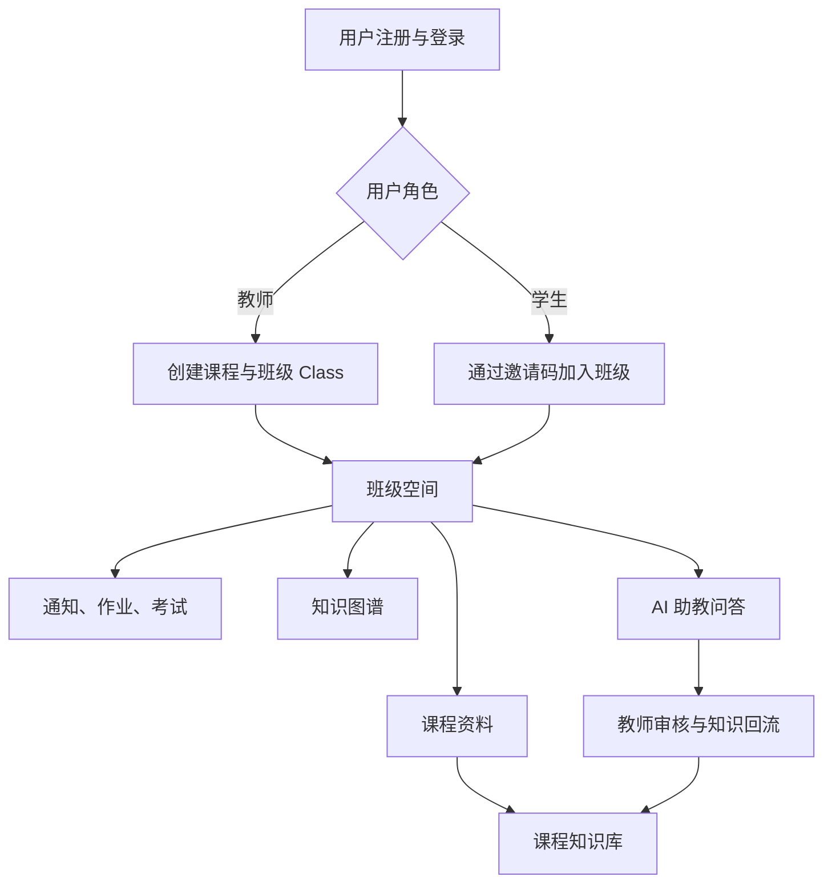
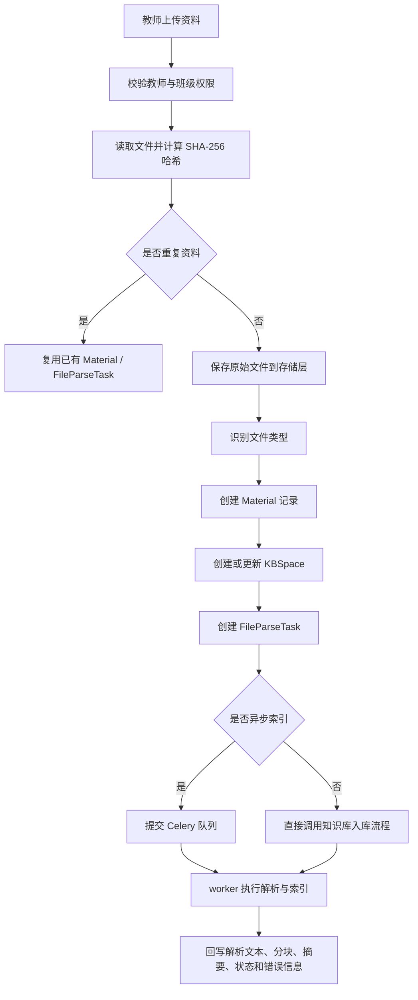
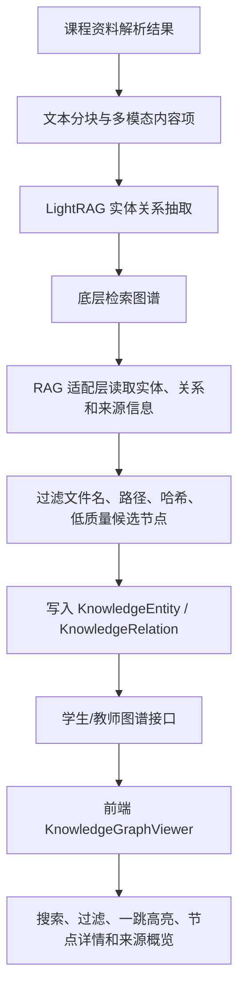
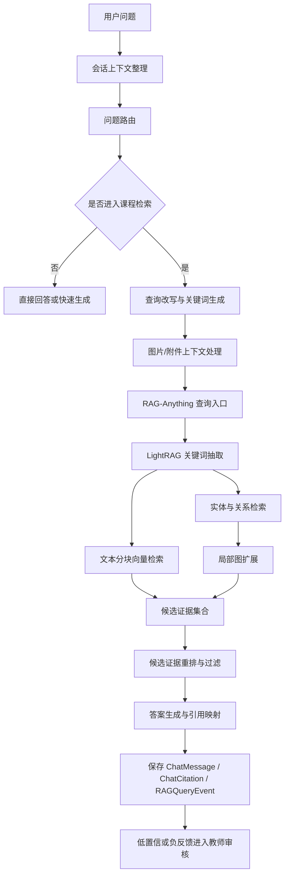
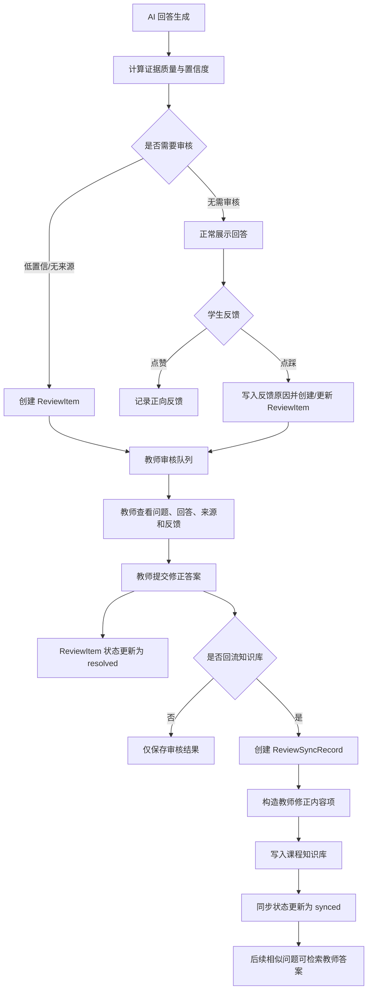

# 第四章 系统关键模块设计与实现

本章围绕 AI 助教平台的核心业务闭环展开实现说明。系统并不是单一聊天机器人，而是以“班级空间”为业务入口，以“课程知识库”为知识边界，以“知识图谱”和“检索增强生成问答”为智能能力基础，并通过“教师审核与知识回流”持续修正知识内容。根据系统实现逻辑，本章依次介绍班级空间基础功能、课程知识库构建、知识图谱构建、检索增强生成问答以及教师审核回流五个模块。

## 4.1 班级空间基础功能实现

### 4.1.1 模块概述

班级空间基础功能模块是整个平台的业务承载层。本模块从用户身份管理、课程与班级创建、学生加入班级、任务通知管理以及班级内资料和 AI 助教入口等方面，为后续知识库构建、智能问答和教师审核提供统一的权限边界与数据上下文。

系统中“课程”和“班级”采用分层设计。`Course` 表示课程本身，保存课程名称、课程代码、课程描述和创建者等信息；`Class` 表示某一教师在某学期或某教学班下开设的课程空间，保存教师编号、班级名称、学期、邀请码和公告等信息；`ClassMember` 用于记录教师、学生与班级之间的成员关系。该设计使同一门课程可以对应不同教学班，也便于系统以 `class_id` 隔离资料、问答、知识图谱和学习记录。

从前后端交互角度看，学生端通过班级空间查看课程首页、资料列表、任务列表、知识图谱和 AI 助教；教师端通过班级空间创建课程、发布通知、上传资料、管理作业考试、查看学生和处理 AI 审核事项；管理员端则在更高层面查看课程、用户、模型和知识库运行状态。因此，班级空间既是业务功能的组织入口，也是权限校验、数据过滤和知识空间隔离的核心标识。

**图 4-1 班级空间业务边界图**



### 4.1.2 功能实现

1. 用户注册与登录

用户注册与登录功能由后端 `auth` 接口提供。系统提供验证码发送、注册、登录和当前用户信息查询等接口，其中 `POST /auth/register` 根据学生或教师注册请求创建用户，`POST /auth/login` 校验账号、密码和角色后返回访问令牌，`GET /auth/me` 基于当前令牌返回用户资料。后端通过统一鉴权依赖获取当前用户，并在学生端、教师端和管理员端接口中分别使用角色依赖进行权限限制。

注册阶段，系统保存用户邮箱、姓名、角色、学校、学院、专业、年级、学号或教师编号等信息。登录阶段，系统返回 `access_token`、用户角色、用户编号和姓名等字段，前端将令牌写入本地认证状态，并在后续 API 请求中携带认证信息。该过程保证课程资料、班级空间、聊天记录和审核数据均与真实用户身份绑定。

从实现效果看，用户登录不仅用于区分页面入口，还直接参与后端数据过滤。例如学生只能访问自己加入的班级，教师只能管理自己创建或任教的班级，管理员才能查看系统级状态。该权限模型贯穿课程空间、资料管理、知识图谱、问答和审核模块。

2. 班级空间创建与加入

教师创建班级时，前端调用教师端课程创建接口，后端在 `course_service.create_class` 中完成课程和班级记录创建。若请求中未指定已有课程，系统先创建 `Course` 记录；随后生成唯一邀请码，创建 `Class` 记录，并在 `ClassMember` 中写入教师成员关系。系统还会记录审计事件，用于后续管理员查看操作轨迹。

学生加入班级时，通过邀请码调用加入接口。后端在 `join_class_by_invite` 中根据邀请码查找有效班级，检查学生是否已经加入，若未加入则写入 `ClassMember` 记录。加入成功后，学生端课程列表和课程空间即可展示该班级信息。

班级空间创建后，系统围绕 `class_id` 形成统一数据边界。资料表 `Material`、解析任务表 `FileParseTask`、聊天会话表 `ChatSession`、知识实体表 `KnowledgeEntity`、知识关系表 `KnowledgeRelation`、审核表 `ReviewItem` 以及学习记录均保存或关联 `class_id`。这样可以避免不同班级之间的资料、图谱和问答结果混用。

3. 任务管理：通知、作业与考试

班级任务管理用于支持教师在课程空间中发布教学安排。系统将通知、作业和考试统一纳入班级任务视图，但在实现上根据业务类型分别处理。

通知发布接口接收标题、内容、重要程度、发布范围和附件等信息。后端更新班级公告字段，并为班级成员创建通知记录。学生端通过通知接口读取未读通知，教师端可以查看已发布通知。通知数据主要保存在 `Notification` 表中，班级首页也会读取最近公告作为课程动态。

作业发布接口将题目列表、截止时间、是否允许迟交和附件等信息转换为 `Task` 记录。系统设置 `task_type` 为 `homework`，保存标题、题目描述、截止时间、满分和发布状态，同时向学生发送截止提醒。学生端任务列表只展示已发布任务，教师端任务列表展示提交数量、状态和截止时间等信息。

考试发布接口同样基于 `Task` 表实现。系统将考试开始时间、结束时间、考试时长、题目内容和考试设置组织为任务描述，设置 `task_type` 为 `exam`，并通过通知机制提醒班级成员。通过这种实现，作业和考试共享任务查询、状态展示和通知分发逻辑，减少了重复接口。

4. 班级空间首页与功能入口

班级空间首页用于整合课程资料、任务、通知、知识图谱和 AI 助教入口。学生访问 `student/courses/{class_id}` 时，后端返回课程摘要、加入时间、默认页面和未读数量等信息；教师访问 `teacher/courses/{class_id}` 时，后端返回课程摘要、邀请码、学生数量、资料数量和待处理问题数量等信息。

班级空间的资料、任务、图谱和问答页面都通过同一套班级访问校验函数判断用户权限。教师端上传资料、重建知识库和查看解析结果时，系统要求当前用户为该班级教师；学生端查看资料、提问和查看图谱时，系统要求当前用户是班级成员。由此，班级空间基础功能为后续智能模块提供了稳定的业务上下文。

**表 4-1 班级空间核心数据表与作用**

| 数据表 | 主要字段 | 作用 |
|---|---|---|
| `users` | `id`、`email`、`role`、`real_name` | 保存学生、教师和管理员身份信息 |
| `courses` | `id`、`name`、`code`、`created_by` | 保存课程基础信息 |
| `classes` | `id`、`course_id`、`teacher_id`、`invite_code` | 保存具体班级空间 |
| `class_members` | `class_id`、`user_id`、`role` | 保存学生和教师的班级成员关系 |
| `tasks` | `class_id`、`task_type`、`due_date`、`is_published` | 保存作业、考试等教学任务 |
| `notifications` | `user_id`、`title`、`content`、`extra_data` | 保存班级通知和任务提醒 |

## 4.2 课程知识库构建模块

### 4.2.1 模块概述

课程知识库构建模块负责将教师上传的课程资料转换为可检索、可引用、可构图的知识内容。该模块的输入是教师上传的 PDF、Word、PPT、Markdown、TXT、图片、音频或视频等资料，输出是业务数据库中的资料记录、解析任务记录、原子内容单元、文本分块、向量索引、图谱索引和前端可展示的解析状态。

系统采用“业务数据库 + 文件存储 + RAG-Anything/LightRAG 索引存储”的分层结构。业务数据库保存课程资料元数据、解析任务状态和图谱投影；文件存储保存原始资料；RAG-Anything/LightRAG 保存文本分块、实体、关系、向量索引和图结构。业务系统不直接实现底层向量检索算法，而是通过 `RAGAnythingAdapter` 封装资料入库和查询过程。

该模块的关键设计是异步化和状态化。资料上传后，系统立即保存原始文件和 `Material` 记录，并创建或复用 `FileParseTask`。如果采用异步索引，任务进入 Celery 队列，由 worker 后台执行；如果采用同步索引，接口在上传后直接调用知识库入库流程。无论同步还是异步，系统均通过 `Material.kb_status` 和 `FileParseTask.status` 向前端展示处理进度。

### 4.2.2 资料上传存储

教师端资料上传接口主要由 `POST /teacher/courses/{class_id}/files` 和底层 `POST /courses/{course_id}/files/upload` 实现。教师在班级空间上传文件后，前端将文件以表单方式发送给后端。后端首先根据 `class_id` 和当前教师身份校验权限，随后读取上传文件内容，计算文件哈希值，并检查同一班级内是否已存在相同哈希的资料解析任务。

如果检测到重复文件，系统不重复索引，而是复用已有 `Material` 和 `FileParseTask`，返回已有资料编号、解析任务编号和知识库状态。该设计可以避免教师重复上传同一课件时造成重复向量、重复图谱节点和额外模型调用成本。

如果不是重复文件，系统将文件保存到本地文件系统或对象存储。保存时以班级编号作为存储作用域，生成存储路径和 `storage_key`。随后系统根据文件名和 MIME 类型调用文件类型识别函数，识别结果包括 `pdf`、`docx`、`ppt`、`md`、`txt`、`image`、`audio`、`video` 或 `other`。系统创建 `Material` 记录，保存资料标题、原始文件名、文件路径、文件大小、MIME 类型、文件类型、上传教师和知识库状态。

资料记录创建完成后，系统准备解析任务。`KBSpace` 表示某课程或某班级对应的知识库空间，保存知识库状态、文档数量、分块数量和最近构建时间。`FileParseTask` 表示单个文件的解析任务，保存资料编号、班级编号、课程编号、解析器名称、解析状态、摘要、抽取文本、分块列表、扩展元数据和错误信息。任务状态包括 `pending`、`processing`、`completed` 和 `failed`；资料知识库状态包括 `pending`、`processing`、`indexed` 和 `failed`。

资料预览接口根据文件类型和解析结果返回不同内容。对于 TXT、Markdown、CSV、JSON 和代码类文本文件，系统优先读取原始文件文本；对于 PDF、PPT、图片、音视频等复杂资料，系统优先返回解析任务中的 `extracted_text`，若该字段为空则拼接 `chunks` 中的文本。预览接口同时返回预览来源、摘要、分块数量和是否截断，便于教师检查解析结果。

**图 4-2 资料上传与存储流程**



### 4.2.3 原子单元解析

课程资料通常包含普通文本、表格、公式、图片、扫描页、音频转写和视频关键帧等多种信息形态。为了让这些内容能够统一进入 RAG-Anything 和 LightRAG，系统将资料解析后的最小可追溯知识对象定义为“原子单元”。原子单元保存内容类型、文本表示、来源文件、页码、时间戳、图片路径、表格结构、公式文本、OCR 文本和扩展元数据。

系统首先通过 `preprocess_for_raganything` 根据文件类型选择预处理策略。PDF、Word 和 PPT 等文档使用 `direct_document` 模式，交由 RAG-Anything 的 `process_document_complete` 流程处理；Markdown 和 TXT 使用 `content_list` 模式，后端先读取文本，再抽取 Markdown 表格和公式；图片资料被构造为图像内容项，保存图片路径和说明文本；音频资料通过 ASR 转写为带时间戳的文本片段；视频资料通过音频转写和关键帧抽取形成字幕片段、关键帧路径、OCR 文本或视觉描述。

对于 Markdown 表格，系统不仅保存原始 Markdown，还会解析表头和行数据，并将每一行转换为事实文本。例如“第 1 行，术语：TCP；含义：传输控制协议。”这种文本化结果可以被向量检索和实体抽取直接使用。对于公式，系统保存公式文本和 LaTeX 表达，并将其与所在资料和上下文关联。对于图片、音频和视频，系统通过 OCR、VLM 描述或 ASR 转写生成可检索文本，同时保留原始文件路径用于引用溯源。

RAG 适配层在内容项进入索引前会补充稳定的 `atomic_id`。该编号由资料编号、内容序号和内容指纹生成，写入内容项自身和元数据中。随后系统将内容项转换为文本分块，分块中保存 `chunk_id`、文本、页码、来源文件、来源类型、原子单元编号和模态类型。这样，检索命中某个分块后，系统可以回溯到原始资料、页码、图片、表格或视频时间戳。

**算法 4-1 原子单元解析与入库流程**

```text
Input: 课程资料文件 file、MIME 类型 mime、班级编号 class_id
Output: content_items、chunks、index_status
1. 根据文件扩展名和 MIME 类型识别资料类型
2. if 文件类型为 PDF / DOCX / PPT:
       使用 direct_document 模式调用 RAG-Anything 文档解析入口
3. else if 文件类型为 MD / TXT:
       读取原始文本
       抽取 Markdown 表格并解析表头、行数据和事实文本
       抽取公式并保存公式文本和上下文
       构造 content_list
4. else if 文件类型为图片:
       构造图片内容项，保存图片路径、图像说明和来源元数据
5. else if 文件类型为音频:
       执行 ASR 转写，生成带时间戳文本片段
6. else if 文件类型为视频:
       执行音频转写和关键帧抽取，生成字幕片段与关键帧内容项
7. 为每个内容项补充 atomic_id、material_id、modality 和 source_name
8. 将内容项转换为文本分块，并写入 RAG-Anything/LightRAG
9. 回写 FileParseTask 的 extracted_text、chunks、content_items 和质量报告
```

原子单元解析完成后，系统调用 RAG-Anything/LightRAG 完成索引构建。LightRAG 将文本分块写入文档状态存储，对文本分块、实体描述和关系描述进行向量化，并将实体、关系写入图结构。RAG-Anything/LightRAG 的索引产物可以使用本地文件存储，也可以根据配置接入 Qdrant 和 Neo4j。系统在每个班级下使用独立工作目录，保证不同班级的资料索引互不污染。

## 4.3 知识图谱构建模块

### 4.3.1 模块概述

知识图谱构建模块用于把课程资料中的概念、公式、算法、例题、实验步骤和知识点关系显式组织起来。该模块一方面服务于 RAG 检索，使问答过程能够利用实体、关系和局部图结构；另一方面服务于前端可视化，使教师和学生能够查看课程知识结构、资料覆盖情况和概念关联。

系统中的知识图谱分为底层检索图谱和业务展示图谱两层。底层检索图谱由 LightRAG 在索引阶段维护，包含文本分块、实体、关系、实体向量、关系向量和图结构，主要服务于混合检索。业务展示图谱保存于 `KnowledgeEntity` 和 `KnowledgeRelation` 表中，由 RAG 适配层从 RAG-Anything/LightRAG 的结果中投影而来，主要服务于前端展示、来源概览和学习画像。

`KnowledgeEntity` 保存实体名称、实体类型、描述、来源资料、置信度、来源片段、溯源信息和审核状态；`KnowledgeRelation` 保存源实体、目标实体、关系类型、权重、置信度、来源片段和溯源信息。图谱投影不是替代底层 LightRAG 图结构，而是将底层抽取结果转换为更适合教学界面展示和业务查询的数据形态。

### 4.3.2 文本知识图谱

文本知识图谱主要来源于课程资料中的标题、段落、表格事实文本、公式说明和文档解析文本。LightRAG 在文本分块基础上执行实体和关系抽取，并将抽取结果写入图存储。为了使抽取结果更符合课程场景，系统在 `education_prompts` 中对 LightRAG 的提示词进行教育场景增强。

系统定义了面向课程知识图谱的实体类型，包括 `course_concept`、`learning_objective`、`formula`、`theorem`、`algorithm`、`example`、`exercise`、`misconception`、`experiment_step`、`tool`、`dataset` 和 `assessment_point` 等；关系类型包括 `prerequisite_of`、`part_of`、`explains`、`uses_formula`、`applies_algorithm`、`example_of`、`tests`、`causes`、`contrasts_with`、`equivalent_to` 和 `related_to` 等。系统通过提示词要求模型抽取稳定的教学概念，而不是抽取文件名、页码、UUID、哈希值、路径或普通元数据。

文本实体关系抽取的提示约束可概括如下：

```text
你需要构建课程知识图谱，而不是文件或材料图谱。
请抽取来源文本明确支持的课程概念、学习目标、公式、算法、例题、易错点和实验步骤。
实体名称应短小、规范，中文资料优先使用简体中文术语，标准英文缩写可以保留。
不要把文件名、路径、页码、chunk 编号、UUID、日期或泛化词抽取为实体。
关系必须有可追溯证据；如果证据较弱，应降低置信度或忽略该关系。
请保持原框架要求的输出格式，不改变分隔符、字段名和循环抽取语义。
```

该提示词不替换 LightRAG 原有模板，而是在保留原始格式要求的基础上追加教育场景约束。这样既能利用 LightRAG 原有实体关系抽取机制，又能减少“资料文件”“表格结构”“图片描述”等低质量节点进入课程图谱。

在业务图谱投影阶段，系统优先读取 RAG-Anything 或 LightRAG 明确生成的实体和关系。当显式实体不足时，系统会从解析摘要、关键词和文本分块中生成候选概念，但会过滤文件标签、路径、哈希值、过长标识符和低置信候选节点。系统为每个实体和关系保存来源资料编号、分块编号、页码和来源类型，使图谱节点能够追溯回原始课程资料。

### 4.3.3 跨模态知识图谱

跨模态知识图谱用于处理图片、表格、公式、音频和视频中承载的知识。课程资料中大量信息并不以普通段落出现，例如课件截图中的协议层次图、表格中的术语定义、公式中的变量含义、实验视频中的操作步骤等。系统通过 RAG-Anything 的多模态处理能力和视觉语言模型，将这些内容转化为可抽取实体关系的文本化表示。

对于图片内容，系统构造图片内容项并保存图片路径。RAG-Anything 在处理图片时可调用视觉模型生成图像描述。聊天场景中的临时图片附件也会在本轮问答中通过 VLM 生成描述，但默认不写入课程正式知识库。图像描述提示词要求模型提取可用于课程答疑的可见文字、图示结构、坐标轴、图例、变量、单位、流程步骤和概念关系。

跨模态图谱抽取的 VLM 提示可概括如下：

```text
请分析该课程图片中的教学内容。
请提取图片中可见文字、标题、图例、坐标轴、公式、变量、单位、流程箭头和关键对象。
如果图片包含协议图、流程图、表格或实验步骤，请说明其中的概念、先后关系、组成关系和因果关系。
输出应服务于课程知识库构建，避免描述无关视觉细节。
```

对于表格内容，系统将表格 Markdown、表头、行数据和事实文本同时保存。表格中的每一行可以成为概念定义、参数说明或实验结果证据。对于公式内容，系统保存公式表达、变量说明和上下文，使公式实体与相关概念建立关系。对于音频和视频，系统先通过 ASR 和关键帧抽取将其转换为文本片段和图像片段，再进入同一索引与抽取流程。

跨模态实体关系抽取提示与文本图谱保持一致，但额外强调多模态证据：

```text
请基于文本、表格、公式、图片描述、OCR 文本、字幕转写和关键帧描述抽取课程实体与关系。
实体应是教学概念、公式、算法、实验步骤、例题、工具或数据集。
关系应体现先修、组成、解释、使用公式、算法应用、例子、测试、因果、对比或相关关系。
如果实体或关系只来自图片/表格/视频，请在证据说明中标明对应模态和来源位置。
不要把“图片”“表格”“页面”“第几行”等解析产物当作知识实体。
```

通过上述处理，系统可以将不同模态的内容统一为课程知识节点。例如，一张网络协议分层图可以生成“应用层”“传输层”“网络层”等实体，并生成 `part_of` 或 `related_to` 关系；一个公式截图可以生成公式实体和变量实体，并生成 `uses_formula` 或 `explains` 关系；一段实验视频可以生成实验步骤实体，并生成步骤先后关系。

### 4.3.4 图谱可视化

知识图谱可视化由后端图谱接口和前端图谱组件共同实现。学生端和教师端分别通过 `student/courses/{class_id}/knowledge-graph` 与 `teacher/courses/{class_id}/knowledge-graph` 获取图谱数据。后端读取 `KnowledgeEntity` 和 `KnowledgeRelation`，过滤已拒绝节点、低质量候选节点、文件路径、哈希值、页码、表格结构等噪声节点，并只保留仍由有效资料支持的实体与关系。

后端构造节点时会补充节点类型、颜色、置信度、描述、来源资料和坐标。对于学生端，系统还可以结合学习记录补充节点掌握状态。边数据包含源节点、目标节点、关系类型、权重和置信度。为了帮助前端形成稳定布局，后端会为节点生成初始圆形坐标，并返回课程根节点。前端再根据节点度数、根节点和可见节点集合进行稳定化布局。

前端 `KnowledgeGraphViewer` 支持节点搜索、类型过滤、置信度过滤、全屏查看、节点展开、边选择和一跳邻居高亮。用户点击节点后，界面展示该节点的类型、置信度、掌握状态、说明文本、关联关系和来源概览。来源概览会显示资料标题、文件名或来源资料列表，使教师能够检查某个知识点来自哪份课件或文档。

**图 4-3 知识图谱构建与可视化流程**



## 4.4 检索增强生成问答模块

### 4.4.1 模块概述

检索增强生成问答模块是系统的核心智能交互模块。该模块接收学生或教师在班级空间提出的问题，结合当前班级知识库完成问题预处理、关键词提取、混合检索、证据重排、答案生成、引用溯源和质量记录。与普通聊天机器人不同，该模块强调课程边界、资料依据和可审核性。

问答流程由 `chat_service.send_message` 编排。系统首先获取或创建聊天会话，保存用户问题和附件信息，记录学习行为和审计事件；随后通过问题路由判断是否需要进入课程检索；若问题属于问候、身份、能力介绍、知识库状态或用户资料查询，则直接由后端构造回答；若用户选择快速回答或教师工具模式，则调用非检索大模型生成；其余课程相关问题进入 RAG-Anything/LightRAG 主链。

RAG 主链返回后，系统保存 AI 回答、引用来源、置信度、建议问题和查询追踪信息。系统还会将结构化引用写入 `ChatCitation`，将问答指标写入 `RAGQueryEvent`，并根据证据质量决定是否生成教师审核项。

### 4.4.2 用户问题预处理

用户问题预处理包括会话上下文整理、附件处理、意图路由和有效检索问题构造。

多轮上下文整理由 `conversation_context_service` 实现。系统读取当前会话最近若干轮消息，判断当前问题是新主题、追问还是澄清。如果问题是短追问，系统会将最近一个用户问题作为锚点，构造独立问题。例如用户先问“TCP 慢启动是什么”，再问“它什么时候结束”，系统会构造“TCP 慢启动是什么。追问：它什么时候结束”。这种确定性改写可以避免 RAG 检索只看到“它”而无法定位上下文。

附件处理用于支持本轮临时多模态问答。系统会为聊天附件解析文件路径、文件类型和 MIME 类型。图片附件会被编码为 base64 或 data URL；在 RAG 模式下，RAG 适配层会调用 VLM 生成图片描述，并将其作为本轮查询上下文；在快速回答模式下，图片可以直接作为多模态输入发送给生成模型。聊天附件默认只影响当前轮问答，不进入课程正式知识库，避免学生临时上传内容污染教师维护的课程资料。

问题路由由 `question_router` 采用保守规则实现。系统识别问候、身份、能力说明、知识库状态、用户资料和明显课程范围外问题，直接返回系统回答；当教师选择教学工具模式时，系统进入教师工具生成路径；当用户选择快速回答时，系统不检索课程资料；其余默认进入 `course_rag` 路由。该设计减少无意义检索，同时保证课程相关问题默认受到知识库约束。

### 4.4.3 关键词提取

关键词处理分为业务层查询改写和检索层关键词抽取两级。

业务层查询改写由 `build_query_rewrite_bundle` 实现。系统首先分析用户问题意图，识别定义解释、过程步骤、公式计算、作业题目、比较对比、示例应用、因果说明和复习总结等类型。不同意图会生成不同检索焦点词。例如比较类问题会补充“区别、对比、相同点、不同点、适用场景”，公式类问题会补充“公式、变量、推导、计算步骤、单位”。系统还针对计算机网络课程设置领域扩展词，例如 TCP、UDP、三次握手、链路层、网络层、拥塞控制等。

查询改写不会把长篇提示直接拼接给 LightRAG，而是采用“原始独立问题 + 紧凑检索词”的策略。RAG 适配层会过滤噪声词、泛化词和与原问题无关的扩展词，仅保留少量高价值检索词，形成有效查询文本。这样既能增强召回，又不会破坏 LightRAG 原有关键词抽取机制。

检索层关键词抽取由 LightRAG 执行。LightRAG 会从有效查询文本中抽取高层关键词和低层关键词。高层关键词偏向主题、意图和抽象概念，主要用于关系检索和全局图谱发现；低层关键词偏向具体实体、术语和细节，主要用于实体检索和文本分块召回。业务层改写结果作为检索层输入的增强信号，底层混合检索仍由 LightRAG 完成。

**算法 4-2 用户问题到有效查询文本的处理流程**

```text
Input: 用户原始问题 q、聊天历史 history、回答模式 mode、附件 attachments
Output: 问题路由 route、有效查询文本 q_e、筛选历史 h_c
1. 获取或创建聊天会话
2. 读取最近聊天历史，判断当前问题是新主题、追问还是澄清
3. 若为追问，则使用最近用户问题构造独立问题 q_s
4. 处理本轮附件，生成附件文本或图片描述
5. 根据问题内容、角色、回答模式和附件判断问题路由
6. 若不需要检索，则直接回答或快速生成
7. 对课程检索问题分析意图，生成检索焦点词
8. 过滤噪声词和过宽泛词，构造 q_e = q_s + compact_terms
9. 根据 q_e 筛选与当前问题相关的少量历史消息
10. 将 q_e、附件上下文和筛选历史提交给 RAG 主链
```

### 4.4.4 双路检索

本文中的双路检索指向量语义检索与图结构检索的结合。课程资料入库后，LightRAG 同时维护文本分块向量、实体向量、关系向量和知识图结构。查询时，系统既可以通过向量相似度召回语义相近的文本分块，也可以通过实体和关系检索定位课程概念，并沿知识图谱进行局部扩展。

向量检索主要面向具体证据召回。系统将有效查询文本嵌入为向量，并与文本分块向量、实体描述向量、关系描述向量进行相似度匹配。文本分块命中后可以提供回答所需的直接证据，例如定义、步骤、公式说明或表格事实。

图检索主要面向概念关系组织。LightRAG 根据高层关键词和低层关键词召回相关实体与关系，再以实体和关系为种子进行局部图扩展。图结构可以帮助系统处理跨章节、跨资料和多概念关联问题。例如“TCP 慢启动和拥塞避免有什么关系”不仅需要命中文本段落，也需要定位“慢启动”“拥塞避免”“拥塞窗口”等实体及其关系。

对于多模态问题，系统将图片描述、OCR 文本、表格事实、公式说明、ASR 转写和关键帧描述作为文本化证据进入同一检索流程。结构化表格问题还会触发表格证据补充逻辑，系统会在已完成解析的 `FileParseTask.chunks` 中查找 Markdown 表格和表格事实文本，提高表格问答的来源准确性。

可以将候选证据集合表示为：

$$
R = R_c \cup R_v \cup R_e \cup R_g
$$

其中，$R_c$ 表示文本分块召回结果，$R_v$ 表示实体召回结果，$R_e$ 表示关系召回结果，$R_g$ 表示基于图结构扩展得到的局部图证据。最终，系统在 token 预算内将文本分块、实体描述、关系描述和局部图结构组合为生成模型上下文。

### 4.4.5 候选证据重排与最终回答生成

RAG-Anything/LightRAG 主链返回初版回答和来源后，系统并不直接保存结果，而是执行候选证据后处理。首先，系统将返回结果标准化为回答正文、来源列表和置信度。来源字段包括文件名、资料编号、页码、分块编号、原子单元编号、来源类型、检索分数、片段文本和元数据。

其次，系统进行结构化表格补充和图谱来源回溯。对于表格定义类问题，系统会从已解析表格分块中查找直接命中的表格行；对于回答中出现的图谱实体，系统会根据业务图谱实体的来源资料和分块，回溯补充更明确的课程资料来源。该机制可以缓解底层图检索返回实体但未附带清晰文档来源的问题。

随后，系统调用重排序器对候选来源重新排序。重排序器接收用户问题和候选证据文本，返回新的相关性分数。系统根据重排分数筛选低相关来源，并根据配置保留 Top-K 证据。若候选来源中包含已删除或已停用资料，系统会根据当前班级有效 `Material` 记录进行过滤，避免引用已删除文件。

最后，系统根据回答中的引用标记和来源列表建立映射。回答正文中若出现 `[1]`、`[2]` 等引用标记，系统会将其与来源文件路径或文件名进行匹配，并为来源补充 `citation_index` 和 `citation_label`。如果初版回答出现严重乱码、异常转义、重复噪声或多模态元数据泄漏，系统会基于候选来源触发回答修复，重新生成自然、清晰、符合教育场景的中文回答。

回答保存阶段，系统写入一条 AI 消息，保存回答正文、来源、建议问题、置信度和是否需要审核；同时将每条来源写入 `ChatCitation`。系统还记录 RAG 查询事件，包括引擎、查询模式、查询方法、是否使用多模态、是否 fallback、延迟、置信度、来源数量、候选数量、重排序信息、查询改写信息、问题意图和完整 query trace。这些数据为管理员监控和后续实验评估提供依据。

**图 4-4 RAG 问答主链流程**



## 4.5 教师审核与知识回流模块

### 4.5.1 模块概述

教师审核与知识回流模块用于解决 AI 回答质量不可完全自动保证的问题。课程问答场景对准确性和教学一致性要求较高，即使系统已经使用 RAG 检索和引用溯源，仍可能出现证据不足、来源覆盖较弱、回答不符合教师要求或学生认为无帮助等情况。因此，系统引入教师审核机制，将低置信回答和学生负反馈纳入人工质量控制流程。

该模块的核心数据表包括 `ReviewItem` 和 `ReviewSyncRecord`。`ReviewItem` 保存待审核回答的消息编号、班级编号、学生编号、触发类型、原始问题、AI 回答、教师修正答案、审核状态、审核人和审核时间。触发类型包括低置信度、学生点踩和手动升级。`ReviewSyncRecord` 保存教师修正内容回流知识库的同步状态，包括问题内容、最终答案、同步状态、同步备注和同步时间。

教师审核不是简单的反馈列表，而是连接问答质量评价和课程知识库更新的闭环。学生的负反馈可以形成审核项，教师的修正答案可以成为新的课程知识，后续相似问题能够优先检索到教师标准解释。

### 4.5.2 教师审核与知识回流实现

系统通过自动触发和人工触发两种方式生成审核项。

自动触发主要依据回答证据质量。系统根据来源数量、来源分数、回答置信度和覆盖程度计算 evidence quality，并生成 review context。当置信度低于阈值、没有支持来源、证据分数较低或 grounding level 为 weak/ungrounded 时，系统将 AI 消息标记为 `needs_review`，并创建 `ReviewItem`。该审核项的触发类型为 `low_confidence`，AI 回答中会附带证据质量信息，便于教师判断问题原因。

人工触发主要来自学生反馈。学生端可对 AI 回答点赞或点踩。若学生点踩，后端在 `submit_feedback` 中写入 `ChatMessage.feedback` 和 `feedback_reason`，并检查该消息是否已有审核项。若没有，则根据最近的用户问题、AI 回答、来源和反馈原因创建 `ReviewItem`，触发类型为 `dislike`。系统还提供手动升级接口，允许学生将特定问答提交给教师审核。

教师端通过待审核接口查看审核队列。接口会根据当前教师任教的班级过滤审核项，并返回学生姓名、触发类型、问题内容、AI 回答、教师答案、反馈原因、证据质量和推荐处理动作。教师可以查看 AI 回答引用的资料来源，判断回答是否准确、是否遗漏课程要求，随后提交修正答案。

教师提交审核时，系统校验该审核项是否属于当前教师的班级。审核通过后，系统保存教师答案、审核人、审核时间，并将审核状态更新为 `resolved`。如果教师选择不回流知识库，审核流程到此结束；如果选择回流，系统创建 `ReviewSyncRecord`，将学生问题和教师标准答案组织为补充问答知识，写入对应班级知识库。

知识回流的内容以课程补充资料的形式进入 RAG-Anything/LightRAG。系统将“学生问题”“教师修正答案”“审核来源”“班级编号”等信息构造成内容项，通过内容列表入库方式写入课程知识空间。回流成功后，同步记录状态更新为 `synced`；若写入失败，则保存失败原因，供教师或管理员后续重试。这样，教师的一次修正不只解决当前学生问题，也会成为后续相似问题的检索证据。

**图 4-5 教师审核与知识回流闭环**



审核与回流机制提高了系统的教学可靠性。自动检索生成负责快速回答常见问题，教师审核负责纠正低质量回答，知识回流负责将纠正结果沉淀为课程知识。三者共同形成“资料入库、智能问答、反馈审核、知识更新”的持续改进闭环。

## 4.6 本章小结

本章按照系统实现链路介绍了 AI 助教平台的关键模块。班级空间基础功能为用户、课程、班级、任务和权限提供业务基础；课程知识库构建模块完成资料上传、存储、解析、原子单元构建和 RAG 索引；知识图谱模块通过文本和跨模态实体关系抽取构建课程知识结构，并提供前端可视化；检索增强生成问答模块通过问题预处理、关键词提取、向量与图结构双路检索、候选证据重排和引用映射生成可追溯回答；教师审核与知识回流模块则将低置信回答和学生负反馈转化为教师可处理事项，并将教师修正内容同步回课程知识库。上述模块共同支撑了面向课程场景的 AI 助教系统闭环。
