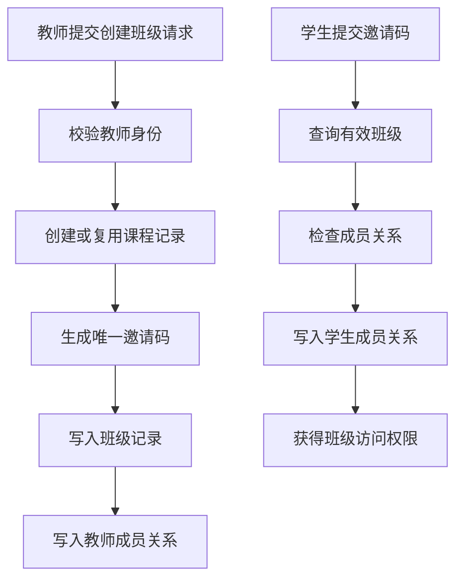
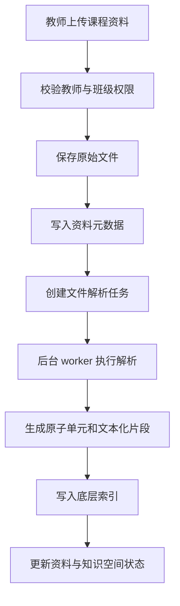
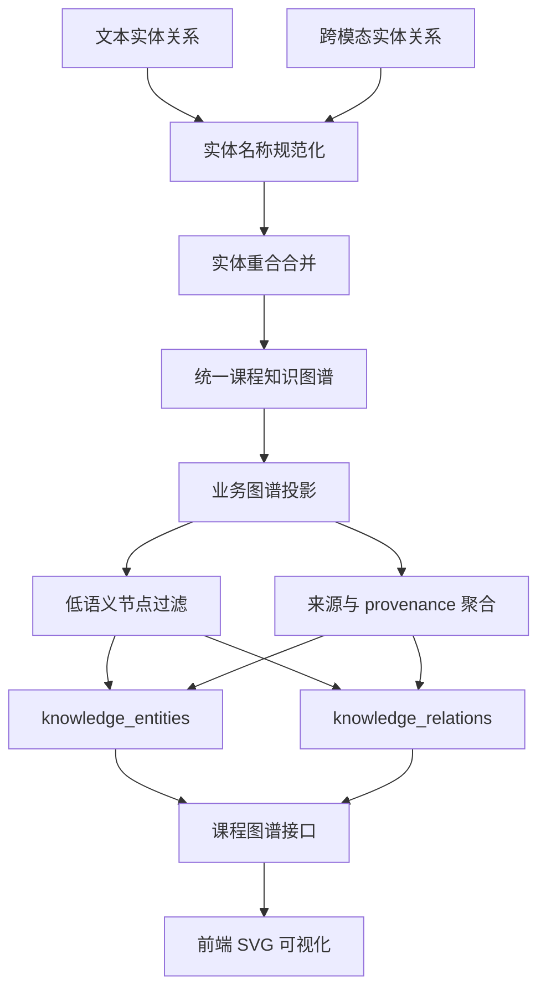
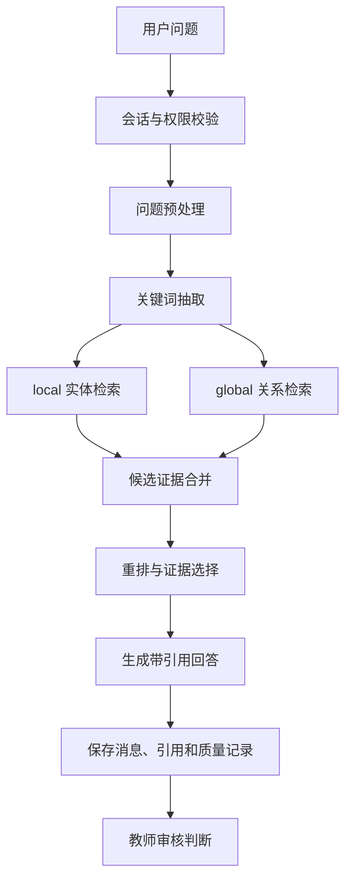
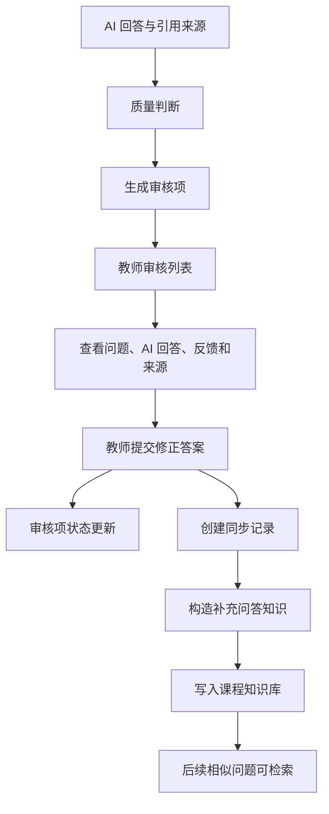

# 第四章 系统关键模块设计与实现（重写稿）

本章在第三章总体设计的基础上，按照系统实际业务链路说明关键模块的实现方式。章节组织遵循“班级空间建立、课程资料入库、知识图谱构建、检索增强问答、教师审核回流、辅助学习支持”的顺序，重点说明数据如何进入系统、如何被解析和索引、如何参与问答，以及教师修正内容如何回流到课程知识库。与底层框架原理介绍不同，本章更关注系统在课程场景中的模块职责、数据流转和关键实现结果。

## 4.1 班级空间基础功能实现

### 4.1.1 模块概述

班级空间是系统组织教学活动和隔离课程数据的基础。教师创建班级后，系统生成邀请码并建立教师与班级之间的成员关系；学生通过邀请码加入班级后，系统建立学生与班级之间的成员关系。后续资料上传、任务发布、AI 问答、知识图谱访问和教师审核均依据该成员关系进行权限判断。

本模块的实现采用前端页面调用后端 REST 接口、后端服务层封装业务规则、关系数据库保存业务状态的方式。注册、登录、创建班级、加入班级、发布任务和发布通知等请求以 JSON 请求体发送到后端，由 FastAPI 路由接收并通过 Pydantic 模型完成字段校验。认证接口负责生成访问令牌，班级接口负责课程班级的创建、查询、加入和成员校验，任务和通知接口负责教学管理信息的发布与读取。

### 4.1.2 用户认证与权限控制

用户认证流程由验证码发送、账号注册、账号登录和当前用户信息获取组成。前端注册页面先调用验证码接口，提交邮箱和用途字段。后端生成 6 位数字验证码，将验证码、邮箱、用途、是否已使用、过期时间和创建时间写入 `verify_codes` 表。验证码有效期为 10 分钟；同一邮箱和用途下生成新验证码时，系统将旧验证码置为已使用，避免多个验证码同时有效。

注册请求发送到 `/auth/register`。学生注册请求包含姓名、学号、邮箱、密码、确认密码、验证码、学院、专业和年级等字段；教师注册请求包含姓名、工号、邮箱、密码、验证码、院系和职称等字段。后端先校验两次密码一致性，再检查 `users` 表中邮箱是否重复。验证码校验通过后，系统使用 bcrypt 对密码进行哈希处理，并将用户基础信息与学生或教师扩展字段写入 `users` 表。

登录请求发送到 `/auth/login`，账号字段支持邮箱、学号或工号。密码校验通过后，系统生成 JWT 访问令牌。令牌采用 HS256 算法签名，payload 中包含用户编号、用户角色、签发时间和过期时间。前端在后续请求头中携带 `Bearer <token>`，后端统一认证依赖解析令牌并查询当前用户对象。具体业务接口再根据当前用户角色、班级成员关系和任课教师关系执行权限判断。

**表 4-1 用户认证实现要点**

| 阶段 | 输入 | 后端处理 | 输出 |
|---|---|---|---|
| 验证码发送 | 邮箱、用途 | 生成验证码、设置有效期、置旧验证码失效 | 发送状态 |
| 注册 | 邮箱、验证码、密码、姓名、角色资料 | 校验邮箱唯一性、验证码和密码，写入用户资料 | 用户编号与角色 |
| 登录 | 账号、密码、可选角色 | 查询用户、验证密码、校验角色 | 访问令牌和用户信息 |
| 当前用户 | 访问令牌 | 解析令牌并查询用户资料 | 用户个人信息 |

### 4.1.3 班级创建、加入与成员管理

班级创建请求发送到 `/classes`，仅允许教师角色调用。教师提交班级名称、课程编号、课程描述和学期等信息后，后端先判断请求中是否指定已有课程。指定课程时，系统查询 `courses` 表确认课程有效；未指定课程时，系统在 `courses` 表中创建课程记录。随后系统生成 8 位邀请码，字符来源为大写字母和数字，并查询 `classes.invite_code` 判断是否冲突。邀请码重复时重新生成，直到得到唯一邀请码。

邀请码确定后，系统在 `classes` 表中写入班级记录，保存课程编号、教师编号、班级名称、学期、邀请码、公告、启用状态和创建时间等信息。班级记录写入后，系统同步向 `class_members` 表写入教师成员关系，成员角色为 teacher。该设计使班级创建者也进入统一成员关系模型，后续班级访问和资料访问均可复用成员校验逻辑。

学生加入班级请求发送到 `/classes/join`，请求体包含邀请码。后端根据邀请码查询有效班级，再查询 `class_members` 表判断当前学生是否已经加入该班级。未加入时，系统写入学生成员关系，成员角色为 student；已经加入时，接口返回重复加入提示。教师端和学生端查询班级列表时，后端分别按照 `classes.teacher_id` 和 `class_members.user_id` 过滤数据。

**图 4-1 班级创建与加入流程图**



### 4.1.4 任务通知与班级活动管理

通知发布请求发送到 `/notifications`，请求体包含班级编号、通知标题、通知内容、通知类型、通知范围和扩展数据。后端根据 JWT 得到当前教师用户，再查询 `classes` 表确认该教师拥有班级管理权限。权限校验通过后，系统根据通知范围查询 `class_members` 表，为对应接收者在 `notifications` 表中写入通知记录。学生端查询通知时，接口按当前用户编号过滤通知记录，并支持未读过滤、单条已读和全部已读更新。

作业、考试和测验统一由 `tasks` 表实现。教师通过 `/classes/{class_id}/tasks` 或 `/tasks` 创建任务，请求体包含班级编号、标题、描述、任务类型、截止时间、满分和发布状态。`task_type` 字段用于区分 homework、exam、quiz 和 project，`is_published` 字段用于控制任务是否对学生可见。学生提交任务时，后端根据任务所属班级查询 `class_members` 表，确认当前学生具有访问权限，再写入或更新 `submissions` 表中的提交记录。提交完成后，系统向 `learning_records` 表写入任务提交行为，为后续学习统计提供数据。

**表 4-2 班级空间主要数据表**

| 数据表 | 写入时机 | 关键字段 | 作用 |
|---|---|---|---|
| `users` | 用户注册 | 邮箱、密码摘要、姓名、角色、学号或工号 | 保存学生、教师和管理员身份信息 |
| `verify_codes` | 发送验证码 | 邮箱、验证码、用途、是否使用、过期时间 | 支持邮箱验证码注册 |
| `courses` | 教师创建课程或班级 | 课程名称、课程编号、描述、创建者 | 保存课程基本信息 |
| `classes` | 教师创建班级 | 课程编号、教师编号、班级名称、学期、邀请码 | 保存班级空间信息 |
| `class_members` | 创建班级或学生加入 | 班级编号、用户编号、成员角色 | 保存班级成员关系并支撑权限校验 |
| `tasks` | 教师发布任务 | 班级编号、标题、类型、截止时间、发布状态 | 保存作业、考试和测验任务 |
| `submissions` | 学生提交任务 | 任务编号、学生编号、内容、附件、状态 | 保存学生提交记录 |
| `notifications` | 教师发布通知 | 接收用户、类型、标题、内容、已读状态 | 保存面向用户的通知消息 |

## 4.2 课程知识库构建模块

### 4.2.1 模块概述

课程知识库构建模块负责将教师上传的课程资料转换为可检索、可引用和可展示的知识资源。该模块的输入包括原始资料文件、资料元数据、班级标识和上传教师信息；输出包括资料记录、解析任务、原子单元、文本分块、内容项、底层索引状态和业务侧知识图谱投影。

本节只说明课程资料如何完成上传、存储、解析、文本化和索引状态管理。实体关系抽取、图谱融合和图谱可视化属于 4.3 节内容。这样划分后，4.2 负责“把资料变成可被索引和抽取的基础内容”，4.3 负责“从基础内容中抽取课程实体和关系”。

### 4.2.2 资料上传与存储

教师在班级资料页面选择文件并提交后，前端以 `multipart/form-data` 形式调用资料上传接口。后端首先校验当前用户是否为该班级教师，随后读取上传文件，计算 SHA-256 文件哈希，识别文件扩展名和 MIME 类型，并将原始文件保存到本地文件存储或对象存储路径。同一班级下存在相同哈希文件时，系统复用已有资料记录和解析结果，减少重复解析和重复索引。

文件保存完成后，系统在 `materials` 表中写入资料元数据，包括文件名称、标题、文件路径、文件大小、MIME 类型、文件类型、上传者、班级标识和知识库状态。资料上传接口完成业务记录后，创建或复用对应的解析任务。解析任务初始状态为 pending，随后进入异步任务队列，由后台 worker 执行资料解析与索引构建。

资料预览接口根据文件类型和解析状态返回预览内容。TXT、MD、CSV、JSON 和代码类文件可以直接读取原始文本；PDF、PPT、Word、图片、音频和视频等复杂文件优先返回解析任务中的完整解析文本，完整文本为空时拼接文本分块作为预览内容。预览结果同时包含资料类型、预览来源和分块数量，便于教师判断资料是否成功进入知识库。

**表 4-3 资料上传与存储对象说明**

| 对象 | 保存内容 | 主要作用 |
|---|---|---|
| 原始文件 | 教师上传的课程资料文件 | 下载、预览、重新解析、引用溯源 |
| 资料元数据 | 文件名、路径、大小、类型、上传者、班级、知识库状态 | 权限控制、资料列表展示、状态跟踪 |
| 解析任务 | 解析状态、解析文本、文本分块、内容项、错误信息 | 后台索引、解析结果预览、失败重试 |
| 底层索引 | 文本分块、实体、关系、向量项和图结构 | RAG 检索、图增强召回、上下文组合 |
| 业务图谱 | 面向前端展示的实体和关系投影 | 知识图谱可视化、学习画像关联 |

### 4.2.3 原子单元解析与文本化

课程资料进入检索和图谱构建流程前，需要被转换为粒度适中且可追溯的原子单元。原子单元是系统中最小的可处理知识对象，可以是文本段落、表格、公式、图片区域、音频转写片段或视频关键帧片段。每个原子单元保存内容本体、模态类型、来源文件、页码或时间戳、位置元数据和文本化描述。该步骤的目标是把不同格式的课程资料统一转换为后续索引、实体关系抽取和引用溯源都能使用的结构化输入。

系统的输入为教师上传的原始文件、MIME 类型、文件名、资料编号和班级编号。后端首先根据扩展名和 MIME 类型识别资料类型：PDF、PPT 和 Word 等文档资料进入 RAG-Anything 的 `process_document_complete` 流程，由配置的 MinerU 解析器进行版面解析；MD 和 TXT 文件由系统预处理器直接读取文本，并抽取 Markdown 表格和行内公式；图片资料被转换为 RAG-Anything `content_list`，其中包含图片路径和一段文本锚点；音频和视频资料优先查找同名转写文件，启用自动预处理时调用 ASR 或关键帧抽取能力，当前系统核心测试集中在文档、图片、表格和公式内容。

MinerU/RAG-Anything 对文档型资料的处理输入是原始文件路径、解析输出目录、解析方式、资料编号和文件名，输出是文档中的标题、正文段落、表格、公式、图片区域和版面位置信息。MinerU 的作用是完成版面分析和内容区域切分，将页面中的非文本区域识别为图片、表格、公式等多模态内容项；VLM 描述生成发生在 RAG-Anything 后续的多模态内容处理阶段。系统在初始化 RAG-Anything 实例时注入 `vision_model_func`，该函数封装系统配置的 VLM API。RAG-Anything 处理 MinerU 输出的图片、图示或公式截图等内容项时，会按照内容类型选择官方多模态提示词，并调用系统注入的 VLM 函数生成文本化描述。

从调用链路看，该过程可以概括为：原始文档进入 MinerU 版面分析，MinerU 输出带有类型、页码、图片路径、bbox 和上下文的多模态内容项；RAG-Anything 根据内容项类型选择 `image_prompt`、`figure_prompt`、`equation_prompt`、`table_prompt` 或 `vision_prompt`；系统追加教育场景指导语后，将提示词和图片数据发送给 VLM；VLM 返回可见文字、图示结构、公式含义、表格关系或学习线索等文本描述；RAG-Anything 将该描述写入后续索引内容，适配层再从处理状态、官方输出文件和 LightRAG 持久化结果中读取 `content_items`、`chunks`、`summary` 和 `keywords`。当官方输出中缺少可用元数据时，适配层从 content items 构造文本分块，或使用本地回退解析结果补充 `chunks` 和 `summary`。

MD/TXT 资料的处理由系统预处理器完成。普通文本被保存为 type 为 `text` 的内容项；Markdown 表格通过表格行识别和表头分割生成 type 为 `table` 的内容项，输出内容包括 `table_markdown`、`table_headers`、`table_rows` 和由行列数据构造的事实文本；Markdown 公式通过 `$$...$$`、`\[...\]`、`\(...\)` 和 `$...$` 等模式抽取，生成 type 为 `equation` 的内容项，输出内容包括 `equation`、`formula_latex` 和公式文本说明。

独立图片作为课程资料上传时，预处理器先构造包含文本锚点和图片路径的 `content_list`，再通过 RAG-Anything 的 `insert_content_list` 接口写入底层索引流程。该路径与文档中由 MinerU 切分出的图片区域类似，都会在 RAG-Anything 多模态内容处理阶段调用系统注入的 VLM 函数。VLM 输入包括图片 base64 数据、官方多模态解析提示词和系统追加的教育场景指导语。系统追加的指导语要求模型识别可见文字、标题、坐标轴、图例、变量、单位、步骤和学习相关关系，并关注课程概念、公式、例题、习题、易错点和实验步骤。VLM 返回结果是图片的文本化描述，通常包括可见文字、图示内容、关键对象、关系说明和学习线索。该描述进入 content item 的文本字段或后续 chunks，成为可嵌入、可检索、可抽取实体关系的文本证据。

表格和公式在 RAG-Anything/MinerU 输出中已经具有独立内容类型。表格内容项的输入是页面中的表格区域，输出包括表格文本、表头、行列结构或 Markdown 表示；系统将其进一步转换为表格事实描述。公式内容项的输入是页面中的公式区域，输出包括公式文本、LaTeX 表示和相邻上下文；系统将其转换为包含公式、变量和适用语境的文本化描述。图片、表格和公式的原始内容仍保存在文件存储或解析输出目录中，文本化描述用于检索和图谱抽取，原始内容用于引用溯源和前端查看。

**表 4-4 多模态原子单元解析输入输出**

| 资料类型 | 输入 | 处理方式 | 原子单元输出 | 文本化输出 |
|---|---|---|---|---|
| PDF/PPT/Word | 原始文件路径、资料编号、输出目录 | RAG-Anything 调用 MinerU 解析版面 | 标题、段落、表格、公式、图片内容项 | 文本分块、表格事实、公式说明、图片描述 |
| MD/TXT | 原始文本文件 | 直接读取文本，抽取 Markdown 表格和公式 | text、table、equation 内容项 | 正文文本、表格行列事实、公式文本 |
| 图片 | 图片路径、图片内容项 | `insert_content_list` 写入，VLM 生成视觉描述 | image 内容项、文本锚点 | OCR 文本、图注、视觉描述 |
| 表格 | 文档表格区域或 Markdown 表格 | MinerU/RAG-Anything 或本地表格抽取 | table 内容项 | 表头、行列数据、表格事实描述 |
| 公式 | 文档公式区域或 Markdown 公式 | MinerU/RAG-Anything 或正则抽取 | equation/formula 内容项 | 公式文本、变量说明、上下文 |
| 音频/视频 | 音视频文件、转写或关键帧 | ASR 转写、关键帧抽取或元数据回退 | text、image/keyframe 内容项 | 转写文本、关键帧描述、时间戳 |
 
**表 4-5 多模态解析提示词组成**

| 提示词来源 | 使用阶段 | 组成方式 | 主要约束 |
|---|---|---|---|
| RAG-Anything 官方多模态提示词 | 图片、表格、公式和通用视觉内容解析 | 官方 `vision_prompt`、`image_prompt`、`table_prompt`、`equation_prompt`、`figure_prompt`、`generic_prompt` | 要求模型按框架格式描述多模态内容 |
| 系统教育场景指导语 | 官方提示词之后追加 | 追加 `[AI Tutor multimodal education guidance]` | 要求识别可见文字、标题、坐标轴、图例、变量、单位、步骤和学习相关关系 |
| 当前轮图片附件提示词 | 用户聊天上传图片时 | 后端单独构造 system prompt 与 user prompt | 提取题目内容、可见文字、图示和解题线索，仅作为当前轮问答辅助信息 |

多模态解析提示词的返回结果属于面向索引的文本化内容。系统接收这些结果后，将其与来源文件、页码、内容项编号、模态类型和解析质量一起保存到解析任务的 `extra_data.content_items` 中，并进一步转换为 `chunks`。因此，多模态资料进入系统后的输出可以概括为三类：第一，原始文件或图片路径，用于预览和引用溯源；第二，content items，用于保存模态类型和结构化元数据；第三，文本化 chunks，用于向量嵌入、实体关系抽取和 RAG 检索。

RAG-Anything 将第 $i$ 个知识源分解为若干原子内容单元，原子单元由模态类型和原始内容构成。结合本系统需要保存资料编号、来源位置和解析元数据的实现方式，本文将第 $i$ 个资料中的第 $j$ 个原子单元表示为：

$$
u_{i,j}=(id_{i,j},m_{i,j},c_{i,j},d_{i,j},p_{i,j},e_{i,j})
$$

其中，$id_{i,j}$ 表示原子单元标识，$m_{i,j}$ 表示模态类型，$c_{i,j}$ 表示原始或结构化内容，$d_{i,j}$ 表示可检索语义描述，$p_{i,j}$ 表示来源位置，$e_{i,j}$ 表示扩展元数据。原子单元进入索引前被转换为文本化片段：

$$
t_{i,j}=g(c_{i,j},m_{i,j},p_{i,j})
$$

$t_{i,j}$ 随后参与文本分块、向量嵌入和实体关系抽取。

其中，$d_{i,j}$ 的生成方式由模态类型决定。文本单元的 $d_{i,j}$ 来自正文内容；表格单元的 $d_{i,j}$ 来自表头、行列数据和表格事实描述；公式单元的 $d_{i,j}$ 来自公式文本、变量说明和上下文；图片单元的 $d_{i,j}$ 来自 OCR 文本、图注和 VLM 视觉描述；音视频单元的 $d_{i,j}$ 来自 ASR 转写文本、关键帧描述和时间戳上下文。

**算法 4-1 原子单元解析流程**

```text
Input: 课程资料文件、文件类型、班级标识
Output: 原子单元集合、文本化片段集合
1. 识别文件扩展名和 MIME 类型
2. 文档资料调用 RAG-Anything/MinerU 解析标题、段落、表格、公式和图片
3. MD/TXT 资料直接读取文本，并抽取 Markdown 表格和公式
4. 图片资料构造 content_list，并交由 VLM 生成视觉描述
5. 音频或视频资料生成转写文本和关键帧说明
6. 为每个内容项补充 atomic_id、来源文件、页码、时间戳和模态类型
7. 按模态生成 d_{i,j}，并转换为文本化片段 t_{i,j}
8. 保存 content_items、chunks、summary、keywords 和解析质量信息
```

### 4.2.4 索引任务状态管理

资料解析与索引构建属于耗时操作。系统通过 `file_parse_tasks` 表记录任务状态、关联资料、关联知识空间、解析文本、分块数量、内容项、错误信息和重试信息。任务状态从 pending 进入 processing，索引完成后更新为 completed，异常时更新为 failed。教师端资料列表和管理端索引任务页面根据任务状态展示处理进度。

知识空间由 `kb_spaces` 表维护，记录课程或班级知识库的文档数量、分块数量、最近构建时间和整体状态。每份资料解析完成后，系统更新资料的知识库状态，并同步刷新知识空间统计信息。解析失败时，系统保存错误类别和错误信息，支持教师或管理员发起重试。

**图 4-2 资料上传与知识库构建流程图**



## 4.3 知识图谱构建模块

### 4.3.1 模块概述

知识图谱构建模块负责从课程资料中抽取课程知识点及其关联关系，并形成可用于检索增强和前端展示的课程知识结构。该模块接收 4.2 节生成的文本分块和多模态文本化片段，经过实体关系抽取、来源绑定、图谱融合和业务投影后，形成 `knowledge_entities` 和 `knowledge_relations` 中的可视化图谱数据。

系统中的图谱构建由 RAG-Anything 与 LightRAG 协同完成。RAG-Anything 负责资料解析、内容项组织和入库调度，将不同类型的课程资料转换为可索引文本或内容列表；LightRAG 负责文本分块、实体关系抽取、向量写入和底层图结构维护。索引完成后，系统从底层处理结果和解析任务元数据中提取适合展示的实体与关系，保存到业务数据库，用于可视化、来源展示和学习画像关联。

### 4.3.2 文本实体关系抽取

文本实体关系抽取路径主要处理课程文档、纯文本资料和转写文本。资料完成解析和文本化后，系统将文本分块提交给 LightRAG 的实体关系抽取流程。该流程通过大语言模型识别实体名称、实体类型、实体描述、关系端点、关系类型和关系描述。抽取得到的结果进入底层图结构，同时以描述文本形式进入向量索引，使后续查询能够同时命中文本证据和概念关系。

为了使抽取结果更符合课程场景，系统在官方实体关系抽取提示词后追加课程知识图谱抽取约束。该约束要求抽取对象聚焦稳定教学知识，过滤文件名、路径、页码和解析标识等低语义内容。实体类型覆盖课程概念、公式算法、例题习题、实验步骤和考核要点等教学对象；关系语义覆盖先修、组成、解释、应用、考查和对比等课程关系。

**表 4-6 文本图谱抽取提示词约束**

| 约束类别 | 主要内容 |
|---|---|
| 抽取目标 | 构建课程知识图谱，优先抽取具有教学意义的知识点及其关系 |
| 实体类型 | course_concept、prerequisite、learning_objective、formula、algorithm、example、exercise、misconception、experiment_step、tool、assessment_point |
| 关系语义 | prerequisite_of、part_of、explains、uses_formula、applies_algorithm、example_of、tests、causes、contrasts_with、related_to |
| 过滤对象 | 文件名、路径、页码、解析编号和无教学意义的泛化词 |
| 描述要求 | 实体描述和关系描述基于课程资料内容 |

文本实体关系抽取形成的节点和边保留文本来源信息，包括资料编号、文本分块、页码和来源片段。后续图谱融合阶段依据实体名称和关系端点将这些结果与跨模态来源进行合并。

### 4.3.3 跨模态实体关系抽取

跨模态实体关系抽取建立在 4.2 节的多模态内容文本化结果之上。系统在知识库构建阶段已经将表格、公式、图片、音频和视频等内容转换为文本化片段，因此本节不重复说明解析过程，而是说明这些文本化内容如何进入图谱抽取。表格事实描述、公式文本、变量说明、OCR 文本、视觉描述、ASR 转写文本和关键帧说明被统一视为实体关系抽取的输入证据。

跨模态内容进入抽取流程时，系统使用与文本图谱相同的实体关系抽取主流程。大语言模型仍然输出实体名称、实体类型、实体描述、关系端点和关系描述。跨模态路径的差异体现在来源绑定上：系统在每个实体和关系的 provenance 中记录模态类型、内容项编号、来源页码、图片路径、表格结构、公式文本或时间戳等信息。这样，图谱中的课程概念仍以教学知识点为中心，但教师和学生查看节点详情时，可以追溯该知识点来自普通文本、表格、公式、图片描述或音视频转写片段。

跨模态实体关系抽取还会过滤低语义内容。文件名、路径、图片编号、页码、chunk 编号、UUID 和泛化词不会作为前端图谱节点展示。表格中的行列数据、公式中的变量说明和图片中的可见文字只有在能够对应课程概念、公式含义、实验步骤或知识点关系时，才进入课程图谱。

**表 4-7 跨模态实体关系抽取输入**

| 来源模态 | 抽取输入 | provenance 保留内容 | 图谱结果 |
|---|---|---|---|
| 表格 | 表头、行列数据、表格事实描述 | 表格编号、页码、行列结构 | 概念、指标、对比关系 |
| 公式 | 公式文本、变量说明、上下文 | 公式文本、页码、变量说明 | 公式实体、适用条件、概念关系 |
| 图片 | OCR 文本、图注、视觉描述 | 图片路径、页码、视觉描述 | 图中概念、流程、结构关系 |
| 音频 | ASR 转写文本、时间戳 | 转写片段、时间范围 | 讲解片段与课程概念 |
| 视频 | 字幕片段、关键帧描述、时间戳 | 关键帧路径、时间范围 | 关键帧内容与知识点 |

### 4.3.4 图谱融合与可视化

文本实体关系抽取和跨模态实体关系抽取最终汇入统一课程知识图谱。系统以规范化后的实体名称作为主要重合依据；同一课程概念在多个来源中出现时，系统将其合并为同一个实体，并把来源位置、模态类型和资料编号追加到来源信息中。关系融合以源实体、目标实体和关系类型为依据；相同关系重复出现时，系统增加关系权重并合并证据来源。

统一课程知识图谱形成后，系统将适合教学展示的部分投影到本地业务数据库。投影流程读取底层处理状态中的显式实体关系；显式结果不足时，从解析摘要、文本分块和内容项中抽取候选概念作为补充。投影阶段过滤技术性节点和低语义内容，使本地图谱保留课程知识点及其关系。

本地图谱使用 `knowledge_entities` 和 `knowledge_relations` 两张表保存。实体写入时，系统以“班级编号 + 实体名称”为合并依据查询 `knowledge_entities` 表；未查询到同名实体时创建新记录，查询到同名实体时合并来源并更新可信度估计。关系写入时，系统以“班级编号 + 源实体 + 目标实体 + 关系类型”为合并依据查询 `knowledge_relations` 表；未查询到同类关系时创建新记录，查询到同类关系时增加关系权重并合并 provenance 信息。

知识图谱可视化直接读取本地业务图谱。学生端和教师端通过课程图谱接口获取数据。接口校验班级访问权限后，读取当前班级有效资料范围内的实体和关系，并过滤低语义节点。前端图谱组件使用 SVG 渲染接口返回的 `nodes`、`edges` 和 `meta`，提供搜索、过滤、展开和详情查看功能。

**图 4-3 知识图谱融合与可视化流程图**



## 4.4 检索增强生成问答模块

### 4.4.1 模块概述

检索增强生成问答模块是系统的核心智能服务。该模块接收学生或教师在班级空间中的问题，结合课程知识库检索相关证据，再调用大语言模型生成带引用来源的回答。模块输入包括用户问题、班级标识、用户角色、聊天历史、回答模式和当前轮附件；输出包括回答正文、引用来源、可信度估计、追问建议、查询追踪信息和审核标记。

问答模块根据问题类型选择处理路径。课程知识问答进入课程知识库检索，系统状态查询、闲聊和教师工具请求进入快速回答或状态回复路径。课程问答主路径包括用户问题预处理、关键词抽取、双路检索、候选证据重排和最终回答生成。

### 4.4.2 用户问题预处理

用户问题预处理包括会话管理、回答模式识别、多轮上下文整理、附件处理和查询改写。系统获取或创建聊天会话，并保存用户原始问题。课程相关问题进入上下文整理流程，系统从最近聊天历史中识别追问、代词省略和对上一轮回答的澄清，再形成较完整的独立问题。

查询改写采用规则型方法完成，用于增强课程场景下的召回效果。系统根据问题内容识别定义、机制、对比、计算、例题、实验步骤、因果解释和总结复习等意图，并生成少量检索焦点词。最终提交给检索流程的文本由独立问题和紧凑焦点词组成，查询文本长度受到控制，以减少对底层关键词抽取的干扰。

当前轮附件只参与本轮问答。用户上传图片时，系统调用视觉模型生成图片描述，并将该描述加入当前轮查询；用户上传文本类附件时，系统提取附件预览文本并参与当前轮回答。教师或用户明确将附件提升为课程资料时，附件进入 4.2 节的资料上传和知识库构建流程。

### 4.4.3 关键词抽取

查询阶段的关键词处理由业务层焦点词生成、LightRAG 检索关键词抽取和 RAG-Anything 多模态线索组织共同构成。业务层焦点词由本系统查询改写模块生成，用于丰富最终提交给底层检索引擎的查询文本。

检索层关键词由 LightRAG 在查询阶段调用大语言模型抽取。关键词抽取提示词要求模型输出 JSON 结构，并将关键词划分为 `high_level_keywords` 和 `low_level_keywords` 两类。高层关键词描述问题主题、意图和抽象概念，适合用于关系检索和全局知识发现；低层关键词描述具体实体、术语和细节，适合用于实体检索和局部证据定位。本系统构造底层 LLM 函数时保留 `keyword_extraction` 标记，因此关键词抽取调用能够在日志中被独立识别。

RAG-Anything 在该阶段主要负责让多模态内容进入查询上下文和索引空间。图片、表格和公式相关问题的检索对象为索引阶段生成的 OCR 文本、视觉描述、表格事实描述和公式说明。当前轮上传图片时，后端先生成图片描述，再把图片描述与用户问题共同提交给查询流程。普通文本问答调用 LightRAG 引用查询接口，带图片附件的问题调用 RAG-Anything 多模态查询入口。

### 4.4.4 双路检索

普通文本问答主路径采用 LightRAG 的 hybrid 查询模式。hybrid 模式合并 local 与 global 两条检索路径：local 路径以低层关键词为主要线索，优先召回相关实体，并由实体扩展相邻关系和文本分块；global 路径以高层关键词为主要线索，优先召回相关关系，并由关系两端补充实体和文本分块。

系统实现中的双路检索包括四个步骤。第一，根据有效查询文本抽取高层关键词和低层关键词；第二，local 路径检索实体向量并扩展实体相关关系；第三，global 路径检索关系向量并补充关系两端实体；第四，合并两条路径的实体、关系和文本分块，去除重复证据，并在 token 预算内组织为检索上下文。

系统配置中的 `mix` 查询模式在普通文本问答中映射为结构化引用更稳定的 hybrid 查询；RAG-Anything 通用查询和多模态查询路径保留 mix 参数，用于引入文本分块向量召回结果。多模态查询依赖索引阶段生成的文本化内容和当前轮附件描述，使图片、表格和公式相关证据能够参与召回与排序。

**算法 4-2 双路检索流程**

```text
Input: 有效查询文本、班级知识库、用户角色约束
Output: 候选证据集合
1. 由 LightRAG 使用大语言模型抽取高层关键词和低层关键词
2. local 路径使用低层关键词召回实体
3. 根据实体扩展相关关系和文本分块
4. global 路径使用高层关键词召回关系
5. 根据关系补充两端实体和文本分块
6. 合并 local 与 global 结果并去重
7. 根据来源、相关性和 token 预算组织候选证据
```

### 4.4.5 候选证据重排与最终回答生成

双路检索得到的候选证据包括文本分块、实体描述、关系描述和局部图结构。系统对候选证据进行标准化处理，补充资料名称、页码、分块标识、模态类型和检索分数，过滤已删除资料来源，并对重复来源进行合并。表格证据保留表头和行列信息，图片证据保留 OCR 文本、视觉描述和来源图片，视频证据保留转写片段和时间戳。

候选证据排序综合考虑检索相关性、来源可用性、证据类型、引用完整性和 token 预算。系统启用重排序模型时，对候选证据进行进一步精排；重排序服务不可用时，适配层按照检索返回分数、来源数量和证据覆盖情况进行启发式排序。最终进入大语言模型上下文的内容包括用户问题、筛选后的历史消息、角色化回答约束、文本证据、实体关系证据和引用标识。

回答生成提示词强调课程证据约束。学生端回答侧重概念解释、步骤说明和易错点提示；教师端回答侧重教学讲解重点、学生困惑位置和补充练习建议。模型生成回答后，系统解析回答正文中的引用标识，并将结构化来源保存为问答引用记录。回答为空、引用来源失效、回答严重乱码或结构异常时，系统返回资料依据不足提示或执行回答修复流程。

系统保存的问答结果包括用户消息、AI 回答、引用来源、可信度估计、质量标签和查询追踪信息。可信度估计属于启发式质量指标，主要依据来源数量、来源质量、检索分数和证据覆盖情况生成。查询追踪信息用于管理员监控和第五章评估实验，包括查询模式、查询方法、是否使用多模态附件、候选来源数量、检索耗时、生成耗时和是否触发回答修复。

**图 4-4 RAG 问答模块总体流程图**



## 4.5 教师审核与知识回流模块

### 4.5.1 模块概述

教师审核与知识回流模块用于处理 AI 回答质量无法完全由模型自动控制的问题。系统在回答生成后，根据可信度估计、引用来源数量、证据质量和学生反馈判断是否需要教师介入。需要审核的回答进入教师审核队列，教师可以查看原始问题、AI 回答、学生反馈原因、引用来源和触发原因，并提交修正答案。

该模块将学生反馈、教师判断和知识库更新连接为闭环。学生端负反馈暴露回答错误、证据不足或表达不清的问题；教师端修正答案形成更可靠的课程问答知识；知识回流机制使后续相似问题能够检索到教师确认后的内容。

### 4.5.2 教师审核与知识回流实现

系统在两类情况下生成审核项。第一，AI 回答的可信度估计较低、来源数量不足或证据质量较弱时，系统自动创建低可信度审核项。第二，学生对 AI 回答点踩并填写反馈原因时，系统创建或更新负反馈审核项。审核项保存消息标识、班级标识、学生标识、触发类型、原始问题、AI 回答、审核状态和创建时间。

教师进入审核页面后，可以按班级和状态查看待审核回答。审核详情展示学生问题、AI 回答、学生反馈、引用来源和系统判断原因。教师提交修正答案后，系统保存教师答案、审核人和审核时间，并将审核项状态更新为已解决。教师选择回流知识库时，系统创建同步记录，将学生问题、教师标准答案、班级标识和审核来源组织为补充问答知识，写入课程知识库。

知识回流以增量知识的方式补充课程知识空间。该方式保留原始资料来源，并使教师在真实答疑中形成的高质量答案被后续检索利用。同步完成后，系统记录同步状态和同步备注；同步失败时，教师和管理员可以根据错误信息重试或人工处理。

**图 4-5 教师审核与知识回流流程图**



**算法 4-3 教师审核与知识回流流程**

```text
Input: AI 回答、引用来源、可信度估计、学生反馈
Output: 审核项、教师修正答案、知识库增量内容
1. 根据来源数量、证据质量和可信度估计判断是否需要审核
2. 学生提交负向反馈时创建或更新审核项
3. 教师查看原始问题、AI 回答、反馈原因和引用来源
4. 教师提交修正答案
5. 更新审核项状态、审核人和审核时间
6. 教师选择回流知识库时，构造“问题-教师答案”补充知识
7. 写入课程知识库并记录同步状态
```

## 4.6 辅助学习功能实现

辅助学习功能用于记录学生在课程空间中的学习行为，并为资料推荐和教师学情查看提供基础数据。系统记录学生提问、负反馈、任务提交、闪卡复习和推荐点击等行为，写入 `learning_records` 表。学生画像接口以班级为统计范围，从学习行为、聊天记录、任务提交和闪卡复习中统计提问次数、任务完成率、活跃度、强项主题和薄弱主题，并写入 `student_profiles` 表。

资料推荐采用规则化排序方式实现。推荐接口根据学生画像中的薄弱主题、近期提问关键词、班级热点问题和历史反馈生成候选资源。资料候选来自 `materials` 表，系统优先考虑与薄弱主题匹配、已完成知识库索引、近期上传且在班级问题中热度较高的资料。候选生成后，系统根据主题匹配、资料新近度、知识库状态、班级问题热度和学生历史反馈计算排序分数，并返回推荐理由。该功能属于辅助学习支持，当前实现以可解释规则为主。

## 4.7 本章小结

本章按照系统实际业务链路重新说明了第四章关键模块实现。班级空间基础功能为课程资料、任务通知、成员权限和学习行为提供业务载体；课程知识库构建模块完成资料上传、存储、原子单元解析、文本化和索引任务状态管理；知识图谱构建模块基于文本分块和多模态文本化内容抽取课程实体与关系，并将底层图谱结果投影到业务数据库用于可视化；检索增强生成问答模块通过问题预处理、关键词提取、双路检索、候选证据整理和回答生成实现基于课程证据的智能答疑；教师审核与知识回流模块将待审核回答和学生反馈转化为教师可修正、可回流的增量知识；辅助学习功能则为学生画像和资料推荐提供数据基础。上述模块共同形成从课程资料入库、课程问答到知识持续更新的闭环。
